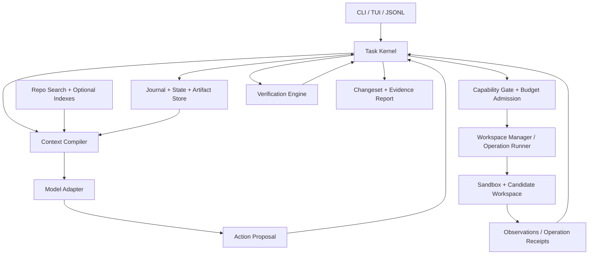

# Harness — Ürün ve mimari tasarımı v2

Tarih: 22 Eylül 2026. Durum: uygulanabilir tasarım önerisi; henüz implementasyon veya ölçülmüş performans iddiası değildir. Dayanak ve eleştiriler: [MIMARI_INCELEME.md](C:/Users/ixayl/Desktop/harrnes/MIMARI_INCELEME.md). Teslim sırası: [UYGULAMA_VE_EVAL_PLANI.md](C:/Users/ixayl/Desktop/harrnes/UYGULAMA_VE_EVAL_PLANI.md).

## 1. Ürün sözleşmesi

**Kullanıcı, mevcut repository'sinde bir mühendislik işi verir. Harness bu işi sınırları belli bir çalışma ortamında ilerletir; ara verileri ve kararları korur; kesinti veya model değişiminden sonra durumla uzlaşarak devam eder; sonucu hangi kontrollerin doğruladığını gösteren incelenebilir bir changeset teslim eder.**

Kullanıcıya verilecek kısa vaat:

> Uzun kodlama işini kaldığın yerden sürdür; neyin değiştiğini ve neyin doğrulandığını bil.

Başarı, belleğe alınan token sayısı veya agent sayısı değildir. Başarı, kullanıcının kabul edebileceği doğru değişikliğin daha az düzeltme, tekrar iş ve belirsizlikle ortaya çıkmasıdır.

### 1.1 İlk kullanıcı ve iş

Başlangıç varsayımı: terminal kullanan bireysel geliştiriciler ve küçük ekipler; mevcut Git repository'sinde hata düzeltme, çok dosyalı özellik, dependency migration ve refactor yapıyorlar. İlk derin dil desteği TypeScript/JavaScript ve Python; diğer metin tabanlı projeler lexical araçlarla çalışabilir ancak aynı analiz kapsamı vaat edilmez.

Kullanıcının işletim sistemi varsayımı gizlenmez: CLI istemcisi Windows, Linux ve macOS için tasarlanır; ilk güçlü sandbox yürütme profili Linux tabanlı izole ortamdır. Windows'ta WSL2/container seçeneği ayrı backend olarak ele alınır. Native Windows sandbox eşdeğerliği doğrulanana kadar aynı güvenlik rozeti verilmez. Windows'a özgü derleme gerektiren projeler native backend hazır değilse açıkça sınırlı destek alır.

### 1.2 İlk ürünün sınırı

İlk kararlı sürüm bir kodlama CLI'si ve dayanıklı yerel runtime'dır. Kurumsal deployment platformu, genel ajan pazaryeri, kendi foundation modelini eğitme ürünü veya dağıtık iş kümesi ilk teslimin koşulu değildir. Bu alanlar genişleme yollarıdır.

İlk günden gerekli: doğrudan model adapter'ları, tek agent loop, kaynak okuma/arama, patch ve sandbox process araçları, diff, stop/resume, bütçe, doğrulama raporu, makineye uygun çıktı.

### 1.3 Neden kullanılsın?

Kullanıcı deneyimindeki belirleyici an: görev yarıda kesilir, kullanıcı bir dosyayı değiştirir, ardından başka modelle devam eder. Harness eski sonuca güvenmek yerine farkı gösterir, etkilenen kanıtları yeniler, doğru noktadan ilerler. Bu davranış canlı demoyla ve eval ile gösterilebilmelidir.

Sürdürülebilir ürün avantajı için hipotez: bu kesintilerin ve yanlış tamamlanmaların azaldığı bir CLI, geliştiricinin doğrulama yükünü düşürür. Bu hipotez kullanıcı pilotunda ölçülür; “çok sayıda iyi bileşen” tek başına farklılaşma sayılmaz.

## 2. Tasarımın merkezindeki invariant'lar

1. **Tek yetkili çekirdek:** Model, plugin ve worker öneri üretir. State geçişi ve yan etkili işlem kabulü kernel'dadır.
2. **Sürüme bağlı gözlem:** Her okuma ve test, gözlemlendiği snapshot/ortamla birlikte saklanır.
3. **Niyet korunur:** Ham kullanıcı talimatı ve değişiklikleri kalıcıdır; çıkarılan gereksinimler kaynağına bağlıdır.
4. **Eski yetki kullanılamaz:** Eski policy epoch veya fencing token ile yeni işlem başlatılamaz/publish edilemez.
5. **Doğrulama kapsamı görünür:** PASS yalnız tanımlı kriter, candidate ve ortam için geçerlidir.
6. **Belirsizlik durumdur:** Çalıştırılamayan kontrol veya sonucu kaybolan dış eylem başarılı sayılmaz.
7. **Kullanıcı çalışması korunur:** Baseline dışı değişiklik fark edilince sessiz overwrite veya geniş rollback yapılmaz.
8. **Türetilen bilgi otorite üretmez:** Özet, retrieval sonucu ve LLM yorumu kendi başına izin/kriter değiştirmez.
9. **Bütçe ortak ve rezervasyonludur:** Child çağrı yeni sınırsız bütçe açmaz.
10. **Index isteğe bağlı hızlandırıcıdır:** Bozuk/eksik index doğruluk iddiası üretmez; doğrudan kaynağa düşülür.
11. **Inspection replay yan etkisizdir:** Journal okunur; dış çağrılar otomatik yeniden oynatılmaz.
12. **Güvenlik sınırı ölçülür:** Sandbox desteği yoksa otomatik olarak eşdeğer koruma varmış gibi devam edilmez.

## 3. Sistemin yapısı



Bunlar başlangıçta ayrı microservice değildir. Tek modüler runtime ve izole tool process'leri yeterlidir. UI state değiştirmez; komut gönderir ve journal event'lerini izler. Context Compiler ve modelin dosya yazma yetkisi yoktur.

### 3.1 Modül sorumlulukları

| Modül | Yetki ve çıktı | Yapmaması gereken |
|---|---|---|
| Task Kernel | Command validation, state transition, policy epoch, scheduler | LLM cevabını doğrulamadan state'e dönüştürmek |
| Workspace Manager | Baseline/candidate manifest, read receipts, patch, publish ve recovery | Git worktree'yi sandbox saymak |
| Operation Runner | Process lifecycle, timeouts, cancellation, effect receipts | İzin verilmiş komut adına sınırsız child process yetkisi vermek |
| Capability Gate | Scope, environment, egress, approvals ve lease kontrolü | Repo metninden yetki çıkarmak |
| Context Compiler | Geçerli referanslardan bounded context ve manifest | Eksik bilgiyi uydurmak veya authoritative state'i özetle değiştirmek |
| Repository Search | Lexical/symbol arama, coverage ve freshness bilgisi | “Bulamadım” sonucunu “yoktur” saymak |
| Model Adapter | Sağlayıcı protokolü, streaming, tool-call normalizasyonu | Kendi başına araç çalıştırmak |
| Verification Engine | Requirement → check → receipt → verdict bağlantısı | Genel semantik doğruluk garantisi vermek |
| Store | Atomik metadata/journal işlemleri, içerik adresli artifact'lar | Harici yan etkileri DB commit'iyle atomik saymak |
| Eval Recorder | Yapılandırılmış lokal ölçümler | Varsayılan olarak kullanıcı kodunu dışarı göndermek |

## 4. Doğruluk ve otorite modeli

“Tek source of truth” bütün bilgiyi tek tabloya doldurmak anlamına gelmez. Her alanın otoritesi bellidir:

| Alan | Yetkili kaynak | Türetilen görünüm |
|---|---|---|
| Kullanıcı niyeti | Ham user input + açık revision zinciri | TaskSpec, plan, özet |
| Repository içeriği | Immutable snapshot manifest + blob'lar | AST, graph, lexical/vector index |
| Çalıştırma gözlemi | Runner'ın kaydettiği operation/test receipt | Test özeti, model yorumu |
| Görev ve yetki durumu | Kernel journal + sürümlü policy | TUI durumu, cached projection |
| Mühendislik kararı | Yetkili actor'ın kaydettiği Decision | Özetlenmiş proje hafızası |

Immutable snapshot geçmişi anlatır; kullanıcının canlı dizininin hâlâ aynı olduğunu göstermez. Her işlem öncesi gereken tazelik seviyesi belirlenir. İlerleme sırasında yeni canlı içerik varsa yeni snapshot alınır; eski kayıt değiştirilmez.

### 4.1 Observation, Claim ve Decision

**Observation:** “Bu hash'teki dosyada bu byte'lar var”, “bu environment'ta komut şu exit code ile bitti.” Runtime üretir; kaynak kimliği ajan tarafından seçilemez.

**Claim:** “Bu akış tekrar kullanılan token'ı reddeder.” Bir çıkarımdır; gözlem referansları, bağımlılık kapsamı ve doğrulama yöntemi vardır. `proposed`, `supported`, `refuted`, `unknown` statüleri kullanılır.

**Decision:** “Bu görevde opaque refresh token kullanacağız.” Yetkili seçimdir; ampirik doğru/yanlış gözlemi değildir. Scope, gerekçe, actor ve reopening koşulları saklanır. Kullanıcı revizyonu veya yeni kanıtla yeniden açılabilir.

Bir observation'a referans, claim'in mantıken o observation'dan çıktığını kanıtlamaz. `confidence=1.0` yetki veya test sonucu oluşturamaz.

### 4.2 Evidence geçerliliği

Tek `stale: boolean` yerine iki eksen:

```text
source_integrity: INTACT | MISSING | CORRUPT
applicability:    CURRENT | STALE | UNKNOWN | HISTORICAL
```

Kaynak dosya eski diye geçmiş karar kaydı bozulmuş olmaz. Sadece bugün kullanılabilirliği ayrı değerlendirilir. Davranışsal iddialar için dependency fingerprint gerekir; dependency kapsamı bilinmiyorsa `UNKNOWN` kalır. Geçmiş kanıt retrieval'da bulunabilir ama current fact slot'una giremez.

## 5. Minimum veri sözleşmeleri

Aşağıdaki alanlar mantıksal sözleşmedir; ilk sürümde hepsi ayrı tablo olmak zorunda değildir.

```text
TaskSpec
  task_id, version, input_event_ids, goal
  requirements[{id, source_span, kind, required, verification_method}]
  constraints[{id, source_span, scope, status}]
  allowed_effects, budget_policy, created_by

WorkspaceSnapshot
  snapshot_id, project_id, parent_snapshot_id
  git_head?, git_index_manifest?, file_manifest_digest
  entries[{path, blob_hash, file_kind, mode, symlink_target?}]
  included_untracked_paths, exclusions, capture_consistency

EnvironmentFingerprint
  backend, image_digest?, os, architecture
  toolchain_versions, dependency_lock_digests
  test_config_digest, relevant_nonsecret_config_digest
  secret_version_handles, external_fixture_versions, reproducibility

Operation
  op_id, task_id, attempt_id, kind, immutable_args_digest
  base_snapshot_id, requirement_version, policy_epoch, fencing_token
  effects, approval_ref?, budget_reservation_id
  retry_class, status, external_idempotency_key?, receipt_ref?

Observation
  observation_id, op_id, snapshot_id, environment_id?
  source_locator, source_blob_hash, observed_at, artifact_ref

Claim
  claim_id, text, observation_refs, dependency_fingerprint
  applicability, support_method, producer, status

VerificationReceipt
  receipt_id, task_id, requirement_version, candidate_snapshot_id
  environment_id, policy_epoch, check_definition_digest
  requirement_ids, command_ref?, result_artifact_ref
  verdict, scope, trust_level, skipped_checks, baseline_comparison

Checkpoint
  checkpoint_id, journal_seq, task_spec_version, state_digest
  candidate_snapshot_id, open_operations, claims_and_decisions_refs
  policy_epoch, budget_ledger_version, continuation_ref?, schema_version
```

Snapshot yalnız HEAD değildir. Staged/unstaged/untracked durumlar ve dosya modları kullanıcı çalışmasının parçasıdır. Ignored secret ve büyük binary'ler varsayılan olarak modele/index'e alınmaz; çalıştırma için gerekenler açık kapsamla sağlanır. Submodule/LFS gibi yapıların destek durumu manifest'te belirtilir; kısmi capture tam snapshot gibi gösterilmez.

## 6. Görev yaşam döngüsü ve completion

Execution lifecycle ile quality verdict ayrı tutulur. Böylece kullanıcı bir işi sonlandırabildiği halde sistem onu yanlış biçimde “doğrulandı” diye etiketlemez.

```text
lifecycle:
  CREATED -> SCOPING -> READY -> RUNNING -> VERIFYING -> FINISHED
                                    ^         |
                                    +---------+ (bounded repair)

nonterminal interruptions:
  WAITING_USER | WAITING_RESOURCE | BLOCKED | PAUSED | RECOVERING

terminal outcomes:
  FINISHED | CANCELLED | FAILED | BUDGET_EXHAUSTED

quality verdict:
  VERIFIED | PARTIAL | UNVERIFIED | FAILED | ACCEPTED_WITH_WAIVER
```

`FINISHED` execution'ın durduğunu söyler. CLI ana dilinde yalnız `VERIFIED` için “doğrulandı” kullanılır; `PARTIAL` için “kısmi sonuç, şu koşullar açık” denir.

### 6.1 Tamamlanma koşulu

```text
VERIFIED(candidate, spec, env, policy) iff
  every required criterion has an admissible PASS receipt
  AND receipt bindings match candidate/spec/env/policy
  AND all required regression gates pass
  AND no unresolved required operation has UNKNOWN_OUTCOME
  AND no unresolved blocking conflict or policy violation exists
```

Bir kriterin kontrolü `human_review` ise yetkili insan onayı o kriterin receipt'i olabilir. Model hakemi yüksek riskli davranışın tek hakemi olamaz. Waiver kriteri geçtiye dönüştürmez; `ACCEPTED_WITH_WAIVER` üretir ve benchmark strict success'inden ayrı sayılır.

Küçük bir yazım düzeltmesi için typecheck veya tüm test paketi otomatik zorunlu değildir. Verification policy görev türüne göre gerekli kanıtı seçer. Araştırma/tasarım görevleri kod testine zorlanmaz; kaynak ve kapsam denetimi kullanır.

### 6.2 Kabul ölçütlerini kurma

Model goal'den ölçüt önerir, kernel bunları ham istekle ilişkilendirir. Açık ve düşük riskli taleplerde rutin onay turu gerekmez. Belirsiz davranış, geri alınamaz etki veya önemli kapsam seçimi varsa yalnız o karar sorulur; bağımsız işler ilerleyebilir.

Yeni test eklemek kriteri güçlendirebilir. Zorunlu kriter silmek, testleri devre dışı bırakmak veya kapsamı daraltmak normal repair eylemi değildir. Yetkili kapsam değişikliği ve spec version artışı gerektirir.

## 7. Workspace ve değişiklik protokolü

### 7.1 Üç ayrı nesne

1. **User workspace:** kullanıcının canlı çalışma dizini; mevcut kirli durum korunur.
2. **Candidate workspace:** ajanın üzerinde çalıştığı izole kopya/overlay; süreç yalnız bu kapsamda yazabilir.
3. **Candidate snapshot:** belirli bir anda capture edilmiş, doğrulamanın bağlandığı immutable içerik.

Bir worktree candidate altyapısı olabilir; tek başına sandbox değildir. Baseline'daki unstaged/untracked içerik seçilen kapsamla candidate'a aktarılır. Snapshot toplarken değişim algılanırsa yeniden denenir; istikrarsız capture ile “tutarlı” etiketi basılmaz. Dosya sistemi snapshot desteği yoksa kısa quiescence ve tekrarlı manifest kontrolü kullanılır, kalan sınırlama kayda girer.

### 7.2 Patch transaction

```text
PROPOSED
 -> AUTHORIZED       immutable args + policy + budget
 -> PREPARED         base/read-set/write-set checked; before blobs persisted
 -> APPLIED          writes to isolated candidate; after hashes captured
 -> VALIDATED        mechanical checks
 -> VERIFIED         required acceptance checks against frozen candidate
 -> PUBLISHED        candidate reference / delivery result recorded
```

Hata yolları: `REJECTED`, `CONFLICTED`, `ABORTED`, `RECOVERY_REQUIRED`. Testi geçmeyen aday debug için tutulabilir; verified olarak publish edilmez.

Adımlar:

1. Model patch ve kullandığı read receipt'lerini önerir. Kernel okunmuş sürümün hâlâ geçerli olduğunu kontrol eder.
2. Prepare kaydı ve geri kazanım için before blob'ları dayanıklı biçimde saklanır.
3. Geçerli fencing token ile candidate'a yazılır; writer serialize edilir.
4. Candidate içerikleri tekrar hash'lenir; changed set keşfedilir. Formatter'ın beklenmeyen geniş yazısı da kapsama kontrolünden geçer.
5. Final check öncesi writer'lar durdurulur; test için ayrı geçici execution copy hazırlanır. Kontrol kodu test sırasında candidate'ı değiştiremez.
6. Receipt, immutable candidate ve test environment'a bağlanır. Check sırasında generated output'lar ayrı alanda tutulur.
7. Journal ve candidate pointer tek metadata transaction'ında ilerler. Kullanıcının Git branch'ine commit yaratmak ayrı opsiyondur.

Sadece write-set kontrolü yeterli değildir: okunan ama değiştirilmeyen API/config dosyası değişirse patch eski varsayıma dayanabilir. Read-set de kontrol edilir; bilinmeyen shell okuma kapsamı için candidate snapshot düzeyinde muhafazakâr kontrol kullanılır.

### 7.3 Kullanıcının dizinine teslim

Varsayılan çıktı incelenebilir changeset/candidate'dır. Kullanıcı baştan auto-apply yetkisi verdiyse veya `apply` çağırdıysa, baseline ile güncel hedef uzlaştırılır. Bağımsız kullanıcı editleri korunur; çatışmada sessiz overwrite yapılmaz.

Normal dosya sisteminde çok dosyalı apply dış editor'lara atomik görünmek zorunda değildir. Uygulama günlüğü + dosya başına before/after hash + kontrollü yazım recovery sağlar; “bütün dünyaya atomik commit” iddiası verilmez. Apply esnasında hedefin eşzamanlı değişmesi halinde otomatik overwrite/rollback bırakılır, conflict recovery'ye geçilir. Güçlü atomiklik isteyen tüketici immutable candidate reference kullanır.

Hash kontrolü ile yazı arasındaki yarış da ayrıca kapatılmalıdır. İşbirliği yapmayan harici writer'lara karşı sıradan advisory lock yeterli değildir. Backend gerekli dışlayıcı erişimi sağlayamıyorsa, eşzamanlı edit altında kayıpsız otomatik apply garantisi sunulmaz; güvenli teslim candidate/patch olarak kalır. Güçlü koruma modunda doğrudan apply yalnız backend'in dışlayıcı erişim sözleşmesi sağlanınca açılır. UI “değiştirmeyi bırakın” uyarısını teknik kilit yerine saymaz.

Teslim sonrası içerik test edilen candidate'dan ayrışırsa receipt yeni duruma taşınmaz. Yeni birleşim doğrulanır veya sonuç açıkça “candidate doğrulandı; mevcut workspace farklı” olarak raporlanır.

### 7.4 Restore

Restore hedefi belirli checkpoint/changeset'tir. Yalnız harness'ın sahip olduğu değişiklikler üç yönlü karşılaştırmayla geri alınır. Kullanıcının daha sonra yaptığı değişiklikte durulur. Veri tabanı, package registry veya uzak servis etkileri restore kapsamına otomatik girmez.

## 8. Yan etkiler, crash recovery ve journal

### 8.1 İşlem sınıfları

| Sınıf | Örnek | Tekrar davranışı |
|---|---|---|
| Saf okuma | Immutable blob okuma | Güvenli tekrar |
| Tekrar çalıştırılabilir hesaplama | İzole disposable ortamda test | Yeni attempt ile tekrar; eski sonuç silinmez |
| Yerel kontrollü yazı | Base hash'e bağlı patch | Ön/son hash uzlaştır; iki kez kör uygulama yok |
| Uzak idempotent işlem | Sağlayıcının desteklediği idempotency-key ile çağrı | Aynı mantıksal ID; sonuç sorgulanır |
| Uzak veya yerel belirsiz yan etki | Migration, mesaj, idempotency'siz API | `UNKNOWN_OUTCOME`; gözlemle veya insan kararı bekle |

Idempotency key'i kendi kaydımıza yazmak, karşı tarafın idempotency sağladığını göstermez. Adapter yeteneği doğrulanmalıdır.

### 8.2 Recovery sırası

1. Workspace/kernel lock alınır; eski sahiplik generation'ı fence edilir.
2. Journal integrity ve DB migration sürümü kontrol edilir.
3. Açık operations taranır; canlı process'ler PID yanında start identity/supervisor kimliğiyle eşleştirilir.
4. Yarım patch'ler before/after manifest ile sınıflandırılır; kullanıcı değişikliği varsa otomatik geri alma yapılmaz.
5. Sonucu belirsiz dış işlemler tekrar edilmeden önce sorgulanır.
6. Canlı workspace, spec, policy ve environment değişimleri uzlaştırılır.
7. Evidence ve receipt applicability yeniden hesaplanır.
8. Bütçe rezervasyonları kesin usage veya muhafazakâr belirsizlik kaydıyla uzlaştırılır.
9. Güncel context derlenir; yalnız hazır görev çalıştırılır.

Tekrar üretilebilir olan journal reducer ve kayıtlı sonuçların inspection'ıdır. Yeni model çağrısı veya dış sisteme tekrar erişim, yeni run ve yeni attempt sayılır.

### 8.3 Saklama yaklaşımı

İlk sürüm: yerel SQLite metadata/journal, immutable içerik adresli blob dizini, lexical arama. Journal event'i ve projection güncellemesi aynı DB transaction'ında; blob önce temp yazım ve integrity kontrolünden sonra yayımlanır. DB'nin eksik blob'a referans vermemesi için sıralama ve recovery testi gerekir. Kullanılmayan blob'lar ancak canlı referanslar/checkpoint'ler tarandıktan sonra GC edilir.

Event envelope: `event_id, schema_version, task_id, task_seq, actor, op_id, causation_id, timestamp, payload_ref`. Sıralamanın temeli duvar saati değil kernel sequence'tır. Önce tek host/tek writer; dağıtık consensus ilk ürünün konusu değil.

Varsayılan state dizini repository dışında kullanıcıya özel uygulama veri dizinidir. Projede yalnız paylaşılabilir, secretsiz config bulunur. Böylece logların yanlışlıkla Git'e eklenmesi önlenir. Kernel store'u agent sandbox'ına yazılabilir mount edilmez.

## 9. Güvenlik ve izin modeli

Tehdit kapsamı: yanlış model eylemi, kötü niyetli repository içeriği, test/package script'leri, prompt injection, plugin/MCP çıktıları ve yanlışlıkla credential kullanımı. Host yöneticisinin ele geçirilmesine karşı mutlak koruma vaat edilmez.

### 9.1 İki bağımsız karar

**Autonomy:** kullanıcı hangi işlem sınıflarını önceden yetkilendirdi?

**Isolation:** ortam teknik olarak hangi erişimleri engelleyebiliyor?

`auto` isolation'ı düşürmez. `review` de sandbox yerine geçmez. Preauthorized etkiler için tekrar tekrar onay istenmez; onaylar işlem sınıfı, hedef, argüman kapsamı, süre ve policy version ile bağlanır.

### 9.2 Enforcement

- FS sınırı gerçek path/handle üzerinden uygulanır; `..`, symlink, junction, case alias ve mount davranışı backend testlerine dahil edilir.
- Shell ve bütün child process'ler aynı process/OS sınırında kalır. String komut denetimi tek güvenlik sınırı değildir.
- Network varsayılan kapalı; izinlerde destination ve gerekiyorsa typed operation sınırı vardır. Genel HTTP erişimi sınırsız exfiltration yolu olarak bırakılmaz.
- Credential'lar genel model context'ine veya tüm süreçlerin environment'ına eklenmez. Gerekli tool için kısa ömürlü/scoped handle kullanılır.
- Git metadata, hooks ve config etkileşimleri kontrollüdür. Agent'a ortak `.git` yazı yetkisi verilmez.
- Repo talimatları çalışma rehberi olabilir; kernel policy'sini genişletemez.
- Modelin tool açıklaması, tool riskini belirlemez. Effect sınıfını adapter ve policy belirler.
- Aynı kernel process'inde keyfi native plugin, güvenilen çekirdeğin parçasıdır; güvenilmeyen plugin ayrı sandbox process'inde çalışır.

Policy egress denetimi yalnız dosyaların remote modele gönderilmesini değil embedding, reranker, MCP, browser ve diğer dış çıkışları da kapsar. İçeriğin yanlış sınıflandırılması ve izinli kanaldan sızıntı residual risk olarak kalır; “prompt injection hiçbir etki yapamaz” garantisi verilmez.

### 9.3 Steering bariyeri

Kullanıcı yeni kısıt gönderdiğinde input event önce dayanıklı yazılır. Açık bir daraltma ise kernel policy epoch'u yükseltir, eski queued action'ları durdurur, etkilenen process'leri iptal/drain eder ve lease'leri fence eder. Dispatch ve publish öncesi aynı epoch tekrar kontrol edilir.

Doğal dil yorumlama hatası ihtimali vardır. Çıkarılan kural UI'da kısa ve anlaşılır gösterilir. Kalıcı proje tercihi oluşturmak ayrı kapsam kararıdır; mevcut görevde açık talimata uymak için yeniden onay gerekmez. `npm` → `pnpm` gibi değişim semantik eşdeğerlik kanıtı olmadan shell metin replacement'ı olarak uygulanmaz.

## 10. Context sistemi: MMU'nun uygulanabilir karşılığı

Context sistemi üç mekanizma olarak kurulur:

1. **Store:** eksiksiz olması gereken authoritative görev verisi ve politika kapsamında arşivlenen kaynaklar.
2. **Retrieval:** o anda işe yarama olasılığı yüksek kaynakları bulma.
3. **Compiler:** uygun kaynakları sağlayıcının geçerli mesaj protokolü ve bütçesi içinde paketleme.

L0–L5 kavramları dokümantasyonda yardımcı olabilir; altı ayrı depolama motoru gerektirmez. Başlangıçta stable state, recent interaction, source artifacts ve derived index ayrımı yeterlidir.

### 10.1 Context derleme algoritması

```text
input: task/spec version, candidate snapshot, policy epoch, model profile

1. Sabit runtime/tool contract'ını ve son kullanıcı kısıtlarını pin et.
2. Açık criteria, aktif iş, blocker, bütçe ve yakın tool sonuçlarını ekle.
3. User-pinned kaynakları ve doğrudan istenen symbol/path'leri bul.
4. Yetkili scope içinde lexical/symbol adayları üret; gerekiyorsa graph/history/semantic arama ekle.
5. Scope, sensitivity ve current/historical uygunluğunu hard filter ile kontrol et.
6. Exact kaynakları taze içerikten hydrate et; index metadata'sına kör güvenme.
7. Tekrarları azalt; ilgili negatif kanıtı ve çelişkileri koru.
8. Provider tokenizer/profile ile output ve protocol rezervini ayır.
9. Bağımlı tool-call/result bloklarını bozmadan context'i paketle.
10. Context manifest'i üret; bu sürümlere göre model çağrısını kaydet.
```

Manifest: her parça için ref/hash, provenance, trust sınıfı, inclusion reason, freshness, token maliyeti; kullanılan retriever/compiler sürümü ve toplam bütçe. `/why` bu kayıttan açıklama üretir; modelin gizli muhakemesiymiş gibi bir hikâye üretmez.

Scope filtreleri yalnız sonuç gösteriminde uygulanmaz; index sorgusu, candidate generation ve harici reranker'a çıkış sınırlarında da uygulanır. Yetkisiz kaynağın varlığı, path'i veya özeti model context'ine sızdırılmaz.

`input_tokens + tool_schema_tokens + output_reserve + provider_overhead_reserve <= model_limit` koşulu çağrıdan önce sağlanır. Zorunlu içerik bile sığmıyorsa sessizce kısıt kesilmez; uygun başka model/ayrıştırma önerilir veya context-too-small sonucu verilir. Kullanıcının model/privacy kilidi korunur.

### 10.2 Cache ve continuity

Sabit prefix deterministik sırada kalır. Aktif state ve kaynaklar değişken bölümde yer alır. Yakın tool etkileşimleri yüksek doğrulukla korunur; context switching yalnız güvenli boundary'de yapılır. Adapter'a özgü opaque continuation verisi aynı provider sınırında tutulur; başka modele çevrildiği varsayılmaz.

Her çağrıda context geçerliliği kontrol edilir; her çağrıda LLM ile özet çıkarılmaz. Prompt caching kazanımı modele/sağlayıcıya bağlıdır ve gerçek usage üzerinden ölçülür; cache dış belleğin yerine geçmez.

### 10.3 Compaction ve checkpoint farklı işlemler

Checkpoint, journal sequence'tan deterministic görev snapshot'ıdır. Her test sonucu veya constraint yazıldığı anda typed state güncellenmiştir; compaction bunları yeniden keşfetmez.

Compaction yalnız büyük etkileşim geçmişinin anlatı kısmını ve aktif hipotezleri kısaltır. Summary; source refs, açık belirsizlikler ve çözülemeyen sorular içerir. Required kriterleri, policy'yi ve operation sonuçlarını değiştiremez. Başarısız summary önceki checkpoint'i bozmaz.

Capacity trigger zorunlu güvenlik hattıdır; semantic boundary daha iyi zamanlama fırsatıdır. Model `context.compact` önerebilir ama zorunlu sınırı iptal edemez. Geçmiş arama ve blob paging her zaman policy'den geçer. Artık saklanmayan içerik için `unavailable` dönülür; yeniden uydurulmaz.

### 10.4 Retrieval genişlemesi

Başlangıç: path + ripgrep/lexical + dosya outline. Sonra measured benefit varsa AST symbol index; ardından resolver/LSP ve graph. Semantic embedding ve learned reranker sonradan, doğal dil lokalizasyon problemlerinde ablation kazanımıyla eklenir.

Query sonucunda `coverage`, `indexed_snapshot`, `excluded_paths`, `extractor_version`, `truncated` alanları bulunur. Bütün repository index'inin bitmesi ilk yararlı eylemi engellemez.

Graph edge türleri: `syntactic`, `resolved`, `observed_runtime`, `inferred`. Bunlar birbirine çevrilmez. Graph traversal depth, node sayısı ve token bütçesiyle sınırlıdır. Repo geçmişi sadece görev başlangıcından önceki izinli commit'leri içerir; eval'de çözüm commit'i erişilebilir olmaz.

## 11. Model adapter'ları ve routing

Çekirdek kendi agent loop'una sahiptir. Provider SDK kullanımı bu loop'un kontrolünü sağlayıcıya teslim etmez. Canonical model output: `text`, `tool_call`, `usage`, `stop_reason`, `provider_continuation`; bütün tool-call'lar kernel gate'e döner.

Capability profile iki bölümdür:

- Beyan edilen protokol: context/output limiti, tool schema desteği, streaming ve cancellation, multimodal, continuation, cache ve usage raporu.
- Ölçülen davranış: patch doğruluğu, tool uyumu, instruction adherence, görev sınıfına göre başarı, latency dağılımı. Eval kimliği ve tarihiyle sürümlenir.

İlk kullanım kalibrasyonu pahalı zorunlu benchmark değildir; adapter smoke test ve isteğe bağlı görev eval'i yeterli. Küçük modelin desteklemediği görevde sistem bunu kabul eder; sonsuz repair döngüsüne sokmaz.

İlk ürün tek seçilmiş modelle sticky çalışır. Auth/provider hatasında ya aynı model yeniden denenir ya izinli fallback kullanılır. Privacy veya kullanıcı model kilidi aşılmaz. Router ancak phase-level kararların gerçek kazancı gösterilirse eklenir; switch maliyetine cache kaybı ve context aktarımı dahildir.

Mevcut bir coding CLI'nin sarmalanması `ExternalAgentAdapter` olur. Bu worker kendi sandbox'ında artifact/patch üretir; iç compaction ve tool kontrolünün gözlemlenebilirlik sınırı raporlanır. Doğrudan ModelAdapter ile aynı garantiler sunulmaz.

## 12. Planlama ve paralellik

Task classifier ilk başta karmaşık bir model olmak zorunda değil. Açık tek dosyalı değişiklik hızlı yoldan ilerler; bağımlılık, belirsizlik veya risk büyüdüğünde plan önerilir. Kullanıcı sonradan planı değiştirebilir.

PlanNode: goal, dependencies, inputs, expected output contract, write scope, required verification, estimate ve status. Doğal dil gerekçe serbesttir; scheduler için bağımlılıklar typed olmalıdır. Schedule edilen dependency altgrafı acyclic olmalı; cycle bir plan hatası veya birlikte yürütülecek grup olarak çözülür. `INVALIDATES` gibi analiz ilişkileri dependency DAG'ından ayrıdır.

### 12.1 Paralellik politikası

İlk sürüm tek writer agent. Sonraki sıra: bounded read-only keşif/review; ardından bağımsız candidate'larda writer'lar. Merge/publish tek integration queue'dan geçer. Her birleşim yeni doğrulama candidate'ıdır.

Lease alanları: `lease_id, owner, generation, scope, expiry, renewal, base_snapshot, policy_epoch, budget_reservation`. Process sadece lease nesnesine sahip diye yetkili sayılmaz; kernel ve sandbox bu kapsamı uygular. Yenilenen lease'in eski generation'ı ile gelen sonuç publish edilemez.

Spawn koşulu: yeterli bağımsızlık + belirli output contract + bütçe + beklenen kritik yol kazancı. Dosya ayrılığı tek başına yeterli değildir. Lockfile, migrations, formatter ve shared service state'i için açık mutex kapsamları vardır. İlk paralel sürümde recursion depth 1; daha derini ölçümle açılır.

## 13. Bütçe, watchdog ve durma politikası

Çağrıdan önce global ledger'dan muhafazakâr üst sınır rezervasyonu alınır. Kullanım geldikten sonra settle edilir; timeout'ta kesin harcama bilinmiyorsa rezervasyon risk kaydıyla tutulur. Aynı rezervasyon iki child'a harcanamaz. Kullanıcı ekranı kesin ve tahmini maliyeti ayırır.

Bütçe eksenleri: API harcaması, input/output tokens, toplam süre, process runtime, disk/artifact boyutu, concurrency ve retrieval çağrıları. Yerel model için compute zamanı/memory raporlanır. Sağlayıcının eksik usage bilgisiyle faturaya mutlak üst sınır garantisi verilmez; yeni admission durdurulur ve belirsiz harcama gösterilir.

Progress kontrolü sadece yeni edit/evidence saymaz. Açık kriterler, giderilen blocker'lar, yeni test bilgisi ve tekrar eden action/error fingerprint birlikte izlenir. Başlangıç policy'si: aynı koşullarda tekrarlanan başarısız eylemde yeniden değerlendirme; değişmeyen stratejiyle sınırsız retry yok. Eşikler eval konfigürasyonudur.

`BLOCKED` nedenleri açık sınıftır: kullanıcı kararı, erişilemeyen kaynak, desteklenmeyen ortam, belirsiz dış etki. Bütçe bitişi ayrı terminal outcome'dur. “Daha fazla düşündüm” ilerleme değildir; keşifteki gerçek yeni kanıt ise hemen test başarısı üretmese de anlamlı ilerlemedir.

## 14. Verification Engine

Önce baseline: mevcut ilgili test durumu, ortam ve bilinen arızalar kaydedilir. İşin büyüklüğüne göre mekanik kontrol, static check, targeted tests, regression scope ve acceptance scenario seçilir.

Check tanımı yetkili kaynaktan gelir; ajan check runner'ını, zorunlu kriterleri veya beklenen sonucu sessizce gevşetemez. Proje testleri değiştirilebilir; değişiklikler diff'te gösterilir ve kriteri zayıflatıp zayıflatmadığı ayrıca değerlendirilir. Testin PASS yazması tek başına receipt değildir; process exit, seçilen testler, runner sürümü, skip sayısı ve çıktısı kaydedilir.

Güven seviyesi: mevcut proje testi, yeni ajan testi, bağımsız test paketi, insan değerlendirmesi. Bunlar aynı ağırlıkta sunulmaz. Flaky test için sınırlı rerun ve bütün sonuçların kaydı; en iyi sonucu seçerek PASS üretme yok.

Kritik kriterler için frozen candidate'ın disposable kopyasında, temiz environment ve dışarıdan korunan test tanımı kullanılır. Bu da bütün hataları kanıtla dışlamaz; doğrulanan kapsamı güçlendirir. Shell ve test süreçleri güven sınırı içindedir.

Build/test ortamı yoksa check `UNKNOWN/BLOCKED` olur; model sonucu PASS'e çeviremez. Kullanıcı waiver verebilir veya kısmi sonucu alabilir. Güvenlik için zorunlu kernel denetimi waiver ile kapatılamaz.

## 15. CLI ve TUI deneyimi

Ana ekran dört soruya cevap verir: ne yapılıyor, ne değişti, ne doğrulandı, kullanıcıdan ne bekleniyor?

```text
Görev: Refresh token rotation
Durum: Doğrulama · Candidate c18
Değişiklik: 4 dosya · +84 / -21
Kanıt: 3/4 zorunlu koşul doğrulandı · 1 concurrency testi bekliyor
Bütçe: kullanılan / ayrılan / sınır
> yeni yönlendirme yaz…
```

Önerilen komut sözleşmesi:

```text
harness                         interactive giriş
harness run "..."               görev yürüt
harness run "..." --json         JSONL event akışı
harness status TASK
harness resume TASK
harness pause TASK
harness cancel TASK
harness diff TASK
harness apply TASK --candidate ID
harness restore TASK --checkpoint ID
harness explain TASK --item ID
harness inspect TASK --at SEQ
harness doctor
harness export TASK              policy kapsamında taşınabilir çıktı
```

`Ctrl+C` foreground'da önce güvenli pause ister; tekrarı supervisor'a zorla durdurma isteği olabilir. Detached görevde UI kapanması görevi iptal etmez. Pause yeni işler başlatmaz; çalışan geri alınamaz etkinin durumu netleşene kadar “duruyor” gösterilir. Cancel restore anlamına gelmez.

JSONL envelope sürümlüdür; stdout makine protokolüne ayrılır, insan logları stderr'e gider. Reconnect için task sequence cursor kullanılır; yavaş istemci kernel'i bloklamaz. Ayrıntılı token/graph ekranları isteğe bağlıdır. Çözülmemiş verifikasyon, final mesajın altında saklanmaz.

Headless exit sözleşmesi: `0` strict verified, `2` kısmi/doğrulanmamış veya waiver ile kabul edilmiş sonuç, `3` gerekli girdi/onay nedeniyle ilerleyemedi, `4` runtime/task failure, `5` budget exhausted, `130` cancellation. Tam anlamları sürümlü CLI spec'inde sabitlenir. CI gerekli onayı yok sayarak devam etmez; structured pending request üretir.

CLI process'inin `3` ile bitmesi kalıcı görevi terminal failure yapmaz; görev `WAITING_USER` veya ilgili bekleme durumunda resume edilebilir. Event akışındaki lifecycle ve invocation exit code farklı alanlardır.

## 16. Yerel veri ve privacy

Bağımsız ayarlar: `remote_inference`, `allowed_providers`, `telemetry_export`, `training_export`, `retention`, `sensitive_paths`, `cross_project_memory`. Varsayılan telemetry/training export kapalı. Remote model kullanımı sırasında ne tür içeriğin çıkabileceği ilk kurulumda açıktır; local-first sıfır egress anlamına gelmez.

Offline profil embedding/reranker dahil bütün inference'ı ve doküman erişimini yerel tutar. Gerekli model/paket bağımlılıkları önceden hazırlanmış olmalıdır; ağ gerektiren tool “offline” diye gizlenmez.

Secret içerikleri log/telemetry'de azaltılır; şifreleme anahtarı kaynak kodda tutulmaz, OS credential store kullanılır. Crash dump ve support bundle aynı veri politikasına tabidir. Silme; blob'ları, index'leri ve derived summary'leri kapsar. Retention yüzünden tam replay artık mümkün değilse bu görünürdür. Journal metadata'sı ile ham payload retention'ı ayrılabilir.

Görevlerden otomatik global skill veya kalıcı kullanıcı kuralı çıkarılmaz. Aday skill geçmiş doğrulanmış gözlemlere bağlıdır; ayrı eval ve uygun kullanıcı/policy kabulüyle etkinleşir. Online learned policy güvenlik invariant'ını veya zorunlu check'i değiştiremez.

## 17. Teknoloji ve dağıtım kararları

Bu bir ekip bilgisi olmadan yapılmış başlangıç önerisidir: core için Rust, metadata için SQLite, artifact için yerel dosyalar, Git/arama araçları için mevcut güvenilir binary/protokoller. Rust seçiminin nedeni process/storage sınırlarını tek dağıtılabilir runtime'da açık yönetme isteğidir; “en hızlı dil” iddiası değildir. Ekibin Rust deneyimi yoksa aynı sözleşmeleri Go ile uygulama seçeneği teknik spike'ta değerlendirilmeli; yalnız dil için iki ayrı çekirdek yazılmamalı.

UI aynı kernel command/event API'sini kullanır. Önce foreground CLI ve sade terminal görünümü; detach ihtiyacı doğrulanınca on-demand supervisor. Supervisor IPC'si kullanıcı ACL'li named pipe/Unix socket; istemci kimliği ve protocol version kontrolüyle. Yerel TCP herkese açık varsayılan değildir. Aynı workspace'e iki kernel writer lock/generation ile engellenir.

Kurulumda model provider/local endpoint ve execution backend seçilir; `doctor` araçlar, Git, sandbox, disk ve permission kapsamını kontrol eder. Başlangıçta bütün repository'yi embed etmek veya zorunlu bulut hesabı açmak gerekmez. Binary/artifact sürümleri ve schema migration'ları version pin + backup/restore stratejisiyle çıkarılır.

## 18. Örnek uçtan uca görev

İstek: “Refresh token rotation ekle ve eski token reuse attack'ını önle.” Bu örnek ürün akışını sınamak içindir; bütün authentication sistemleri için hazır güvenlik reçetesi değildir.

1. Intake ham isteği kaydeder. Mevcut token/session tasarımı ve test komutları bulunur.
2. Kabul ölçütleri çıkarılır: normal rotation, eski token yeniden kullanımı, session/family davranışı, eşzamanlı refresh ve mevcut akışlarla uyumluluk. Revocation kapsamı mevcut ürün kuralından çıkmıyorsa bu karar sorulur.
3. Baseline ve environment kaydedilir. Migration gerekiyorsa yalnız yetkili disposable DB üzerinde geliştirilir.
4. Tek agent önce storage/API contract'ını netleştirir. Test önerisi bağımsız salt okuma worker'ıyla ileride paralelleştirilebilir; zorunlu değildir.
5. Patch candidate'a uygulanır. Değişen kaynaklara bağlı claim'ler yeniden doğrulanır.
6. Process çökerse journal'daki operation durumu uzlaştırılır; migration körlemesine tekrar edilmez.
7. Kullanıcı “migration yapma” derse yeni policy epoch eski queued işlemleri engeller; uygulanmış candidate değişiklikleri yeni kısıta göre yeniden planlanır.
8. Final candidate dondurulur. Davranış ve regresyon kontrolleri bu içerikte yapılır.
9. Sonuç: changeset, kriter bazında receipt'ler, atlanan/engellenen kontroller, maliyet ve apply hedefi. Çalışmayan concurrency testi varken “tamamen bitti” denmez.

## 19. Başarının kanıtı ve sonraki genişleme

Birincil ölçüt: önceden tanımlı bütçe ve süre içinde, bağımsız zorunlu kontrolleri geçen görev oranı. Bunun yanında toplam harcama/çözülen görev, insanın düzeltme süresi, recovery başarısı ve yanlış VERIFIED oranı raporlanır.

Context MMU, graph, router ve multi-agent ayrı ablation'larla değerlendirilir. Güvenlik ve veri bütünlüğü çekirdeğin koşuludur; diğer bileşenler ölçülebilir kalite/maliyet kazancı sağlamıyorsa devre dışı kalabilir. Nihai geniş mimari, bu küçük ama doğru çekirdeğin üzerinde büyür.
