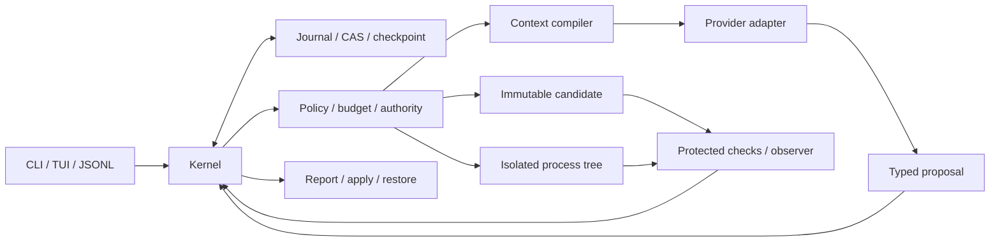

# Viber üretim tamamlama planı

Yetkili sözleşme: [PRD 1.1](../prd.md). Plan sürümü: 2, 8 Ekim 2026. Başlangıç: 0.4.0-dev / `3ddf650`. Bu plan PRD'nin kapsamını veya kabul ölçütlerini daraltmaz.

## Tamamlanma sözleşmesi

İlk kararlı sürüm A–D kapsamıdır. "%100" aşağıdaki koşulların birlikte sağlanmasıdır: kapsam içindeki her FR/NFR için çalışan davranış ve gözlenmiş kabul kanıtı; §28'deki ilgili tüm kritik fixture'larda PASS; gerçek backend/provider/platform conformance; restore/migration/delete kabulü; bağımsız ürün eval'i; kurulabilir, doğrulanabilir release paketi ve pilot kabulü. Test sayısı, kod miktarı ve modelin başarı beyanı ilerleme yüzdesi değildir.

E–G ayrı deneylerdir; A–D release'ini engelleyen ek ürün kapsamı değildir. Bununla birlikte deney kapalıyken de eski yetki, global bütçe, izinsiz egress, plugin metadata erişimi ve yanlış VERIFIED engellenir. Deney açılırsa kendi matrisi zorunludur. FR-33'ün B'deki tek writer plan/dependency sözleşmesi ve FR-38'in D'deki sınırlı extension sözleşmesi ilk sürüme dahildir.

Kullanıcı gerçek inference kabulünü şimdilik erteledi. Offline vector/loopback/fixture geliştirme devam eder; OpenAI, Anthropic ve local endpoint gerçek kabulü `DEFERRED_REAL_ACCEPTANCE` olarak kalır. Credential, signing identity, native platform ve 5–10 kullanıcı pilotu gerektiren kabulü kodla veya fixture ile geçmiş göstermeyeceğiz.

Her işin Definition of Done'u: sürümlü contract ve hata davranışı; gerçek komut/akışa bağlanmış kod; olumlu ve saldırgan fixture; crash/recovery etkisi; mevcut kullanıcı verisinin korunması; doğru docs/doctor/capability çıktısı; uygulanmış doğrulama kanıtı; yalnız görev değişikliklerini içeren commit. Mock bir OS sınırının kanıtı değildir. SKIP, UNKNOWN, NOT_IMPLEMENTED ve DEFERRED, PASS sayılmaz.

## Şu an çalışan temel

Durable offline agent; ham niyet/source span; native Git index/dirty capture; exact-byte immutable candidate/CAS; strict JSON; read/list/search paging; zorunlu context preflight ve request manifest; intent/reserve/receipt ve UNKNOWN bloklama; tek owner OS lock; peer-auth yerel IPC; aktif pause/cancel; durable steering ve bound scope revision; scoped one-shot respond; tarihsel replay; exact changeset export; SQLite snapshot backup ve fresh store restore.

Bunlar geliştirme profilidir. Korunan check origin/closure, tam process fencing, global ledger/control reserve, live apply/restore, retention/delete/migration, gerçek provider runtime/streaming, compaction, supervisor/TUI ve bağımsız release eval'i tamamlanmadığı için A, B ve stable kapıları kapalıdır. Başlangıç kanıtı: Windows 197 PASS / 2 SKIP; Linux vet/race PASS; Darwin cross-compile (native çalıştırma değildir).

## Mimari ve sınırlar

Tek Go core; kernel/store/gate/adapter/backend trusted, repo/model/tool/test çıktıları untrusted. Tek metadata owner SQLite WAL/FULL ve CAS kullanır; store kaynak dizinin dışında kullanıcı ACL'iyle korunur. CLI/TUI ve plugin DB'ye doğrudan yazamaz. Untrusted process yalnız ayrıca doğrulanmış Linux backend içinde çalışır; unsupported ortam host shell'e düşmez.

Authority her dispatch ve publish sınırında spec, epoch, generation, task, environment ve candidate'a bağlanır. Store lock process fencing yerine geçmez. Immutable manifest OS isolation yerine geçmez. Quality, fulfillment ve terminal outcome ayrı hesaplanır. UNKNOWN dış etki veya charge kör tekrar edilmez. Terminal resume yeni attempt üretir; tarihsel sonuç yeniden yazılmaz.

## Bağımlılığa göre kodlama sırası

Paketlerin mevcut parçaları yeniden yazılmayacak; aşağıdaki eksikler aynı contract altında tamamlanacak. Sıra takvim tahmini değildir. Her satırdaki kabul kapanmadan capability varsayılan olarak açılmaz.

| İş | PRD paketi / bağımlılık | Somut teslim ve kabul |
|---|---|---|
| P01 | A1/A5; mevcut temel | Eksik operation/effect/check/environment/receipt/plan/checkpoint schemas; compatibility vectors; ADR 001–013 karar eşlemesi; test fixture kimlik kataloğu. Unknown version ve bozuk authority fail-closed. |
| P02 | B5 origin; B4 | **İlk kodlama:** mutation öncesi operator check planı, exact check/helper/config/fixture closure ve absent/tree kapsamı; CAS/journal'a bağlı origin; test/discovery zayıflatma guard'ı; frozen check-set binding. Repo baseline bağımsız observer sayılmaz; tanımsız closure UNKNOWN. |
| P03 | A3/B2/B3; P01 | Backend capability/version floor; gerçek mount source identity; readonly source/check closure; ayrı scratch; nonroot, FS/network/credential/resource sınırı; process start identity ve owner epoch/generation fencing; orphan keşfi/drain. Native unsupported açık block. |
| P04 | B1; P01 | Quota/low-watermark ve ayrılmış kontrol alanı; migration intent/version/backup/commit/recovery; minimum payload envelope ayrımı; deletion/tombstone watermark; task-scoped reachability ve GC; restore eski silinmiş scope'u diriltemez. |
| P05 | B3; P03/P04 | Store transaction içinde global reserve/settle/release; bounded control reserve; parent/child allocation; price/version/usage lineage; duplicate settlement; UNKNOWN usage/effect reconciliation; monotonic clock domain/reboot uzlaşması. |
| P06 | B4/FR-33; P03–P05 | Native tools read/write-set ve negative coverage; prepare/apply/freeze transaction; baseline/candidate env/dependency records; tek writer plan/dependency graph; generated output genişleme reddi; pending writer freeze engeli. |
| P07 | B5; P02/P03/P06 | Trusted runner result protocol, discovery/executed/selected/skipped contracts; baseline failure provenance; V0–V5 check selection; independent protected observer/scoped human acceptance; flaky tüm attempts; current receipt admissibility; goal coverage review. Fake stdout/exit 0 VERIFIED üretemez. |
| P08 | B7/D4; P04/P06/P07 | Target/repo mutex ve exclusive-access capability; exact preimage checks; file-by-file apply intent/receipt/crash reconciliation; conservative three-way conflict; scoped restore; merged bytes yeni candidate olarak yeniden verification. Unsupported filesystem fail-closed. |
| P09 | A4/D1; P01/P03/P05 | Responses/Messages/Ollama streaming adapters; partial call asla dispatch edilmez; refusal/rate/auth/cancel/timeout/usage/continuation; no redirect/proxy/fallback leakage; credential OS handle; real endpoint kabulü ayrıca. |
| P10 | B6; P05–P09 | Fixture ve gerçek adapter ortak agent loop; scoping/goal criteria/check origin → plan → tools → freeze → check → report; no-op/analysis artifact; fresh attempt terminal resume; kill–user edit–resume; scoped requests/respond. |
| P11 | C1/C2; P04/P10 | Provider token/capability profile; bounded mandatory slots + sensitivity hard filters; stable prefix/cache metadata; typed checkpoints/work intervals; exact hydration/history pin/page; inclusion reasons; unavailable payload explicit. |
| P12 | C3/C4; P07/P11 | Narrative compaction verifier authoritative constraints'e dokunamaz; compaction cost/reservation; lock/config/env/absence/listing dependency invalidation; watcher loss direct-read fallback; paired continuation eval. |
| P13 | C5; P09/P12 | Model/privacy lock; complete tool boundary switch; provider opaque state taşınmaz; tokenizer/capability/context yeniden compile; affected receipts current admissibility; pin/page/context why API. |
| P14 | D3; P03/P10/P13 | Background supervisor lifecycle; secure attach/detach; persistent command/event cursor handshake; bounded slow/disconnected clients; retained replay/gap-resync; multiple tasks tek metadata writer; target mutex ve orphan cleanup. |
| P15 | D2/D4; P08/P13/P14 | TUI composer, @file, slash, prompt queue, status/diff/why/request; durable steering barrier; control/delivery UX; escaped OSC/output; resize/keyboard/large logs; crash'te UI kaybı task kaybı olmaz. |
| P16 | D5/FR-38; P04/P09/P14 | User/system/repo config authority intersection; onboarding/doctor support matrix; bağımsız inference/telemetry/training/retention axes; secret-safe preview/export/support bundle; derived deletion; version-pinned tool/extension boundary ve annotation yalnız hint. |
| P17 | D6; P06/P12/P16 | TS/JS/Python source-bound outline/symbol extraction; path/byte spans/freshness/coverage; unsupported syntax lexical fallback; external parser/LSP sandbox; source/index sensitivity korunur. |
| P18 | A5/C/D7; P07/P10–P17 | Reproducible repo/fault/adversarial cohorts; independent evaluator; solution/control denominator ve tüm attempts cost; preregistered uncertainty/holdout/paired ablations; reference performance manifest; correctness önce. |
| P19 | D7; P18 ve bütün A–D | Windows/Linux/macOS native smoke; Linux backend gerçek conformance; install/update/downgrade/restore; reproducible build/SBOM/license/secret/vulnerability/checksum/signature; offline installed smoke; 5–10 user pilot ve rework; capability manifest/rollback/runbook. |
| P20 | Release; P01–P19 | Exact source revision/PRD/schema/policy/backend/adapter/platform'a bağlı release evidence bundle; bütün mandatory gates PASS; hard-stop yok; bağımsız review; version tag/package promotion. İncomplete/skip/deferred varsa CLOSED. |

P02, P03 ve P04 farklı eksikleri kapatır; bütünlük kontrolü olmayan check result'a veya deletion watermark'sız backup'a güçlü kabul verilmez. P09'un offline geliştirilebilir kısmı kullanıcı tercihine uygun ilerler; gerçek kabul P20'ye taşınmış bir engel olarak görünür kalır. TUI/retrieval optimizasyonu güven zincirini atlatmaz.

## Gereksinim → teslim → kanıt

Bu tablo PRD §8'in tamamını kapsar. Birden fazla işe bağlanan gereksinim, bütün bağlar kapanınca DONE olur. Örneğin read-only test tek başına FR-07'yi, backup testi tek başına FR-26'yı kapatmaz.

| Gereksinim | İşler | Beklenen kanıt |
|---|---|---|
| FR-01 | P01/P02/P10 | Raw input bütünlüğü, source-bound criteria/revision ve goal omissions |
| FR-02 | P01/P04/P14 | Pure reducer/replay/command dedup; tek metadata owner |
| FR-03/04/05 | P06/P08 | Dirty/staged/untracked/index korunur; immutable manifest; stale/phantom/read-set |
| FR-06 | P04/P05/P10 | Durable intent/receipt, crash matrix ve UNKNOWN reconciliation |
| FR-07/08 | P03/P05/P16 | Gerçek process-tree OS sınırı, scoped approvals, epoch fencing |
| FR-09 | P05 | Concurrent global reserve, settlement/double charge/control reserve |
| FR-10 | P06/P11 | Exact-byte range/lexical/path paging ve known_absent scope |
| FR-11 | P02/P07/P08/P18 | Protected origin/receipt, independent eval ve ayrı fulfillment |
| FR-12 | P10/P14 | Tam CLI/JSONL lifecycle/exit/cursor protocol |
| FR-13 | P04/P11 | Typed checkpoint/reducer equality, unavailable historical payload |
| FR-14/15/16/17 | P11/P12/P13 | Token preflight/filter, compaction safety, env invalidation, inclusion reasons |
| FR-18 | P09/P13/P16 | Privacy/model lock ve safe switch/continuation |
| FR-19/20 | P03/P10/P15 | Durable steering race; review/guided/auto ve ayrı isolation |
| FR-21 | P08/P15 | Apply/restore receipt ve kullanıcı editleri korunur |
| FR-22 | P15 | TUI/@file/slash/composer/diff/status human acceptance |
| FR-23 | P16/P19 | Install/onboarding/doctor actual support matrix |
| FR-24 | P09/P19 | İki remote + bir local gerçek conformance; deferred kabul PASS değil |
| FR-25 | P14 | Peer-auth IPC, supervisor, detach/attach ve gap/resync |
| FR-26 | P04/P16 | Retention/delete/export; managed-copy purge; eski backup watermark |
| FR-27 | P17 | TS/JS/Python source-bound outline/fallback |
| FR-28/29/30/31/32 | E1–E6, P18 altyapısı | Ayrı experimental graph/history/semantic/trace/generation eval kapıları |
| FR-33 | P06, F1/F2 | B tek writer typed plan/dependency; F ayrı mutex/integration |
| FR-34/35/36/37 | F1–F4 | Experimental leases/global budget/routing/external worker kabulü |
| FR-38 | P16, G3 | D sınırlı extension authority; G ayrı MCP/team scope |
| FR-39/40/41/42 | G1–G4 | Skill/rule lineage, shadow/rollback, consent/license, tenant/auth |
| NFR-01 | P03/P04/P06/P08/P19 | Fault injection'da veri kaybı/yanlış publish yok |
| NFR-02 | P03/P05/P14 | Dispatch/publish fencing, clock-domain, stale authority reddi |
| NFR-03 | P02/P07/P08/P18 | Eksik/unknown/wrong-candidate ile false VERIFIED yok |
| NFR-04 | P05/P09/P10/P14 | Provider/ortam failure ve restart recovery |
| NFR-05 | P03/P09/P16 | Her profile egress gate; offline tüm remote egress kapalı |
| NFR-06 | P04/P05/P11/P14/P15 | Bounded disk/log/context/UI ve control reserve |
| NFR-07 | P01/P04/P19 | Pinned schema/reducer/migration, restore-tested backup |
| NFR-08 | P18/P19 | Reference machine/cache/repo manifest ile warm CLI/context p95 |
| NFR-09 | P03/P11/P16/P17 | Source/index/derived memory sensitivity ve unauthorized access reddi |
| NFR-10 | P01/P10/P14/P19 | Sürümlü JSONL/cursor/retention-gap/exit compatibility |
| NFR-11 | P04/P16 | Telemetry/training OFF, secret-safe export ve deletion lineage |
| NFR-12 | P12/P13/P17/P18 | Controlled ablation, holdout/uncertainty ve tüm denemelerin maliyeti |

E/F/G sırası PRD §26.1: E1 resolver → E2 graph/impact → E3 cutoff history → E4 scoped semantic → E5 rerank/trace → E6 generation cohort; F1 read workers → F2 writer integration → F3 routing → F4 opaque external adapter; G1 skills → G2 offline policy → G3 team/remote → G4 opt-in datasets. Her deney preregistered adoption, feature flag ve rollback ile değerlendirilir.

## Kalıcı kabul fixture aileleri

[Release gate kaydı](RELEASE_GATES.md) gözlenmiş durumu taşır. Test kimlikleri `Fxx/<case>` biçiminde sabitlenir; her kanıt source revision, command, OS/backend/provider/profile ve observed result içerir. Her aile için en az aşağıdaki davranış kapatılır; yalnız başarılı yol yeterli değildir.

| Aile | Sorumlu işler | Zorunlu davranış |
|---|---|---|
| F01/F02 | P04/P05/P06/P08/P09 | First-write crash; effect/response loss; no partial publish/blind retry |
| F03/F04/F05 | P06/P07/P08/P12 | Candidate edit/lockfile/read sonrası user edit eski kanıtı geçersiz kılar |
| F06/F07/F08 | P03/P05/P10/P14 | Steering queued dispatch, stale worker, aynı bütçeye concurrent reserve |
| F09/F10/F11 | P03/P19 | Sibling/symlink/junction/case/network/external-file OS escape |
| F12/F13 | P02/P07 | Fake PASS/zero discovery/check reduction admissible başarı üretemez |
| F14/F15/F16/F17 | P06/P09/P11/P12 | Corrupt index/watch loss, incomplete stream, overflow, bad compaction |
| F18/F19 | P03/P09/P16 | Privacy fallback ve plugin metadata access reddedilir |
| F20/F21/F22/F23/F24 | P04/P08/P14/P16 | Disk/blob/migration failure; two owners; restore conflict; cursor disconnect; no telemetry |
| F25/F26/F27/F28 | P02/P03/P07/P08/P11/P16 | Optimizations OFF guards; preverification weakening; transient source write; delivery conflict/unknown |
| F29/F30/F31/F32/F33 | P03/P05/P10/P14 | Reboot/clock/generation; alias mutex; live child/shared cache; stale respond/dedup; control reserve |
| F34/F35/F36/F37/F38 | P04/P07/P11/P16/P18 | Delete/backup revival; multi-task sequences/checkpoint; raw intent/no-op; independent verdict; Git/OSC/secret egress |

Ek sabit kimlikler: X01 known_absent vs not_found; X02 external check closure edit; X03 denied provider server tool; X04 repository config escalation; X05 migration backup restore; X06 unexpected generated writes; X07 flaky all-attempt result; X08 unsupported backend; X09 model switch privacy/continuation; X10 post-verification candidate edit. Her biri ilgili işin DoD'sine dahildir.

## Test ve kanıt üretme akışı

1. Değişen contract'ın package tests'i ve saldırgan fixture'ı; uygun gerçek OS/backend sınırı testi. Low-impact docs için aynasını test olarak yazmayız.
2. `scripts/check.ps1`: formatting, module integrity, vet, bütün Go tests, native Windows build/doctor. Linux pinned container: vet/race/fuzz; macOS native CI. Cross-compile ayrı `COMPILE_ONLY` kanıtıdır.
3. `scripts/offline-demo.ps1`: fixture → candidate → sınırlı UNVERIFIED teslim → export → backup → restore → replay; source/index aynı kalır. Offline sonucu VERIFIED sayılmaz.
4. P03 suite: nonroot/rootless/readonly/mount identity/resource/egress/child/orphan/fencing; P04/P08 suite: disk, CAS, journal, migration, deletion, first-write crash ve restore conflict injection.
5. P09 suite: recorded protocols + loopback hostile responses; opt-in gerçek two-remote/local conformance ayrı run ve credential-safe evidence. Bu aşama kullanıcı tercihiyle ertelenmiştir.
6. P18: bağımsız solution/control cohorts, preregistered budget/versions/holdout ve uncertainty; all attempts ve safe handling ayrı payda. Modelin final etiketi score değildir.
7. P19/P20: clean install/upgrade/restore, OS/backend matrix, artifact checksums/signature/SBOM, pilot, release evidence bundle. Kaynak veya profile değişirse ilgili kanıt yeniden üretilir.

P18 adoption protokolü PRD §5/§27'yi uygular: başlangıç %95 belirsizlik yöntemi, eşleştirilmiş task/run ve repo kümelenmesi holdout açılmadan kaydedilir. Varsayılan özellik hedefi başarı farkının alt güven sınırı en az +5 yüzde puanı; veya en az -2 puan ve toplam maliyet oranının üst sınırı en fazla 0,80'dir. Bunlar ölçülmüş sonuç değildir. Latency/rework non-regression ve safety hard-stop ayrıca geçmelidir. Başlangıç 120 görev/karar cohort'unda üç tekrar öneridir; çözüm/control ayrı, unsupported/timeout atanmış çözüm paydasında, en iyi run seçimi yasaktır. Zorunlu ayırt edici demo: multi-file mutation → kill → user edit → izinli farklı modelle resume → stale proposal reddi → intent korunarak current candidate verification/delivery. Reference machine/cache/repo tanımı olmadan p95<1s CLI ve p95<250ms context hedefi başarı beyanı değildir.

Her milestone sonunda [VALIDATION.md](VALIDATION.md), [RELEASE_GATES.md](RELEASE_GATES.md), doctor ve [DEVELOPMENT.md](DEVELOPMENT.md) gerçek duruma güncellenir; uygun doğrulamadan sonra origin/main'e commit/push. Kullanıcıya ait unrelated deletions ve secrets dahil edilmez.

## Release hard-stop ve işletim

Kullanıcı dosyası kaybı, stale authority admission, policy bypass, false VERIFIED, unknown effect blind retry, required criterion silinmesi, privacy fallback veya inconsistent checkpoint sonucu varsa rollout durur; benchmark bu engeli kaldırmaz. Control command 0 task success değildir; run/resume 0 yalnız FINISHED + VERIFIED + SATISFIED + sıfır açık required obligation.

Release bundle şunları birlikte bağlar: exact revision; PRD/gate policy version; schema/reducer/IPC/provider/backend versions; required fixture sonuçları (SKIP dahil); supported/unsupported capability matrix; native install/upgrade/restore kanıtı; bağımsız eval ve all-attempt costs; SBOM/licenses/checksum/signature; migration/downgrade ve known residual risks; pilot rework/latency. Onay/secret/harici kabul bekleyen her koşul açık kalır; metadata'ya elle "ready=true" yazmak acceptance değildir.

İşletim runbook'u: owner/process orphan uzlaşması; UNKNOWN operation reconcile; disk low-watermark stop/control reserve; bozuk store karantinası ve doğrulanmış fresh restore; migration recovery; scoped target conflict/restore; deletion/purge status; credential rotation; destek bundle preview/redaction; active task'ta upgrade durdurma. Telemetry ve training varsayılan OFF; hiçbir hata host execution veya remote inference fallback açmaz.

Bu oturumun 0.5.0-dev teslimi: P02 mutation öncesi typed origin/explicit file-tree-absence closure, guarded proposal/review, recovery/backup/restore kontrolü, frozen binding ve honest capability özeti; P03 exact Docker source/image/argv/namespace/scratch binding. Windows 260 PASS/2 SKIP, Linux vet/race PASS, Darwin COMPILE_ONLY, offline demo PASS. P02/P03 hâlâ PARTIAL: authoritative check revision, closure review, trusted discovery/result/observer ve full OS fencing/escape matrisi açık. P04 store lifecycle/control reserve ile P03/P07 güven zinciri sonraki kritik işlerdir. Tüm işler ve kabul kanıtları kapanana kadar uygulama prod-ready ilan edilmeyecek.
0.6.0-dev devam teslimi: P04 explicit v1→v2 migration; current schema/format lineage; full backup'ın actual fresh restore preflight'i; immutable intent/transaction/completion; pending read-only/no-generation-bump; aynı command ID ile commit reconciliation; eski/yeni full restore. Historical checkpoint'ler journal'a karşı denetlenir; DB/WAL/SHM/lock single-link preflight'i ortak fileguard lock'u kullanır. P04 tamamlanmadı: fiziksel control reserve, kota/retention/deletion/tombstone/GC ve tam power-loss/upgrade matrisi sonraki zorunlu dilimlerdir. P03/P07 trust chain, P05 global budget, P09 streaming/real loop, P14/P15 supervisor/TUI ve P18/P19 release acceptance açık kalır. Ölçülen güncel testler [VALIDATION](VALIDATION.md)'da; %100 veya prod-ready beyanı yoktur.
0.7.0-dev anahtarsız teslim: P06/FR-33 B typed node/input-output/read-write/criterion/check/mutex metadata ve DEPENDS_ON DAG; deterministic single-active-node model tools, pending-node final block, IMPLEMENTED/quality ayrımı, bound CAS output ve revision/restore closure. P09/P10 declared-local Ollama CLI aynı intent/usage/tool/recovery loop'una bağlıdır; fresh inference authority, canonical num_ctx/num_predict, overflow-before-dispatch, unknown retention ve loopback acceptance vardır. P05 immutable store-wide token limits, transaction-atomic reserve, multi-task admission, dedup/observed settle/overage, raw receipt lineage, unknown cancel/restart/fresh restore ve budget IPC/CLI eklenmiştir. Bu alt dilimler üst work package'leri DONE yapmaz. Tam backlog [KEYLESS_PROGRESS](KEYLESS_PROGRESS.md) ve kabul sınırları [VALIDATION](VALIDATION.md) içinde açık kalır.

0.8.0-dev devam: Registered check runtime + check_run/check_output + candidate-bound retained receipts, bounded completion repairs, analysis/no-change artifact ve explicit fresh attempt kodlandı. Context why/page, TS/JS/Python lexical outline ve owner observation uçları bağlandı. Official SIWC account login/profile/JWT/PKCE/rotation/revoke, exact account stateless SSE/runtime ve full published output ceiling reservation; OpenAI/Anthropic API-key CLI/env handle wiring eklendi. Kernel no-dispatch zero settlement gerçek gönderilmiş UNKNOWN’dan ayrıdır. Bu alt dilimler tam trust/sandbox/delete/apply/compaction/supervisor/TUI/eval paketlerini kapatmaz. Keyless remaining ve credential/external acceptance ayrımı [KEYLESS_PROGRESS](KEYLESS_PROGRESS.md); trust decisions [ADR 0009](adr/0009-checks-completion-and-plan-auth.md). Prod-ready veya %100 beyanı yoktur.

0.8 ek doğrulama dilimi: API/local explicit SSE/NDJSON streaming, ordered partial-tool assembly, same-profile opaque continuation, cumulative/cache accounting ve bounded terminal-only dispatch; real loopback cancellation/partial receipt → UNKNOWN retention → fresh restore/no retry. Generic source/Git/candidate sınırı credential/temp names’i tracked olsa da dışlar. Bunlar full P09/P11/P16 kabulü değildir; broad profile/real endpoint/semantic privacy/live UI/recovery kapıları açıktır.

0.9.0-dev devam: source-bound archive compaction/human history paging/opaque-free model hydration, exact pins, locked-provider safe switch ve historical charge profiles eklendi. Conservative multi-resource ledger ve versioned operator price catalog token hesabıyla transaction-atomic; physical allocated control reserve/low watermark/archive work disk quota bağlıdır. Kullanıcının current UNKNOWN model riskini bütün upper bound'u charge ederek, output kabul etmeden kapattığı bound command eklendi; native UNKNOWN için bu yol yasaktır. Tam aile kabulü/production iddiası yok; yürütme kapsamı KEYLESS_EXECUTION_PLAN ve ADR 0010'da izlenir.
