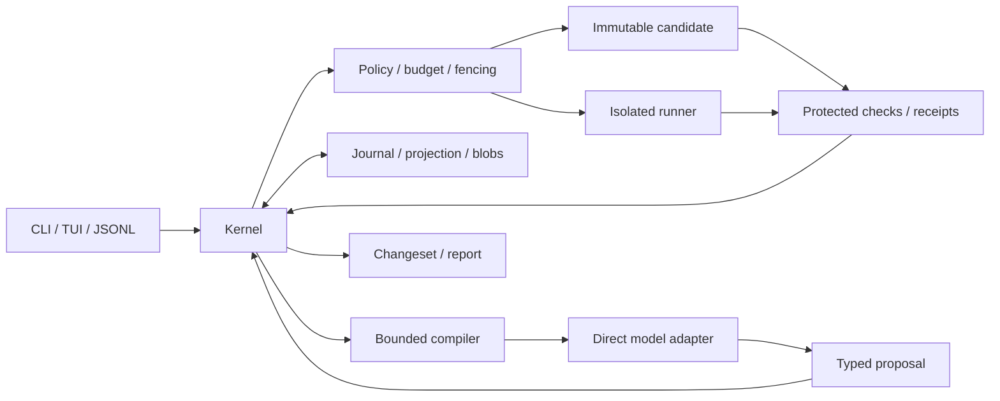

# Viber uygulama planı

Yetkili sözleşme: [PRD 1.1](../prd.md). Tarih: 7 Ekim 2026. Bu plan PRD'yi değiştirmez.

## Hedef ve dürüst teslim sınırı

İlk kararlı ürün A–D kapsamıdır. E–G ölçümle açılan deneylerdir. Üretime hazır kabulü kod yüzdesi değildir: bütün zorunlu güvenlik/veri/verification testleri, platform/provider conformance, restore, paketleme ve kullanıcı kabul kanıtları gerekir.

Başlangıç checkout'u yalnız PRD içeriyordu. İlk dilim engineering CLI, sözleşmeler, saf reducer, policy, context preflight, snapshot/proposal spike, konservatif verification predicate ve SQLite journal temeli kurar. Gerçek coding agent, sandbox, provider, apply/restore ve TUI henüz teslim edilmez. A çıkış kapısı kapalıdır; B preview ve kararlı sürüm yayımlanamaz.

## Mimari

Tek Go core, modüler monolith, untrusted execution ayrı Linux backend. SQLite metadata, exact-byte SHA-256, repository dışında user ACL'li store. Model/retriever/UI doğrudan store veya live workspace yazamaz.

Bağımlılıklar: contracts ← kernel/policy/context/workspace/verify; store → contracts + saf kernel; cli birleştirir. Workspace ayrılığı OS izolasyonu değildir. SQLite dış etkiyi atomik yapmaz. Store owner, candidate writer ve target mutex ayrıdır.

| Modül | İlk dilim | Sonraki teslim |
|---|---|---|
| contracts | Typed spec/event/proposal/receipt, strict JSON, canonical v1 digest | Tam PRD schemas/export/migration |
| kernel | Saf lifecycle, sequence/replay, input barrier | Owner command API/scheduler/attempt recovery |
| store | OS lock, WAL/FULL journal, event+projection transaction, command dedup/checkpoint | Blobs/ACL/backup/retention/deletion/migration |
| workspace | Bounded exact-byte snapshot; negative read-set; immutable preview | Git index/common-dir, materialization, patch journal, apply/restore |
| policy | Restriction intersection, effect/epoch/generation/egress gate | Scoped approval, broker, target/handle enforcement |
| context | Mandatory preflight ve optional bounded packing | Provider tokenizer/protocol blocks/manifest/compaction |
| verify | Conservative receipt guards; quality/fulfillment ayrımı | Protected OS runner/observer/artifact integrity |
| cli | doctor/snapshot/proposal-check/version | run/status/diff/pause/resume/requests/respond/JSONL/TUI |
| runner/models/repo/supervisor/eval | Explicit backlog | A3/A4/B/D acceptance ile açılır |

## Paket sırası ve kabul

Her paket: contract → smallest vertical behavior → adversarial fixture → doğrulama → gerçek capability → reviewable commit. Mock, OS assurance değildir. Eksik capability UNSUPPORTED_CAPABILITY; eksik release fixture NOT_IMPLEMENTED. Test adı varlığı PASS sayılmaz.

| Paket | Bağımlılık | Çıktı | Kabul |
|---|---|---|---|
| A1 | — | IDs/types/command/event/result/schema; canonical v1 | Unknown/duplicate/version/null/order/CRLF ve compatibility vectors |
| A2 | A1 | Dirty/staged/untracked capture; immutable copy; read/listing/absence; proposal | User edit/stale/phantom/CRLF/mode/symlink/case; no host mutation/index loss |
| A3 | A1 | Linux non-root/rootless FS/network/credential/process/quota backend | Child escape, DNS/IPv6/redirect/socket/metadata egress, cancel/drain, read-only source |
| A4 | A1 | OpenAI Responses + Anthropic Messages + local Ollama canonical loop | Call ID/result, partial JSON/cancel/timeout/usage/continuation; server tools OFF |
| A5 | A2–A4 | Go ADR, deterministic repos/fake model/fault runner/eval manifest | Reproducible spike artifacts ve measured backend floor |
| B1 | A1/A5 | Owner, journal/projection, blobs, backup/migration/retention/delete | §28 1/2/20/30/34/35; fresh restore, tombstones, integrity |
| B2 | B1/A3 | Secure IPC, state, input barrier, epoch/generation/fencing/privacy | §28 6/18/21/25/30/32/38; owner loss ve repo escalation reddi |
| B3 | B2 | Atomik reserve/settle/control reserve; intent/receipt/reconcile | §28 2/7/8/29/31/33; unknown usage retained; no blind retry |
| B4 | B1–B3/A2 | fs/list/read/search, receipts, candidate prepare/apply/freeze | §28 1/4/5/10/14; phantom, unexpected write, partial recovery |
| B5 | B4 | Protected origin/closure, read-only verify, quality/fulfillment | §28 3/12/13/26/27/28/31/36; forged stdout/zero test/wrong candidate denied |
| B6 | B1–B5/A4 | Agent loop; run/status/diff/pause/resume/cancel/inspect/requests/respond | §28 15/16/17/23/25/32; kill→user edit→resume→stale reject→fresh verify |
| B7 | B4/B6 | Changeset/report; conservative apply/restore | §28 5/22/28; three-way merge/new verify; unrelated data untouched |
| C1 | B6 | Compiler/manifest/filter/preflight/stable prefix | Required constraints/protocol blocks, exact hydrate, no silent truncate |
| C2 | B1/B6 | Typed checkpoint/work interval/history paging | Replay equality; missing payload unavailable |
| C3 | C1/C2 | Narrative compaction + verifier | Paired continuation; typed state unchanged; bad summary rejected |
| C4 | B4/C1 | Dependency/env/negative-scope invalidation | Lock/config/absence/watch loss; historical != current |
| C5 | C1–C4/A4 | Safe model switch/pin/page/explain | Privacy lock, complete boundary, cross-provider continuation removed |
| D1 | C5/A4 | Two remote + local production adapters | Auth/rate/refusal/timeout/privacy, OS key handles, real smoke |
| D2 | B6/C5 | TUI/composer/@file/slash/steering/queue | Durable barrier, OSC escaping, Ctrl+C pause, unknown visible |
| D3 | D2/B2 | Supervisor/peer-auth IPC/detach/attach/cursor/backpressure | Two owners, orphan drain, retained replay, gap/resync |
| D4 | B7/D2 | Apply/restore diff/conflict UX | User preservation, target divergence, receipt binding |
| D5 | B1/D1 | Doctor/config/retention/export/delete/offline | All egress axes, inherited sensitivity, derived/backup deletion watermark |
| D6 | B4/C4 | TS/JS/Python outline/symbol, lexical fallback | Source-bound extractor, explicit unknown coverage, no host LSP |
| D7 | D1–D6 | Platform binaries/signatures/SBOM/install/upgrade/pilot | Full A–D matrix, restore/migration/OS smoke, independent eval |

A3/A4 kapanmadan temel modüller geliştirilebilir; B kullanılabilir sayılmaz. İlk dikey demo fake model ile deterministik; gerçek provider aynı sözleşmeye bağlanır. B6/B7 kritik yolundan önce graph/router/paralellik optimizasyonu yapılmaz.

E1–E6: symbol resolver → resolved graph → cutoff history → semantic → reranker/runtime trace → blueprint generation eval. F1–F4: read-only leases → isolated writer integration → measured routing → external CLI worker. G1–G4: skills → offline optimization → team/remote → ayrı opt-in training export. PRD §26.1 bağımlılıkları, feature flag, uncertainty ve rollback her paket için zorunlu.

## Transaction ve recovery

1. OS store lock + yeni generation; eski backend process quiescence/fencing. Lock tek başına process authority değildir.
2. Silinebilir input blob durable publish; event+projection aynı SQLite transaction. Global store_seq, task task_seq; checksum zinciri ve payload kontrolü.
3. INTENDED→ADMITTED immutable args/spec/base/env/check/epoch/generation/reservation; dispatch/write/publish boundary yeniden kontrol.
4. Before/after blobs + patch prepare journal. Crash partial changeset olarak reconcile; broad reset/rollback yok.
5. Writer/process quiescence, frozen manifest; source/check closure OS read-only; attempt scratch ayrı; protected runner result channel.
6. Candidate/spec/check/env/policy bağıyla admissible receipt; quality ayrıca, fulfillment ayrıca.
7. Dış delivery kesin receipt sonrası report+fulfillment+terminal outcome aynı metadata transaction.
8. Replay yan etkisiz; unknown response query/idempotency/scoped karar olmadan tekrar edilmez. Unknown provider charge rezervasyonunu sıfırlamaz.

## Security ve privacy

TCB kernel/store/gate/adapter/backend/protected runner. Repo/model/test/build/install/Git helper/plugin/MCP/output untrusted. Network default deny; telemetry/training/cross-project OFF. Repo preferences izin genişletemez. Secret OS handle; credential alan process egress/sensitivity bağını miras alır. Git discovery bile sanitized env/config gerektirir.

Şimdiki snapshot preview BEST_EFFORT regular-file scope'tur; symlink/special/invalid path fail-closed. Hostile directory replacement için actual-handle OS enforcement henüz yoktur. Developer preview sandbox diye sunulmaz. Windows ACL, backup/delete ve blob publication conformance kapanmadan store hassas production veri için supported değildir.

## Test ve release

- PR: gofmt, go vet, tests; Linux race/fuzz; Windows/Linux/macOS build/smoke; pinned dependencies, license/secret/security scan.
- Core: legal reducer, sequence/dedup/checkpoint/corruption, stale/phantom proposal, wrong receipt, barrier/intersection.
- A: gerçek OS escape suite; recorded provider vectors ve opt-in gerçek endpoint smoke.
- B: intent/reserve/blob/first write/receipt/pointer/test/live apply/provider response sınırlarında kill injection; user data korunur.
- C: paired continuation, holdout, all-attempt costs; token azalması tek başına adoption değildir.
- D: package/install/migration/backup restore/delete watermark, pilot rework/latency, tam capability manifest.

Benchmark çözüm ve safe-handling kontrol kohortları ayrı. Aynı model/env/budget; bağımsız evaluator; repo/time holdout; %95 uncertainty önceden kayıtlı. Success alt sınır +5 puan veya en az -2 puan ve cost ratio üst sınır ≤0.80. Safety hard-stop benchmark ile gevşemez.

Version pin: toolchain/SQLite/schema/reducer/protocol/backend image/adapter/effect manifest. Migration öncesi space+backup; downgrade store'u değiştirmez. Active task'ta otomatik upgrade yok. Logs/context/artifacts quota; low-watermark yeni işi durdurur; control reserve cancel/reconcile/receipt için. Support bundle opt-in preview/redaction.

Release artifact: capability/test manifest, versions, migrations/rollback, licenses/SBOM/checksum/signature, benchmark paydaları/unknowns, residual risks. Run/resume exit 0 yalnız strict success; control command 0 task başarısı değildir.

## İlk dilimin bitişi ve sonraki iş

CLI build; doctor doğru unsupported bilgisi; exact-byte snapshot/coverage; proposal preview no host mutation; stale/phantom/scope/fencing denial; journal replay/checkpoint/dedup; missing/wrong evidence asla VERIFIED. Bunlar yalnız ilk dilimdir; A–D stable gate kapanmış sayılmaz.

Sonraki kritik işler A2 Git capture/materialization ve A3 gerçek Linux sandbox; ardından A4 provider round-trip, B1 storage hardening ve B2 owner IPC/admission. Production kabul [release kaydı](RELEASE_GATES.md) ile takip edilir.

Ölçülen ilk dilim sonuçları [doğrulama kaydında](VALIDATION.md) tutulur. Bu kayıt kararlı release kabulü değildir.
