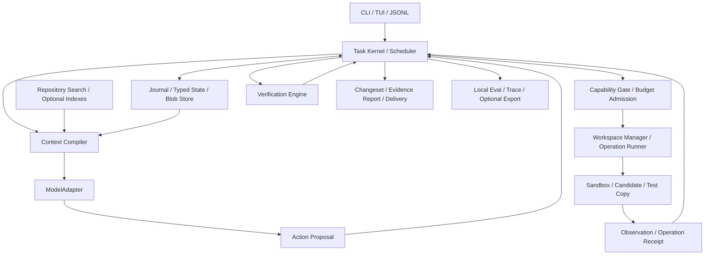

# Viber — Ürün Gereksinimleri ve Uygulama Sözleşmesi

| Alan | Değer |
|---|---|
| Belge / sürüm | `prd.md` / 1.0 |
| Tarih | 5 Ekim 2026 |
| Ürün | Modelden bağımsız, kalıcı görev durumuna sahip coding CLI ve harness |
| Depo / dal | [ixayldz/Viber](https://github.com/ixayldz/Viber) / `origin/main` |
| Durum | Kodlamaya temel olacak ürün ve mühendislik sözleşmesi; henüz çalışan uygulama veya ölçülmüş üstünlük beyanı değildir |
| Yetkili kaynak | Ürün kapsamı, mimari, UX, veri, güvenlik, kodlama fazları, eval ve release için bu belge |

Bu PRD, uygulamayı geliştirmek için diğer proje Markdown belgelerine ihtiyaç kalmayacak şekilde hazırlanmıştır. İlk vizyonun 90 bölümü, mimari tasarımın bütün sözleşmeleri, mimari incelemenin bulguları ve uygulama/eval planının bütün fazları burada birleştirilmiştir. Çelişen öneriler aşağıdaki kararlara göre çözülmüştür. Önceki belgeler tarihsel kayıttır. `AGENTS.md` depo çalışma ve Git teslim talimatlarını taşır; ayrı ürün gereksinimleri kaynağı değildir.

**ZORUNLU** uygulanacak sözleşme, **HEDEF** ölçümle sınanacak başlangıç değeri, **DENEYSEL** adoption gate geçmeden varsayılan olamayacak özelliktir. Bu belgede verilen performans ve başarı hedefleri ölçülmüş sonuç değildir.

## İçindekiler

1. [Ürün özeti ve problem](#1-ürün-özeti-ve-problem)
2. [Kullanıcılar, işler ve kapsam](#2-kullanıcılar-işler-ve-kapsam)
3. [Düzeltilen mantık hataları](#3-düzeltilen-mantık-hataları)
4. [Değişmez çekirdek kuralları](#4-değişmez-çekirdek-kuralları)
5. [Başarı ve ürün kabulü](#5-başarı-ve-ürün-kabulü)
6. [Platform ve destek matrisi](#6-platform-ve-destek-matrisi)
7. [Kullanıcı yolculukları](#7-kullanıcı-yolculukları)
8. [Gereksinim kataloğu](#8-gereksinim-kataloğu)
9. [Sistem mimarisi](#9-sistem-mimarisi)
10. [Otorite, kanıt ve güncellik](#10-otorite-kanıt-ve-güncellik)
11. [Veri modeli ve depolama](#11-veri-modeli-ve-depolama)
12. [Görev yaşam döngüsü](#12-görev-yaşam-döngüsü)
13. [Workspace ve değişiklik protokolü](#13-workspace-ve-değişiklik-protokolü)
14. [İşlemler, kesinti ve recovery](#14-işlemler-kesinti-ve-recovery)
15. [Güvenlik, yetki ve steering](#15-güvenlik-yetki-ve-steering)
16. [Context MMU, compiler ve compaction](#16-context-mmu-compiler-ve-compaction)
17. [Repository intelligence](#17-repository-intelligence)
18. [Model adapter ve routing](#18-model-adapter-ve-routing)
19. [Planlama, scheduler ve çoklu ajan](#19-planlama-scheduler-ve-çoklu-ajan)
20. [Bütçe ve watchdog](#20-bütçe-ve-watchdog)
21. [Verification ve tamamlanma](#21-verification-ve-tamamlanma)
22. [CLI, TUI ve headless API](#22-cli-tui-ve-headless-api)
23. [Yapılandırma, privacy ve eklentiler](#23-yapılandırma-privacy-ve-eklentiler)
24. [Observability, eval ve öğrenme](#24-observability-eval-ve-öğrenme)
25. [Teknoloji, paketleme ve kalite](#25-teknoloji-paketleme-ve-kalite)
26. [Bütün kodlama fazları](#26-bütün-kodlama-fazları)
27. [Benchmark protokolü ve metrikler](#27-benchmark-protokolü-ve-metrikler)
28. [Zorunlu hata ve saldırı senaryoları](#28-zorunlu-hata-ve-saldırı-senaryoları)
29. [Release, riskler ve karar kayıtları](#29-release-riskler-ve-karar-kayıtları)
30. [Tam kapsam izlenebilirliği ve kaynaklar](#30-tam-kapsam-izlenebilirliği-ve-kaynaklar)

## 1. Ürün özeti ve problem

Viber, geliştiricinin verdiği mühendislik işini sınırları belli bir çalışma ortamında yürüten, görev durumunu ve kanıtlarını kalıcı tutan, kesinti veya model değişiminden sonra mevcut gerçeklikle uzlaşarak devam eden CLI/runtime'dır. Çıktısı, neyin değiştiğini ve hangi kontrollerin hangi sürümü doğruladığını gösteren incelenebilir changeset'tir.

Kullanıcı vaadi: **Uzun kodlama işini kaldığın yerden sürdür; neyin değiştiğini ve neyin doğrulandığını bil.**

Model değiştirilebilir muhakeme motorudur. Dosya yazma, state geçişi, süreç başlatma, yetki, bütçe ve tamamlanma kernel'in kontrolündedir. Modelden bağımsızlık, bütün modellerin aynı başarıyı göstermesi değil, aynı yürütme ve doğrulama sözleşmelerinde çalışabilmesidir.

Çözülen problemler:

- Transcript'in state sayılması; eski dosya, karar ve yeni gerçeklerin karışması.
- Uzun görevde niyet, yasak, ölçüt ve başarısız denemelerin compaction sırasında kaybolması.
- Source aynıyken dependency, environment veya test tanımı değiştiğinde eski kanıta güvenilmesi.
- Yanlış ilk retrieval'ın pahalı ve tekrarlayan ajan döngüsüne dönüşmesi.
- Modelin kendi kriterini/testini zayıflatıp işi başarılı ilan etmesi.
- Worktree, shell allowlist veya prompt'un güvenlik sınırı sanılması.
- Crash sonrası gerçekleşmiş dış etkinin yanıtı kaybolduğunda kör tekrar edilmesi.
- Gereksiz büyük prompt, paralel ajan, planner, reviewer ve router maliyeti.
- Kullanıcıya incelenebilir kanıt yerine yalnız final iddia verilmesi.

Ürünün farkı aynı görev/model/ortam/bütçede daha az düzeltme, yanlış tamamlanma ve belirsizlik üretmesidir. Token hafızası veya ajan sayısı başarı ölçütü değildir.

## 2. Kullanıcılar, işler ve kapsam

### 2.1 Hedef kullanıcı ve kullanım

Birincil kullanıcı terminal/Git kullanan bireysel geliştirici veya küçük ekip üyesidir. İkincil kullanıcı JSONL üzerinden CI, IDE veya otomasyon entegrasyonu kurar. Ekip policy yöneticisi ve remote execution işletmecisi sonraki kapsamdır. İlk görev için vector database, multi-agent altyapısı veya zorunlu bulut hesabı gerekmez.

| İş türü | Ürün davranışı | Gerekli kanıt |
|---|---|---|
| Küçük açık değişiklik | Doğrudan dosya okuma ve küçük patch; hızlı yol | İstenen değişiklik ve uygun mekanik kontrol |
| Bug fix | Lokalizasyon, mümkünse reproducer, bounded repair | Önce/sonra davranış ve regresyon |
| Çok dosyalı feature | Kriterler, interface contract, dependency sırası | Davranış ve entegrasyon |
| Refactor | API/dependency etkisi ve davranış koruma | Static check, ilgili test ve risk kontrolü |
| Dependency migration | Lockfile/toolchain/uyumluluk incelemesi | Yetkili install/build/test |
| Uzun görev | Typed checkpoint, paging, steering, resume | Niyet, güncellik ve doğru final candidate |
| İnceleme/araştırma/tasarım | Salt okuma ve kaynaklı bulgu | Kaynak, kapsam ve çelişki denetimi |
| Yeni repository üretimi | Faz E deneyinde blueprint ve kademeli üretim | Yapı, build, davranış ve bağımsız kontrol |

### 2.2 Kapsam sırası

İlk kararlı ürün Faz A–D'dir: kendi agent loop'u, tek writer, doğrudan provider/local adapter, durable state, lexical/outline, izole candidate, process sandbox, bounded context, doğrulama, CLI/TUI/headless, apply/restore ve privacy.

Faz E–G geniş vizyonu tamamlar: symbol/resolved graph, semantic/history retrieval, runtime trace, reranker, kontrollü çoklu ajan, routing, external CLI workers, procedural skills, offline policy optimizasyonu, opt-in training ve ekip/remote execution. Her özellik ayrı fayda ve güvenlik kapısından geçer.

Dağıtık consensus, ajan pazaryeri, tam IDE, foundation model eğitimi, enterprise deployment platformu ve sınırsız recursive delegation ilk sürüm şartı değildir. Ürün görevin çözülebilirliğini, sonsuz doğru context'i veya sıfır halüsinasyonu garanti etmez.

## 3. Düzeltilen mantık hataları

Bu kararlar önceki fikirlerdeki çelişkilerin yerine geçer. Performans optimizasyonu bunları geri alamaz.

| ID | Sorun | Bağlayıcı düzeltme |
|---|---|---|
| D01 | Birden çok eşit source of truth | Alan bazlı otorite; index/özet türetilen görünüm |
| D02 | File SHA semantik güncellik sayılıyordu | Observation/claim ayrımı, dependency/environment fingerprint |
| D03 | Referans/confidence doğruluk sayılıyordu | Runtime provenance; yorum için admissible verification |
| D04 | DB/dosya/uzak etki tek transaction sayılıyordu | Metadata atomikliği, candidate publication ve live apply ayrı |
| D05 | Test salt okuma ve düşük risk sayılıyordu | Test/package/LSP/hook ve child process untrusted code |
| D06 | Worktree sandbox sayılıyordu | Workspace ayrılığı ile OS/process izolasyonu ayrı |
| D07 | Eksik model kriteri completion'ı onaylıyordu | Ham niyet, requirement coverage ve korunan check tanımı |
| D08 | Eski/worker PASS final sürüme taşınıyordu | Birleşim yeni frozen candidate ve doğrulama |
| D09 | Kayıp yanıt işlemin yapılmadığı sayılıyordu | Intent/attempt/receipt, UNKNOWN_OUTCOME, reconciliation |
| D10 | Steering yalnız model interrupt'ıydı | Durable input barrier, policy epoch, execution/publish fencing |
| D11 | Geçici transcript niyeti kaybettiriyordu | Ham user mesajları ve revision journal'ı kalıcı |
| D12 | Her compile yakın protokolü sıfırlıyordu | Stable prefix, yakın tool blokları, opaque continuation |
| D13 | Compaction typed state'i yeniden çıkarıyordu | Olay anında typed update; deterministik checkpoint |
| D14 | Büyük harici bellek erişim garantisi sayılıyordu | Adreslenebilir bellek, coverage ve görünür UNKNOWN |
| D15 | AST/co-change gerçek semantik ilişki sayılıyordu | Syntactic/resolved/observed/inferred edge ayrımı |
| D16 | Stale kaynak yalnız skor cezası alıyordu | Önce hard freshness/scope/sensitivity filter, sonra ranking |
| D17 | Lease'in süre/generation davranışı yoktu | Monotonic expiry, renewal, fencing, integration queue |
| D18 | Ayrı dosya yeterli paralellik sayılıyordu | Contract, lockfile/DB/port/cache mutex ve ortak bütçe |
| D19 | Model API ile external coding CLI karışıyordu | ModelAdapter ve ExternalAgentAdapter ayrı |
| D20 | Eşzamanlı çağrılar aynı bütçeyi kullanıyordu | Atomik reserve/settle/release ve belirsiz maliyet kaydı |
| D21 | Edit/evidence sayısı gerçek ilerleme sayılıyordu | Açık obligation, yeni test sinyali, tekrar fingerprint'i |
| D22 | Plugin güvenliği yalnız sözleşmeydi | Ayrı process/capability RPC; in-process plugin TCB istisnası |
| D23 | Privacy tek enum'du | Inference, provider, egress, telemetry, training, retention ayrı |
| D24 | Bütün vizyon aynı anda MVP'ydi | A–G shipping/adoption/vazgeçme kapıları |
| D25 | Eval model/bütçe/history koşulları farklıydı | Eşleştirilmiş deney, repo/zaman holdout, leakage engeli |
| D26 | Task/session/epoch UX'i karmaşıktı | UI'da görev, değişiklik, doğrulama ve karar |
| D27 | Read-set yalnız mevcut dosyaydı | Eksik path, directory listing ve glob/negative scope dahil |
| D28 | Test copy source mutation PASS'i bozmazdı | Başlangıç ve bitiş source integrity; mutation receipt'i geçersiz |
| D29 | Provider server tools gate'i atlayabiliyordu | İlk sürüm client tools; server tools eşdeğer effect/egress denetimi ister |
| D30 | Her epoch bütün testleri yeniden gerektiriyordu | Eylem fencing ile receipt policy applicability ayrı; sahte rerun yok |
| D31 | Repo config izin genişletebiliyordu | Kısıtların kesişimi; genişletme yalnız yetkili user policy |
| D32 | Çalışma sonucu ile kalite karışıyordu | Execution state, terminal outcome, quality ve exit ayrı |

Araştırma başarı oranları ürüne aktarılmaz. MCP entegrasyon protokolüdür; cache veya task store değildir. “Compatible”, “local”, “container”, “RLM” ve “verified” etiketi kendi başına garanti oluşturmaz.

## 4. Değişmez çekirdek kuralları

1. **INV-01:** Model/worker/plugin proposal üretir; kernel yürütme ve state otoritesidir.
2. **INV-02:** Ham niyet/revision kalıcıdır; requirement ve constraint source span'a bağlıdır.
3. **INV-03:** Consequential okuma/edit/check snapshot, spec ve environment'a bağlıdır.
4. **INV-04:** Eski epoch/generation ile yeni yan etki veya promotion kabul edilmez.
5. **INV-05:** Kullanıcı değişikliği sessiz overwrite, broad reset veya rollback ile silinmez.
6. **INV-06:** VERIFIED belirli criterion/scope/candidate kanıtıdır; model final metni değildir.
7. **INV-07:** Eksik kaynak/check veya kayıp dış sonuç başarı sayılmaz.
8. **INV-08:** Özet/index/memory/tool description izin veya zorunlu kriter üretmez.
9. **INV-09:** Parent/child bütün çağrılar aynı atomik bütçe ledger'ındadır.
10. **INV-10:** Inspection ve reducer replay dış eylem çalıştırmaz.
11. **INV-11:** Test edilmemiş sandbox capability varmış gibi gösterilmez; sessiz downgrade yoktur.
12. **INV-12:** Final birleşim doğrulanır; eski/worker PASS otomatik taşınmaz.
13. **INV-13:** Scope retrieval/index/model/tool/MCP/export/worker sınırlarının tümünde uygulanır.
14. **INV-14:** Retry/resume/replay farklıdır; effect class ve reconciliation gerekir.
15. **INV-15:** Eksik/corrupt artifact completion için kullanılamaz.
16. **INV-16:** Learned policy veya quality waiver kernel korumasını kapatamaz.

## 5. Başarı ve ürün kabulü

Birincil metrik önceden belirlenen bütçe/süre içinde bağımsız zorunlu kontrolleri geçen görev oranıdır. İkincil metrikler başarısız denemeler dahil çözülmüş görev başına maliyet, kullanıcı rework süresi, false VERIFIED ve recovery başarısıdır.

ZORUNLU ayırt edici demo: çok dosyalı iş başlat; mutation sınırında süreci öldür; kullanıcı arada dosya değiştirsin; başka izinli modelle resume et; eski proposal'ı reddet/yeniden temellendir; niyeti koru; güncel final candidate'ı doğru receipt'lerle teslim et. Kullanıcı editleri kaybolamaz.

HEDEF feature adoption: aynı bütçede +5 yüzde puan strict success veya en fazla -2 puan başarı kaybıyla toplam maliyette en az %20 azalma. Eşik ve cohort deney öncesi kaydedilir. Belirsizlik sonucu ayırt etmiyorsa özellik deneysel kalır. Güvenlik/veri koruma ihlali daha yüksek benchmark karşılığında kabul edilmez.

## 6. Platform ve destek matrisi

| Katman | İlk hedef | Garanti koşulu |
|---|---|---|
| CLI istemcisi | Windows, Linux, macOS | Paketleme, terminal, path, IPC ve schema testleri |
| Güçlü execution | Linux izole backend | Process tree FS/ağ/credential/quota conformance |
| Windows execution | WSL2/Linux container | Host mount, junction/case ve path mapping testleri |
| macOS execution | Linux VM/container | Mount/permission ve host erişimi testleri |
| Native Windows/macOS | Sonraki veya açık kısıtlı profil | Eşdeğer test geçmeden aynı assurance verilmez |
| Sandbox yok | Açık salt okuma/patch üretme modu | Host shell otomatik açılmaz |

CLI host'unda state/workspace koordinasyonu, sandbox'ta candidate/untrusted execution bulunur. Docker socket, kernel store, credential store ve genel home sandbox'a verilmez. Rootless/non-root, mount/namespace, process, network, seccomp/capability ve quota profili ayrıca test edilir. [Docker rootless belgesi](https://docs.docker.com/engine/security/rootless/) yalnız ilgili primitive'in kapsamını açıklar; Viber assurance'ı kendi conformance sonucudur.

İlk derin dil desteği TS/JS ve Python'dur. Diğer metin projelerinde lexical/range/patch fallback vardır; semantik coverage sınırlı gösterilir. Native Windows toolchain isteyen repo Linux backend ile tam build destekli sayılmaz.

Mevcut Git repo birincil kullanım, monorepo package boundaries destek hedefidir. Git olmayan text workspace kısıtlı, yeni repo generation deneysel kapsamdır. Submodule/LFS/sparse checkout/generated code/symlink/executable mode/CRLF/case collision capability bazında kaydedilir. Eksik capture tam snapshot diye gösterilmez. Git blob hash'i ile diskteki exact byte hash'i karıştırılmaz.

## 7. Kullanıcı yolculukları

### 7.1 Kurulum ve ilk görev

Binary açılır; provider/local endpoint ve execution profili seçilir. Remote inference'a hangi veri sınıflarının gidebileceği gösterilir. Secret repo config'e yazılmaz. Doctor Git/backend/toolchain/disk/IPC/permission/privacy'yi kontrol eder. Tam embedding/index beklemeden ilk iş başlar.

### 7.2 Küçük ve uzun işler

Küçük açık iş doğrudan read/candidate patch/uygun check ile ilerler; gereksiz planner/onay turu yoktur. Uzun işte criterion, plan slice, decision/failure/hypothesis ve obligation kalıcıdır. Kullanıcının yeni talimatı steering, queued yeni iş veya açık scope revision olarak bağlanır.

### 7.3 Kesinti ve model değişimi

Pause admission'ı durdurur ve açık operations'ı uzlaştırır. Resume checkpoint/journal, workspace, policy, environment ve budget farkını kontrol eder. Farklı provider continuation'ı taşınmaz; canonical fresh context kurulur. Retention yüzünden kaybolan veri unavailable'dır.

### 7.4 Teslim, restore ve CI

Varsayılan teslim candidate/changeset'tir. Apply yetkili policy veya explicit komutla baseline/current/candidate uzlaştırır; kullanıcı editini korur. Restore yalnız harness changeset'ini geri alma işlemidir; DB/deploy/uzak API otomatik geri alınmaz. CI aynı kernel'i kullanır; girdi/onay eksikse pending request döner, UI yokluğu approval sayılmaz.

## 8. Gereksinim kataloğu

Her gereksinim bir test/receipt veya kapsam denetimiyle kapatılır. “Kod yazıldı” DONE değildir.

| ID | Gereksinim | İlk faz |
|---|---|---|
| FR-01 | Ham input/revision ve source-bound requirement/constraint | B |
| FR-02 | Tek writer kernel, command/event API ve state machine | B |
| FR-03 | Dirty/staged/unstaged/untracked baseline ve kullanıcı koruma | A/B |
| FR-04 | İzole candidate/immutable manifest | A/B |
| FR-05 | Read receipt, read/write-set, stale patch reddi | B |
| FR-06 | Durable intent/attempt/receipt ve recovery | B |
| FR-07 | Process tree FS/ağ/credential/resource sandbox | A/B |
| FR-08 | Capability gate, scoped approval ve epoch fencing | B |
| FR-09 | Global reserve/settle/release ledger | B |
| FR-10 | Lexical/path/range ve bounded artifact paging | B |
| FR-11 | Kriter/check/receipt ve ayrı quality verdict | B |
| FR-12 | Run/status/diff/pause/resume/cancel/inspect, JSONL | B |
| FR-13 | Typed checkpoint ve deterministic replay | B/C |
| FR-14 | Context manifest, stable prefix, protocol/token rezervi | C |
| FR-15 | Dependency/environment evidence invalidation | C |
| FR-16 | Bounded compaction ve authoritative state korunması | C |
| FR-17 | Context/history pin/page ve inclusion explanation | C/D |
| FR-18 | Güvenli model switch, privacy/model lock | C |
| FR-19 | Steering ve prompt queue; durable input barrier | D |
| FR-20 | Review/guided/auto ve ayrı isolation profili | D |
| FR-21 | Apply/restore, üç yönlü conflict, delivery receipt | D |
| FR-22 | TUI, @file, slash commands, diff/status | D |
| FR-23 | Doctor/onboarding ve destek matrisi | A/D |
| FR-24 | İki remote provider ve bir local conformance | A/D |
| FR-25 | Detach/attach, secure IPC, cursor reconnect | D |
| FR-26 | Export/retention/delete ve derived veri silme | D |
| FR-27 | TS/JS/Python outline/source-bound symbols | D |
| FR-28 | AST/LSP resolved graph, coverage/freshness | E |
| FR-29 | Git history/co-change/issue memory, cutoff | E |
| FR-30 | Semantic retrieval, versioned embedding/reranker | E |
| FR-31 | Runtime trace/coverage ve muhafazakâr test selection | E |
| FR-32 | Yeni repository üretimi ve blueprint eval | E |
| FR-33 | Typed plan DAG, dependency contract ve mutex | B/F |
| FR-34 | Bounded read-only workers, isolated writers/integration | F |
| FR-35 | TTL/generation/scope bağlı AgentLease | F |
| FR-36 | Sticky/phase routing, ölçülen capability profile | F |
| FR-37 | ExternalAgentAdapter patch worker | F |
| FR-38 | MCP/tool/plugin extension, pinned sürüm/effect | D/G |
| FR-39 | Scoped/versioned/eval edilmiş procedural skills | G |
| FR-40 | Offline learned policy, shadow/canary/rollback | G |
| FR-41 | Ayrı opt-in SFT/preference/context/planner/router export | G |
| FR-42 | Team policy ve remote execution | G |
| NFR-01 | Fault injection'da veri kaybı/yanlış publish yok | A–G |
| NFR-02 | Bilinen eski yetki/binding admission yok | B–G |
| NFR-03 | Eksik check/unknown effect ile false VERIFIED yok | B–G |
| NFR-04 | Provider/plugin/ortam hatası kurtarılabilir | B–G |
| NFR-05 | Offline profilde bütün egress yolları kapalı | D–G |
| NFR-06 | Bounded log/context/UI memory ve quota | B–G |
| NFR-07 | Schema migration, version pin, restore-tested backup | B–G |
| NFR-08 | Warm CLI p95<1 s; context p95<250 ms hedefleri | D |
| NFR-09 | Yetkisiz source/index/memory metadata sızıntısı yok | C–G |
| NFR-10 | Sürümlü JSONL/cursor/exit sözleşmesi | B–G |
| NFR-11 | Default telemetry/training OFF, secret-safe export | B–G |
| NFR-12 | Kontrollü ablation ve tüm denemelerin maliyeti | C–G |

## 9. Sistem mimarisi



İlk ürün modüler monolith, untrusted yürütme ayrı process/backend'dir. UI/compiler/retriever/model adapter user workspace veya store'a yazamaz; state mutation kernel command'ıdır.

| Modül | Sorumluluk | Yetki sınırı |
|---|---|---|
| Kernel | Spec/policy, reducer, completion, command validation | LLM çıktısı otomatik authoritative değildir |
| Scheduler | Dependency/mutex/lease/admission/retry/cancel | Plan önerisi izin değildir |
| Workspace Manager | Capture/read-set/patch/freeze/apply/restore | Live çok dosyalı atomiklik vaat etmez |
| Runner | Process identity/lifecycle/timeout/output/receipt | Child process sınırı korunur |
| Capability Gate | Path/effect/egress/approval/generation | Tool description yetki değildir |
| Compiler | Bounded protocol-valid context/manifest | Zorunlu kuralı sessiz kesmez |
| Repo Intelligence | Lexical/outline/symbol/graph/history/vector | Kaynağın otoritesi değildir |
| Model Fabric | Canonical request/result/profile/routing | Tool yürütmez |
| Verification | Criterion/check/receipt/verdict | Kapsam dışı doğruluk iddia etmez |
| Store | Atomik journal/projection/blob/migration/GC | Dış dünyayı DB transaction'ına katmaz |
| Eval/Learning | Local trace/attribution/izinli adaylar | Güvenlik invariant'ı öğrenmeyle değişmez |
| Extension Host | Versioned MCP/plugin/capability RPC | Untrusted in-process kod yok |

Foreground önce gelir; detach aynı kernel'in on-demand supervisor'ını kullanır. Bir workspace/candidate için ikinci writer lock ve generation ile engellenir.

## 10. Otorite, kanıt ve güncellik

| Alan | Yetkili kaynak | Türetilen görünüm |
|---|---|---|
| Kullanıcı niyeti | Ham input ve yetkili revision | TaskSpec/plan/özet |
| Kaynak | Immutable manifest ve exact blob | AST/index/graph |
| Çalıştırma | Runner receipt/artifact | Test özeti/model yorumu |
| Görev/yetki | Journal/policy revision | UI/projection |
| Karar | Actor/scope'lu Decision | Proje hafızası |

Snapshot tarihi gerçekliği anlatır; canlı disk aynı demek değildir. Index/disk çelişkisinde exact current source kazanır. Typed spec/ham niyet çelişkisi source span ile düzeltilir; belirsiz metin yetki genişletmez. Requirement coverage raporu user goal'ün hangi kriterlerde temsil edildiğini gösterir; modelin eksiksiz yorum garantisi verilmez.

**Observation** runtime'ın dar gözlemidir: byte, exit, diagnostic, seçilmiş test. Model observation kimliğini/source bağını uydurarak authoritative yapamaz.

**Claim** yorumdur: `PROPOSED/SUPPORTED/REFUTED/UNKNOWN`; observation refs, support method ve dependency kapsamı taşır. Referans veya numeric confidence mantıksal doğruluk kanıtı değildir.

**Decision** yetkili tercihtir: actor, scope, alternatives, rationale, evidence ve reopening condition. **Hypothesis** next discriminating check'i olan açıklama; **Failure** attempted action, environment, error fingerprint, cause hypothesis ve retry condition'dır. Eski failure genel “asla yapma” prompt kuralına dönüşmez.

```text
source_integrity = INTACT | MISSING | CORRUPT
applicability    = CURRENT | STALE | UNKNOWN | HISTORICAL
```

Historical observation bozuk değil, bugüne uygulanabilirliği ayrıdır. Source SHA aynı olsa da lock/config/import/schema/env değişince davranış claim'i STALE/UNKNOWN olabilir. Bilinmeyen dependency CURRENT yapılamaz.

Watcher hızlandırıcıdır. Rename/kaçan event/checkout/mode/case/symlink/lockfile critical boundary'de kaynakla uzlaştırılır. Read-set mevcut dosyanın yanı sıra path absence, listing/glob ve config arama scope'unu taşır; yeni dosya eski yokluk çıkarımını bozabilir.

## 11. Veri modeli ve depolama

### 11.1 Tip sözleşmeleri

Her authoritative tip `id, schema_version, actor/producer, causation, journal_seq` taşır. UTC timestamp sunum içindir; ordering sequence, timeout/lease monotonic clock ile yapılır. Her tip ayrı tablo olmak zorunda değildir.

```text
Project:
  project_id, canonical_root_identity, repo_identity, trust_profile,
  config_revision, languages, active_kernel_generation

UserInput:
  input_id, task_id, raw_payload_ref, actor, kind, source_spans,
  supersedes_input_ids, acknowledgement_seq

TaskSpec:
  task_id, version, goal, input_event_ids,
  requirements[{id, source_span, kind, required, risk, verification_method}],
  constraints[{id, source_span, scope, status, interpretation}],
  allowed_effects, delivery_policy, budget_policy, created_by

TaskState:
  spec_version, execution_state, terminal_outcome, quality_verdict,
  candidate_ref, attempt, kernel_generation, obligations, blockers, requests,
  plan_ref, decisions, failures, policy_epoch, journal_seq

WorkspaceSnapshot:
  snapshot_id, project_id, parent, baseline, root_identity,
  git_head, git_index_manifest, file_manifest_digest, capture_consistency,
  filesystem_semantics, case_sensitivity, digest_algorithm,
  entries[{path_bytes, display_path, blob_hash, kind, mode, symlink_target}],
  untracked, exclusions, missing_paths, listing_observations,
  submodule_lfs_status, capture_backend

EnvironmentFingerprint:
  id, backend, image_digest, os, architecture, toolchain_versions,
  lock_digests, check_config_digest, nonsecret_config_digest,
  secret_version_handles, fixture_versions, network_profile,
  reproducibility, unknown_components

ReadReceipt:
  id, task, snapshot, actor, source_ref, blob_hash, range,
  absence_or_listing_digest, scope, integrity, observed_seq

Proposal:
  id, task, spec_version, base_snapshot, read_receipts,
  read_set, write_set, patch_ref, effects, contracts,
  rationale, expected_verification, policy_epoch, status

Operation:
  op_id, task, logical_action_id, parent_op_id, attempt_id,
  provider_tool_call_id, kind, immutable_args_digest, actor,
  base_snapshot, candidate_id?, environment_id?, kernel_generation,
  spec_version, policy_epoch, policy_digest, fencing_token, applicable_check_set_digest?,
  sandbox_profile_digest, admission_ref, effects, approval_ref,
  reservation_id, retry_class, external_idempotency_key,
  status, receipt_ref, unknown_outcome_reason

OperationReceipt:
  id, op_id, attempt_id, backend, start_identity,
  start_seq, end_seq, exit_code, signal, timeout, outcome,
  changed_set_digest, artifacts, partial_output, external_ref

Observation:
  id, op_id, snapshot, environment, source_locator, source_hash,
  artifact_ref/digest/size, producer, trust, sensitivity,
  redaction_profile, integrity, applicability

Claim / Decision / Hypothesis / Failure:
  id, task, text/typed_payload, scope, source_refs, producer,
  dependency_fingerprint, status, reopening_or_retry_conditions

CheckDefinition:
  id, version, digest, requirement_ids, protected_origin,
  execution_contract, expected_result, skip_policy, trust, environment_scope

VerificationReceipt:
  id, check_id/digest/source, task, spec_version,
  frozen_candidate_id/digest, baseline_id, environment_id, check_set_id/digest,
  executed_policy_epoch, policy_digest, sandbox_profile_digest,
  invocation/runner_digest, requirement_ids, result_artifacts,
  verdict, scope, selected_tests, skips, reruns, exit/signal/timeout,
  baseline_comparison, source_mutation_status, human_review_scope

AdmissibilityDecision:
  id, receipt_id, current_spec, current_policy_epoch,
  bindings_valid, policy_compatible, integrity_valid, reason, decided_seq

DeliveryReceipt:
  id, candidate, target_baseline/after_manifest,
  mode, conflicts, preserved_user_changes, op_refs, quality_binding

PlanNode:
  id, task, goal, dependencies, inputs, output_contract,
  write_scope, verification, estimate, risk, status

AgentRun / AgentLease:
  id, parent, node, model_profile, attempt, status,
  lease_id, owner, generation, scope, base_snapshot, policy_epoch,
  expiry_monotonic, renewal_seq, capabilities, reservation, output_schema

ContextManifest:
  id, call_id, spec, candidate, epoch, compiler_version,
  items[{ref, hash, trust, applicability, inclusion_reason, token_cost}],
  omissions, coverage, schema_digest, tokenizer, output_reserve


Candidate:
  candidate_id, task_id, parent_snapshot, manifest_digest, capture_consistency,
  status, frozen_digest, writer_generation, spec_version, policy_epoch,
  quality_binding, delivery_refs

PolicyRevision:
  policy_id, digest, epoch, parent_policy, actor, effective_seq,
  autonomy, isolation, capabilities, egress, resource_constraints

CheckSet:
  check_set_id, digest, protected_origin, requirement_coverage,
  required_check_ids, optional_check_ids, freeze_seq, environment_scope

ResourceLedger:
  ledger_id, task_id, version, limits, reserved, charged, settled,
  unknown_usage_risk, child_allocations, active_slots, quota_state

BudgetReservation:
  reservation_id, parent_reservation_id, task_id, ledger_version,
  upper_bound, reserved, settled, unknown_risk, status

ModelProfile:
  id, version, provider/endpoint/model_ids, protocol_capabilities,
  limits, tokenizer, privacy/locality, pricing_ref, measured_eval_refs

DevelopmentEpoch (WorkInterval):
  interval_id, task_id, parent_interval, start_seq, end_seq,
  baseline_candidate, active_nodes, boundary_reason, checkpoint_ref,
  status, quality_at_boundary, resumed_from

Rule:
  id, version, source_correction_ref, task/project/user_scope,
  allowed_agents/tools, effect_predicate, enforcement_action,
  suggested_replacement, status, approved_actor, policy_revision,
  expiry, invalidation_conditions

Skill:
  id, version, project/user/generic_scope, trigger, procedure, checks,
  source_versions/receipts, capability_needs, status, eval_refs,
  calibration/confidence_metadata, freshness, invalidation_conditions

EvalResult:
  id, suite/dataset_version, run_manifest_ref, cohort, run_ids,
  verdict_counts, metrics, denominators, uncertainty, artifact_refs

Operation status:
  INTENDED | ADMITTED | DISPATCHED | RUNNING | SUCCEEDED | FAILED |
  CANCEL_REQUESTED | CANCELLED | UNKNOWN_OUTCOME | RECONCILED

Checkpoint:
  id, journal_seq, state_digest, schema_version, spec_version,
  candidate_ref, open_operations, unknown_effects, decisions/failures,
  policy_epoch, kernel_generation, budget_ledger_version,
  continuation_ref, event_integrity_ref, durability_barrier
```

Environment/backend profile ayrıca `assurance_level, enforcement_profile_digest, filesystem/network/process/resource_policy_digests, capability_test_manifest` taşır. Doctor, operation receipt ve final report aynı etkin profile digest'ini gösterir.

Reproducibility `EXACT / REPRODUCIBLE_WITH_LOCKS / PARTIAL / NON_REPRODUCIBLE`; capture `ATOMIC / QUIESCENT / BEST_EFFORT / INCONSISTENT`. INCONSISTENT candidate verification'a giremez; BEST_EFFORT kapsam ve yeniden kontrol gerektirir. Secret fingerprint ham değer veya tahmin edilebilir secret hash'i değildir; scoped version handle kullanılır.

Opaque refs `ctx://blob/<hash>`, `ctx://snapshot/<id>/path/<encoded>`, `ctx://symbol/<id>@<snapshot>`, `ctx://evidence/<id>`, `ctx://task/<id>/node/<id>` olabilir. Referans keyfi host path yetkisi değildir. Paging de scope/retention gate'inden geçer.

### 11.2 Store, journal, backup ve GC

User app data repository dışındadır, user ACL'lidir. Projede secretsiz `.viber/config.toml` bulunabilir. State/log/blob sandbox'a writable mount edilmez.

```text
app-data/viber/
  state.sqlite
  blobs/<prefix>/<hash>
  candidates/<project>/<task>/<candidate>
  indexes/<project>/<extractor-version>
  logs/
  backups/
  profiles/
```

SQLite tek writer metadata/journal store'udur. Durable profilde foreign_keys, busy_timeout, desteklenen yerel filesystem'de WAL ve synchronous=FULL; gerçek açılış ayarları doğrulanır. NORMAL durability kaybı sessiz optimizasyon olamaz. WAL aynı host ve yerel filesystem koşullarına sahiptir; resmi [SQLite WAL](https://sqlite.org/wal.html) belgesi kapsamı açıklar. Uygulama journal'ı SQLite WAL dosyasından ayrı kavramdır.

Event envelope `event_id, schema_version, task_id, task_seq, kernel_generation, actor, op_id, causation_id, timestamp, payload_ref, payload_digest` taşır. Event/projection aynı DB transaction'ında; reducer saf ve sürümlüdür. Checksum/hash-chain veya eşdeğer sequence/payload integrity kontrolü bulunur; bu host admin'e karşı mutlak tamper-proof iddiası değildir.

Blob: temp write → hash/length → backend durable publish/flush/directory sync → DB ref commit. Crash orphan bırakabilir; eksik committed blob bırakmamalıdır. Filesystem/hardware durability sınırı ölçülür. DB atomikliği dış dosya/API etkisini kapsamaz; [SQLite Atomic Commit](https://sqlite.org/atomiccommit.html) kendi transaction sınırını anlatır.

GC task/checkpoint/receipt/delivery/backup/export refs ve active reader/publication pin'leriyle mark-and-sweep yapar. Retention metadata/payload için ayrıdır; silinen payload unavailable tombstone olur. Sensitive deletion summary/index/cache/candidate/support kopyalarını da kapsar. Eksik receipt kaynağı completion'dan çıkarılır.

Canlı WAL DB backup'ı yalnız sqlite dosyasını kopyalamaz; backup API veya doğrulanmış quiescent snapshot kullanır. DB+blob set restore ile test edilir. Migration öncesi space/version/backup kontrolü; yarım migration için recoverable/read-only yol; desteklenmeyen downgrade mevcut store'u değiştirmez.


### 11.3 Nesne eşlemeleri, event kataloğu ve çalışma aralıkları

İlk vizyondaki RepositorySnapshot, WorkspaceSnapshot'a; Patch proposal'ın immutable patch artifact'ına; ToolCall, provider protocol event + kernel Operation'a; TestResult, OperationReceipt/VerificationReceipt'e eşlenir. EvidenceLedger observation/claim/source/freshness projections ve invalidation events'tir; ayrıca model tarafından yazılabilir ikinci otorite değildir. Fact, source-bound claim/observation'ın materialized görünümüdür; bağımsız authoritative fact yazma kapısı yoktur. EvalResult, Rule, Skill ve ResourceLedger yukarıdaki tiplerdir.

DevelopmentEpoch (UI'da çalışma aralığı), policy epoch'tan farklıdır. Coherent alt iş, handoff, model switch veya semantic boundary'yi referanslar; başlangıç candidate, nodes ve kapanış checkpoint'ini bağlar. `OPEN/CLOSING/CLOSED/INTERRUPTED` durumları vardır. Kapanış checkpoint'i typed state'tir; VERIFIED olma zorunluluğu yoktur. Crash/partial work'ü kaydetmek doğru engineering state'in parçasıdır. Resume yeni aralığı previous checkpoint'e bağlar; user'a ayrı epoch öğretmek gerekmez. B/C paketleri bu logical record'u checkpoint'e dahil eder.

Canonical event grupları: TaskCreated/InputRecorded/SpecRevised/PolicyRevised; PlanGenerated/PlanNodeStarted/PlanNodeCompleted; FileRead/SourceChanged; ObservationAdded/ClaimProposed/EvidenceInvalidated/EvidenceRevalidated; DecisionRecorded/FailureRecorded; ProposalCreated/ProposalPrepared/ProposalApplied/ProposalRejected; OperationIntended/Admitted/Dispatched/Completed/OutcomeUnknown/Reconciled; ReservationCreated/Settled/Released; CheckSetFrozen/TestExecuted/VerificationRecorded/TaskVerdictCommitted; CompactionStarted/Rejected/Completed; CheckpointCommitted; WorkIntervalOpened/Closed/Resumed; DeliveryPrepared/Applied/Conflicted; RuleProposed/Activated/Revoked; RetentionApplied/ArtifactDeleted. JSONL `verification.completed` gibi sunum event'leri canonical kayda ID/causation ile bağlanır. Type naming sürümle sabitlenir; eksik optional event reducer'ı değiştirmez.

Evidence invalidation event'i old/current source IDs, etkilenen claims, dependency kapsamı ve neden taşır. Test, plan completion veya work interval kapanışı birbirinin yerine success sinyali olamaz.

## 12. Görev yaşam döngüsü

```text
execution_state:
  CREATED → SCOPING → READY → RUNNING → VERIFYING → TERMINATED
                                 ↑         |
                                 └─────────┘ bounded repair

nonterminal interruptions:
  WAITING_USER | WAITING_RESOURCE | BLOCKED | PAUSING | PAUSED | RECOVERING

terminal_outcome:
  FINISHED | CANCELLED | FAILED | BUDGET_EXHAUSTED

quality_verdict:
  UNVERIFIED | PARTIAL | VERIFIED | FAILED | ACCEPTED_WITH_WAIVER

criterion_verdict:
  PENDING | PASS | FAIL | UNKNOWN | WAIVED
```

TERMINATED nötr çalışma state'idir; FINISHED sonucu tek başına başarı değildir. CANCELLED restore değildir. Bütçe duruşunda candidate kalır. BLOCKED typed kullanıcı/ortam/erişim/unknown effect nedeni taşır; problemin zor olması tek başına block değildir.

| Geçiş | Precondition | Kalıcı sonuç |
|---|---|---|
| Create→Scoping | Durable input, scope identity | Input/spec önerisi, capture intent |
| Scoping→Ready | Çalışılabilir hedef, kriter, backend, izin, bütçe | Spec/baseline/environment |
| Ready→Running | Current generation/epoch ve admission | Run/operation intents |
| Running→Verifying | Freeze ve korunan check set | Candidate ve verification plan |
| Verifying→Running | Bounded repair uygun | Failure/hypothesis, yeni candidate |
| Verifying→Terminated | Final quality/report hesaplandı | Outcome/receipts/delivery binding |
| Active→Pausing | User barrier durable | Yeni admission stop, drain/cancel |
| Pausing→Paused | Open effects uzlaşıldı veya unknown kaydedildi | Checkpoint/process state |
| Nonterminal→Recovering | Lock/generation ve store integrity | Reconciliation |
| Recovering→Ready/Waiting | Workspace/spec/policy/env/budget uzlaştı | Fresh context veya blocker |


Yasal kesinti geçişleri de kernel tarafından denetlenir:

| Geçiş | Koşul |
|---|---|
| Her kalıcı nonterminal state → RECOVERING | Kernel crash/daemon loss veya tespit edilen kesinti sonrası lock/generation yenilenmesi |
| RUNNING/VERIFYING/PAUSING → WAITING_USER | Açık typed request/barrier; yeni consequential admission durur |
| RUNNING/VERIFYING → WAITING_RESOURCE | Geçici backend/provider/quota kaynağı yok; intents korunur |
| WAITING_USER/RESOURCE/BLOCKED → READY | Blocker gerçekten çözüldü; current binding/authority yeniden denetlendi |
| RUNNING/VERIFYING/WAITING → PAUSING → PAUSED | Admission stop; açık effects uzlaştı veya unknown kayıtlı |
| Nonterminal → TERMINATED(CANCELLED) | Cancel kabulü, child process quiescence veya unresolved effect'in açık kaydı |
| Nonterminal → TERMINATED(FAILED/BUDGET_EXHAUSTED) | Typed failure veya admission bütçe sınırı; güvenli checkpoint |

`execution_state=TERMINATED` ancak `terminal_outcome` atanmışsa geçerlidir. Outcome ve quality bağımsızdır; FINISHED asla VERIFIED'i otomatik doğurmaz. Final verification/delivery predicate VERIFYING sırasında değerlendirilir; başarılı final verdict ve TERMINATED/FINISHED geçişi aynı metadata transaction'ında commit edilir. Böylece tamamlanma için önce tamamlanmış olma döngüsü kurulmaz.

Planning optional SCOPING/RUNNING alt akışıdır. Terminal task'a yeni kapsam/resume yeni attempt/spec revision olur; eski final receipt tarihi korunur. Quality ile canlı workspace eşitliği ayrıdır: “candidate doğrulandı; workspace farklı” mümkün.

Pending request ID, ilgili action/spec, seçenekler, etkilenen kapsam ve resume condition taşır. Düşük riskli açık işte gereksiz onay yoktur. User mesajı sessiz hedef değişimi yapmaz; steering/queue/revision ilişkisi kaydedilir.


## 13. Workspace ve değişiklik protokolü

### 13.1 Üç ayrı nesne

**User workspace** kullanıcının canlı dizinidir; kirli/staged/unstaged/untracked durum kullanıcı çalışmasıdır. **Candidate workspace** ajanın izole kopya/overlay alanıdır. **Candidate snapshot** belirli içerik için immutable manifest/blob set'idir; verification buna bağlanır.

Candidate başlangıcı yalnız HEAD checkout değildir; izinli kapsamda mevcut kullanıcı değişiklikleri aktarılır. Git index durumu ayrıca korunur. Ignored secret, büyük binary ve çalışma cache'leri varsayılan model/index capture kapsamı dışındadır. Çalıştırmanın gerektirdiği excluded dependency, secret veya fixture açık execution scope ile sağlanır; bunların eksikliği environment fingerprint'te görünür.

Git worktree altyapı seçeneğidir. Bazı ref/config alanları ortaktır; bu nedenle host `.git` yazma yetkisi worker'a verilmez. Bu paylaşım [Git worktree belgesinde](https://git-scm.com/docs/git-worktree) açıklanır. İlk güvenli backend, gerektiğinde bağımsız copy/overlay veya kontrollü worktree export kullanır.

Capture atomik FS primitive'i varsa ATOMIC; yoksa writer quiescence ve tekrarlı manifest kontrolüyle QUIESCENT/BEST_EFFORT olur. İstikrarsız capture retry limitini aşarsa INCONSISTENT ve bekleme/conflict döner. Size/mtime hash yerine geçmez. Kaynak byte'ları, path türü, mode, symlink ve case semantics korunur; text dönüşümü açık format işlemi olmalıdır.

### 13.2 Proposal ve patch transaction

```text
PROPOSED → AUTHORIZED → PREPARED → APPLIED → VALIDATED
                                      → FROZEN → CHECKED → CANDIDATE_COMMITTED

hata yolları:
  REJECTED | CONFLICTED | ABORTED | RECOVERY_REQUIRED

ayrı teslim işlemleri:
  LIVE_APPLY_PREPARED → LIVE_APPLIED | LIVE_CONFLICTED | LIVE_RECOVERY_REQUIRED
  EXTERNAL_INTENT → EXTERNAL_CONFIRMED | UNKNOWN_OUTCOME
```

CANDIDATE_COMMITTED metadata pointer'ın yayınlanmasıdır; candidate'ın quality verdict'i ayrıca tutulur. Başarısız/debug candidate saklanabilir; commit edilmesi VERIFIED anlamına gelmez. Git commit ve uzak push da ayrı effects'tir.

ZORUNLU işlem sırası:

1. Proposal spec/base/read receipts/write scope ve patch artifact ile gelir.
2. Kernel güncel policy/lease/budget ve path/effect yetkisini kontrol eder; arguments immutable hale gelir.
3. Read-set ve write-set kaynakla uzlaşır. Eksik path/listing/glob precondition dahil edilir. Shell'in bilinmeyen okuma kapsamı için candidate-level conservative binding kullanılır.
4. Prepare intent ve before blobs durable saklanır. Dosya yaratma/silme/rename, mode/symlink değişimi açık changeset öğeleridir.
5. Candidate writer serialize edilir; backend write boundary'de generation/epoch tekrar kontrol edilir.
6. After hashes ve gerçek changed set keşfedilir. Formatter veya command'ın beklenmeyen geniş yazısı scope dışındaysa kabul edilmez.
7. Mechanical validation ayrı sonucu verir. Syntax hatası mevcut baseline'dan geliyorsa karşılaştırma kaydedilir.
8. Final freeze writer'ları durdurur; exact immutable candidate üretilir.
9. Checks disposable execution copy'de yapılır; result/candidate/check/environment binding saklanır.
10. Journal/projection/candidate pointer aynı metadata transaction'ında ilerler.

Birden fazla dosya candidate'da yazılırken crash olabilir. Journal/before/after manifest recovery sağlar; kullanıcıya yarım işlemin atomik başarı olduğu söylenmez. Kullanıcı editor'ı candidate'a erişiyorsa garanti seviyesi düşer veya edit reddedilir; ownership açık olmalıdır.

### 13.3 Live apply ve restore

Apply `baseline B`, `candidate C`, `current target U` üç yönlü karşılaştırır. U'daki bağımsız kullanıcı değişikliği korunur. Ortak path veya semantik conflict candidate'a dönüp yeniden çözülür; “son yazan kazanır” yoktur. Hedef branch/HEAD/index/preimage değişimi ayrıca kontrol edilir.

Normal FS'te çok dosyalı apply dış editor'a atomik görünmez. Ön/son hash, file-by-file intent ve receipt ile recovery vardır. Hash kontrolü ile write arasında dış writer yarışı kapanmalıdır; advisory lock işbirliği yapmayan editor'a karşı yeterli değildir. Güçlü exclusive access sağlayamayan backend, kayıpsız concurrent auto-apply vaat edemez; güvenli varsayılan candidate/patch teslimidir. Kullanıcı izin verse de teknik assurance uydurulmaz.

Apply sonrası target manifest yeniden alınır. Test edilen candidate ile farklıysa receipt canlı workspace'e taşınmaz. Yeni birleşim candidate olarak yeniden doğrulanır veya açıkça yalnız eski candidate'ın doğrulandığı gösterilir. Git staged/unrelated changes otomatik stage edilmez.

Restore belirli changeset/checkpoint'tir. Yalnız harness'ın sahip olduğu diff üç yönlü çözülür. Sonradan kullanıcı editinde conflict; geniş `reset --hard`, toplu untracked temizliği veya computed root recursive delete yoktur. Dış DB/registry/deploy restore kapsamına otomatik girmez. Önceki tarihsel receipt'ler silinmez.

## 14. İşlemler, kesinti ve recovery

### 14.1 Operation sözleşmesi ve retry sınıfları

Tool call ile operation aynı şey değildir: provider call ID protokol kimliği, logical action ID işin kimliği, attempt ID her yürütmenin kimliğidir. `dispatch_key = logical_action_id + attempt_id + args_digest + base_snapshot + candidate_id + environment_id + spec_version + policy_epoch + kernel_generation + fencing_token + applicable_check_set_digest` duplicate dispatch'i denetler. Aynı logical intent yeni attempt/generation ile kör retry olamaz; önce retry class ve reconciliation kontrol edilir. Argument değişimi yeni intent'tir.

| Sınıf | Örnek | Retry/recovery |
|---|---|---|
| Saf immutable read | Blob/range okuma | Güvenli tekrar; scope yine kontrol edilir |
| Disposable computation | İzole test/static check | Yeni attempt; önceki sonuç korunur |
| Kontrollü yerel write | Base/read-set bağlı patch | Before/after uzlaştır; kör ikinci apply yok |
| Doğrulanmış idempotent dış işlem | Destekli idempotency-key | Aynı mantıksal key, sonuç query/reconcile |
| Belirsiz dış/yerel etki | Migration, push, non-idempotent API | UNKNOWN_OUTCOME; query veya yetkili karar |

Kendi DB'sine idempotency key yazmak uzak sağlayıcının idempotent olması değildir. Retry contract adapter conformance'ta doğrulanır. Timeout/cancel response almamak gerçekleşmediği anlamına gelmez. Başlangıç model inference retry'si de maliyet belirsizliği taşır; Viber tarafından yürütülen provider-native tool side effects başlangıçta kapalıdır; sağlayıcının retention/billing/server data handling davranışı adapter privacy contract'ında ayrıca kaydedilir.

### 14.2 Crash matrix

| Crash noktası | Beklenen recovery |
|---|---|
| Intent öncesi | Operation yok; mevcut authoritative state değişmez |
| Durable intent sonrası, dispatch belirsiz | Runner/start identity/external query ile uzlaş; güvenli sınıf dışında retry yok |
| Budget reservation sonrası | Usage kesinleşene kadar reservation korunur |
| Before blobs/prepare sonrası | Preimage kontrolüyle resume/abort |
| İlk dosya write sonrası | Partial changed set tanınır; candidate publish edilmez |
| Write sonrası receipt öncesi | Disk hash'leriyle APPLIED/CONFLICTED/UNKNOWN ayrılır |
| Test başladı, sonuç yok | Test attempt incomplete; PASS oluşmaz |
| Receipt var, pointer commit yok | Binding/integrity kontrolü; safe metadata finalize mümkün |
| Candidate pointer commit sonrası | Journal/projection reconcile; aynı candidate tekrar publish sayılmaz |
| Live apply ortası | File-by-file reconcile; kullanıcı farkında otomatik broad rollback yok |
| Uzak etki sonrası yanıt yok | UNKNOWN_OUTCOME; query/idempotency/insan çözümü |

### 14.3 Recovery algoritması

1. User/project/store lock ve yeni kernel generation alınır; eski generation fence edilir.
2. Schema/journal sequence/payload/blob integrity ve migration durumu kontrol edilir.
3. Açık operations taranır; PID tek başına yeterli değildir, process start identity ve supervisor/backend task ID eşlenir.
4. Sandbox/process yaşamı doğrulanır; orphan child cleanup veya karantina uygulanır.
5. Local before/after ve external reconciliation ile outcome belirlenir.
6. Canlı workspace, spec, policy, check definition ve environment değişimleri çıkarılır.
7. Evidence ve receipt admissibility yeniden hesaplanır.
8. Bütçe settle edilir; bilinmeyen provider charge muhafazakâr risk olarak tutulur.
9. Deterministic checkpoint/projection kurulur, fresh context derlenir.
10. Yalnız READY task devam eder; gerekli unknown effect/izin/ortam typed blocker'dır.

Inspection/replay kayıtlı state ve sonuçları gösterir. Yeni model/tool çağrısı yeni run/attempt'tir; “aynı replay” diye dış etki yürütülemez. Corrupt required artifact veya journal read-only recovery'ye düşer; kullanıcıya repair/export imkânı sunulur.

## 15. Güvenlik, yetki ve steering

### 15.1 Tehdit modeli

Kapsam: yanlış model eylemi, hostile repository/metin, prompt injection, test/build/package/Git hook/LSP/formatter, plugin/MCP/browser çıktısı, credential hatası ve kaynak tüketim saldırıları. Host admin/kernel tam ele geçirilmesine karşı mutlak koruma vaat edilmez.

TCB: kernel, store/reducer, gate, runner/backend enforcement, trusted adapter ve protected check runner. Arbitrary native in-process plugin TCB'ye eklenir; untrusted plugin sayılamaz.

### 15.2 Autonomy ve isolation ayrı eksenler

| Preset | Önceden yetkilendirilen davranış | Yetki sınırı |
|---|---|---|
| review | İzinli read/search ve sandbox gözlem | Candidate mutation öncesi proposal onayı |
| guided | İzinli read, rutin candidate edit ve sandbox checks | Önemli contract/dependency/scope kararı policy'ye göre |
| auto | Verilmiş kapsamda candidate/tool/check otomatik | Yeni dış/irreversible effect için mevcut authorization gerekir |

Preset network, host FS veya credential sınırını genişletmez. Test adı onu güvenli yapmaz; auto test yalnız sınırlandırılmış execution profilinde yapılır. Önceden yetkili operation class/target/args/time için tekrar onay istenmez. Görev talimatı gereken rutin ve reversible işi yetkilendirebilir; repo metni yetki kaynağı değildir.

Approval `approval_id, actor, scope, effect_class, target, args_constraint, expiry, spec/policy_digest` taşır. Immutable action değişirse eski approval kullanılmaz. Güvenlik kernel invariant'ları waiver ile devre dışı bırakılamaz.

### 15.3 Enforcement

- FS izinleri gerçek target/handle üzerinden uygulanır. `..`, symlink/junction/reparse, case alias, hardlink, rename/directory replacement race, mount, archive traversal, ADS/device path test edilir.
- Shell argv/cwd/env kontrollüdür; string allowlist ek kontroldür. Child processes aynı FS/network/credential/resource sınırında kalır.
- Etkin authorization autonomy preset, yetkili approval, project/user ve system/admin policy, target scope ve effect class kesişimidir. Açık task instruction yalnız seçili preset'in izin verdiği effects'i preauthorize edebilir. Review preset'i candidate mutation öncesi proposal onayı ister; user açıkça preset/approval kapsamını revize edebilir.

- Güçlü Linux profile non-root/rootless, namespaces, read-only base, capability/seccomp sınırı ve resource controls kullanır; kullanılan primitive/version capability matrisiyle kaydedilir.
- Ağ default deny'dır. Destination/typed operation/proxy enforcement DNS/IPv6/loopback/link-local/metadata service/redirect/rebinding ve Unix socket yollarını kapsar. Broad allowed endpoint yine egress kanalıdır; veri policy'si ayrıca uygulanır.
- Docker/host agent/credential sockets ve host `.git` writable verilmez. Controlled Git operations host gate'inden; hooks/config/external filters untrusted kabul edilerek yapılır.
- Secret genel model context/env/log'a eklenmez. Gerekli tool için short-lived scoped handle; stdout/stderr/artifact/support dump redaction ve access control gerekir.
- Untrusted tool result/system instruction/memory ayrı trust etiketiyle bağlama alınır; kendiliğinden user/system yetkisi kazanmaz.
- Tool risk/effect kernel registry'de tanımlıdır; model/MCP `readOnlyHint` veya açıklaması güvenlik kanıtı değildir.
- Backend eksik capability'de fail-closed veya kullanıcı tarafından açık kısıtlı profil; silent host execution fallback yoktur.

Landlock gibi primitive'lerin ABI ve sınırlamaları backend seçimine bağlıdır; tek başına bütün egress/process assurance sayılmaz. [Linux Landlock belgesi](https://docs.kernel.org/userspace-api/landlock.html) bu sınırların resmi kaynağıdır.

### 15.4 Steering bariyeri

User input önce durable yazılır. Yeni input pending iken kernel eski policy ile yeni consequential admission'a kısa bariyer koyar; böylece doğal dil yorumlama bitmeden eski queued effect başlamaz. Açık daraltma yorumlanınca policy epoch artar, queued intents invalid olur, lease generation fence edilir, etkilenmiş process cancel/drain edilir. Dispatch, gerçek execution, integration/live apply öncesi güncel epoch kontrol edilir.

Interpreter explicit POLICY_CHANGED veya NO_POLICY_CHANGE sonucu üretir. Durable input sonrasında pending yorum crash/timeout/daemon loss yaşarsa barrier journal'dan korunur; task RECOVERING/WAITING_USER olur, eski authority ile consequential dispatch açılamaz. NO_POLICY_CHANGE sonucunda queued operations current binding ile yeniden admit edilir.

Acknowledgement “kaydedildi” ile “çalışan işlem tamamen durdu”yu ayırır. Başlamış irreversible action için iptal garantisi yoktur; sonucu reconcile/UNKNOWN olarak görünür. Yeni kural çıkarımı kısa UI özetiyle gösterilir. Belirsiz yasağın kapsamı yalnız etkilenen eylemleri WAITING_USER yapar; bağımsız işler ilerler.

Mevcut görevde açık user correction'a uymak için yeniden onay gerekmez. Aynı correction'ı kalıcı project/user rule yapmak ayrı scope kararıdır. `npm→pnpm` yalnız metin replacement değildir; lockfile/semantik/command contract kontrolü gerekir.

## 16. Context MMU, compiler ve compaction

### 16.1 Katmanlar ve adreslenebilir alan

MMU iç mimari benzetmesidir; byte adresi gibi kusursuz recall garantisi vermez. Store, retrieval ve compiler ayrıdır.

| Katman | İçerik | İlk uygulama |
|---|---|---|
| L0 | Model çağrısına giren goal/criteria/evidence/tools/reserve | Bounded compiled context |
| L1 | Aktif file/symbol/dependency/test/diagnostic working set | Typed refs ve exact hydrate |
| L2 | TaskSpec/plan/decision/failure/hypothesis/budget/blocker | Journal/projection/checkpoint |
| L3 | Lexical/symbol/graph/history/vector | Optional derived indexes |
| L4 | Exact source/git/tool/test/build/trace/attachment | Content-addressed artifacts |
| L5 | Önceki task, proven procedure, correction/fix pattern | Scoped historical memory |

Altı ayrı DB gerekmez. Bütün katmanlar scope/sensitivity/retention gate'ine bağlıdır; geçmiş veri var diye her task'a verilmez.

Context araçları:
`ctx.search(query, scope)`, `ctx.outline(path)`, `ctx.symbol(name, snapshot)`, `ctx.read(ref, range)`, `ctx.page(ref, cursor)`, `ctx.expand_graph(node, relations, depth, limit)`, `ctx.history(query, cutoff)`, `ctx.pin/unpin(ref)`, `ctx.compact()`.

Her sonuç source/hash/snapshot/trust/applicability/coverage/truncated metadata taşır. Unavailable veri uydurulmaz. Model context'i büyütebilir/compact önerebilir; zorunlu kapasite ve yetki kontrolünü iptal edemez.

### 16.2 Compile algoritması

1. Task/spec/candidate/policy/model profile bağlarını al; current state ile doğrula.
2. Runtime contract, user constraints, required criteria, active operation ve bütçeyi pin et.
3. Aktif subtask/plan slice, blockers, relevant decisions/failures/hypotheses ekle.
4. User-pinned refs ve explicit path/symbol'ı önceliklendir.
5. Lexical/symbol candidates üret; phase'e göre izinli graph/history/semantic arama ekle.
6. Scope/sensitivity/current-vs-historical hard filter'larını index query/candidate/egress sınırlarında uygula.
7. Current exact blobs'u hydrate et; index içeriğine kör güvenme.
8. Dedup/rank/pack yap; ilgili negatif kanıt ve çelişkiyi koru.
9. Yakın high-fidelity tool-call/result bloklarını ve provider continuation'ı geçerli sırada tut.
10. Tokenizer/estimator ile schemas/output/reasoning/protocol rezervini ayır; preflight yap.
11. Manifest/ref hashes/inclusion/omission/retriever/compiler sürümü üret; model intent'i kaydet.

```text
serialized_input_tokens + output_budget + protocol_safety_margin <= model_limit
```

Input içinde system/task/source/recent/schema zaten sayılmışsa schema ikinci kez eklenmez. Provider token-count semantiği conformance'ta tanımlanır. Usage unknown ise güvenli estimator payı vardır. Provider truncation default kapalıdır; kabul ediliyorsa açık policy ve manifest gerektirir.

Zorunlu içerik sığmazsa constraint kesilmez: smaller bounded task, izinli larger model veya CONTEXT_TOO_SMALL. Privacy/model lock aşılamaz. Dinamik slot bütçeleri task phase/model/uncertainty/failure/coverage sinyaliyle ayarlanır; sabit yüzde ürün kuralı değildir.

### 16.3 Stable prefix ve continuity

Stable runtime/tool prefix deterministik sırada tutulur; task/source bölümü değişkendir. Context her çağrı öncesi doğrulanır; her çağrı LLM summary üretmez. Yakın protocol blokları bölünmez; pending tool sonuçları kapanmadan provider switch yoktur. Same-provider opaque continuation adapter-owned'dur, başka sağlayıcıya taşınmaz.

Prompt cache gerçek usage üzerinden ölçülür. Cache'i kullanmak sabit prefix'in adapter request'ten atılması demek değildir. Compiled-context/selection cache key'i provider/model profile, schema, task/spec, policy digest/epoch, candidate/source/index hash'leri, environment ve privacy/manifest inputs'ı kapsar; değişimde revalidate edilir veya atılır. Provider prefix cache yalnız yeniden gönderilen aynı segmentleri optimize edebilir; stable contract cache'i kaynak değişti diye gereksiz silinmez. Cache hiçbir zaman eski kaynak segmentini current fact diye taşımayı yetkilendirmez. Continuation aynı bağlarla ve tamamlanmış protocol boundary ile revalidate edilir.

### 16.4 Checkpoint ve compaction

Checkpoint journal sequence'tan deterministic typed snapshot'tır: goal/spec/criteria/constraints, completed/active nodes, decisions, questions, failure/hypothesis, modified files, evidence/test state, open operations, next obligations, budget, policy ve candidate. Test veya kural compaction sırasında yeniden keşfedilmez.

Compaction büyük anlatı/yakın geçmişin uygun bölümünü kısaltır; summary refs/unknowns/open questions taşır. Required criteria/policy/operation receipt değiştiremez. Capacity trigger zorunlu; subtask/test/plan branch/hypothesis/handoff/model-switch boundary semantic fırsattır.

Verifier source refs, typed state digests, criteria/constraint sayısı, pending tool blocks, blockers/failures ve next action tutarlılığını kontrol eder. Summary başarısızsa önceki checkpoint korunur; yeni summary reddedilir. Schema kontrolü davranış eşdeğerliği kanıtı değildir; paired continuation eval gerekir. Raw trajectory policy retention'ı süresince page edilebilir.

`/context` working set/files/symbols/evidence/slot tokens/reserve/coverage ve addressable artifacts boyutunu gösterir. `/why` manifest inclusion reason/provenance'tan açıklama verir; gizli model muhakemesiymiş gibi hikâye üretmez.

## 17. Repository intelligence

### 17.1 Index türleri ve freshness

İlk useful action için full indexing zorunlu değildir. Sıra exact/path/ripgrep → outline/symbol → resolver/graph → history → semantic → reranker. Her katman snapshot/extractor/version ile partition edilir ve bozulursa direct source fallback vardır.

Live registry `path, byte_hash, version, dirty, parse_version, index_version, last_observed, last_verified` tutar. Registry projection'dır; critical action öncesi kaynak revalidation'ı geçer.

Lexical exact identifier/path/error/config/dependency/stack trace için birincildir. BM25/fuzzy genişletmedir. AST/tree-sitter syntax çıkarır; LSP/resolver semantik çözüm ayrı capability'dir. LSP repo kodu çalıştırabilir; sandbox gerekir.

Chunk unit'leri module preamble/function/method/class/interface/type/test/config block/doc section'dır. Parent/import/export/test ilişkisi korunur; büyük unit bounded range'e ayrılır, context parent signature gerektiğinde eklenir. Structure peeking outline/import/export/size/recent change/test links verir.

### 17.2 Graph ve history

Nodes: Repository, File, Module, Class, Function, Method, Type, Test, Config, Package, DatabaseSchema, Endpoint. Edges: DEFINES, IMPORTS, CALLS, REFERENCES, EXTENDS, IMPLEMENTS, TESTS, CONFIGURES, DEPENDS_ON, READS, WRITES, CO_CHANGES_WITH, OWNED_BY, AFFECTED_BY.

Her edge `snapshot, extractor/version, evidence, relation, resolution_class, coverage` taşır. `syntactic / resolved / observed_runtime / inferred` karıştırılmaz. Reflection/DI/generated/config/conditional compilation açık unknown coverage'dır. Co-change nedensellik değildir. Traverse depth/node/token/time limitlidir.

History commit/issue/fix/co-change/hot-module/evolution bilgisi sağlar; tarihsel source today's fact değildir. Task/eval cutoff'tan sonraki commit/solution/issue comment erişilemez. Cross-project memory varsayılan kapalıdır.

### 17.3 İteratif retrieval ve ranking

Goal → query class → candidate → bounded graph expansion → rerank → exact hydrate → working set → yeni error/symbol/hypothesis → tekrar retrieval.

Explicit symbol exact öncelikli; stack trace lexical/symbol/error proximity; refactor graph/API/history; feature related patterns/tests/contract sinyallidir. İlk ranker şeffaf rank fusion ve dedup kullanır. BM25/cosine/recency ölçekleri kör ağırlıklı toplam yapılmaz. Freshness scope filter'dır, yalnız ceza puanı değildir. Learned ranking yalnız held-out faydayla açılır.

Sonuç metadata'sı `coverage, indexed_snapshot, excluded_scope_summary, extractor_version, truncated, fallback_used` içerir; yetkisiz path'in varlığı bile sızdırılmaz. `not_found` arama sonucu; `known_absent` yetkili exact scope'ta yokluk observation'ıdır.

### 17.4 Runtime intelligence ve test selection

Trace/coverage/profiler/failing path signals Faz E deneyidir. Static possible relation ve observed execution aynı edge değildir. Test seçimi changed scope/dependents/coverage/config/lockfile riskini kullanır; eksik graph daha geniş test gerektirir. Targeted test final broad regression gate'in yerine otomatik geçmez. Missed-impact, localization recall ve bütün indexing/maintenance maliyeti ölçülür.

## 18. Model adapter ve routing

### 18.1 Canonical sözleşme

```text
ModelRequest:
  request_id, task/run/attempt, model_profile, context_manifest,
  canonical_messages, selected_tools, output_budget, reasoning_options,
  privacy_profile, timeout, continuation_ref

ModelEvent:
  text_delta | complete_tool_call | usage_update |
  stop_reason | provider_error | continuation_update

ModelResult:
  text, tool_calls, usage, stop_reason, provider_continuation,
  provider_request_id, completion_status, partial_artifacts
```

ModelAdapter araç yürütmez. Tool schema, arguments, output schema/limits ve effect registry kernel'dedir. Streaming yarım JSON/function arguments çalıştırılmaz; complete item ve schema/semantic validation gerekir. Çoklu call ilk sürümde serial veya yalnız kanıtlı independent reads olarak işlenir; modelin parallel talebi permission değildir.

Provider protocol deltas, call IDs, duplicate events, error/refusal/incomplete stop, usage ve cancellation conformance vektörleriyle test edilir. SDK auto tool runner gate'i atlayamaz. Provider-native server-side web/code/MCP B çekirdeğinde kapalıdır. D'deki dar MCP, Extension Host ve kernel capability RPC üzerinden client-controlled yürür. Provider-native server tools eşdeğer inspectable effect/egress/receipt conformance sağlanmadan model request'ine eklenmez.

### 18.2 Provider kapsamı

| Adapter | Korunacak özel sözleşme | Teslim sırası |
|---|---|---|
| OpenAI doğrudan API | call ID/result eşleşmesi, response items, gerekli continuation/reasoning items | A spike; D production adayı |
| Anthropic doğrudan API | tool_use/tool_result sırası ve continuation/thinking profile | A spike; D production adayı |
| Gemini doğrudan API | function response ID ve varsa thought signature korunması | E/F veya seçilen ikinci remote |
| Compatible endpoint | Gerçek endpoint conformance; capability varsayılmaz | D local + sonraki remote |
| Ollama/vLLM/llama.cpp türü local | Model/template/tool parser/context/usage testi | D'de en az bir endpoint |
| ExternalAgentAdapter | Sandboxed patch/artifact worker; iç davranış kısıtlı gözlem | F |

İlk kararlı sürümde iki ayrı remote protokol ve bir local endpoint zorunludur. Tam model IDs/limits/pricing belgede sabit güncel gerçek diye tutulmaz; runtime ModelProfile'da sürümlenir.

OpenAI'de tool-call/result ve gerekli reasoning item continuation resmi [function calling rehberinde](https://developers.openai.com/api/docs/guides/function-calling), Anthropic client/server tool ayrımı [tool use rehberinde](https://platform.claude.com/docs/en/agents-and-tools/tool-use/overview), Gemini opaque signature taşıması [thought signatures rehberinde](https://ai.google.dev/gemini-api/docs/thought-signatures) tanımlıdır. Bu farklılıklar tek chatCompletion abstraction'ıyla kaybedilemez.

### 18.3 Capability profile ve uyarlama

Beyan edilen: context/output limit, schemas/structured outputs, tool/parallel, streaming/cancel, multimodal, reasoning options, continuation, caching, usage, locality/retention. Ölçülen: tool adherence, patch accuracy, instruction adherence, coding/planning/long-context başarısı, task class, latency/cost, eval ID/tarihi.

Recommended working context hard limit'ten ayrıdır. Küçük model için explicit schemas, small pages/subtasks, sık uygun verification ve deterministic scaffolding; güçlü model için daha geniş scope mümkündür. Güvenlik kaliteye göre gevşemez. Unsupported model görevinde sınırsız repair yoktur. First-use smoke test ucuzdur; tam kalibrasyon isteğe bağlıdır.

### 18.4 Routing

Başlangıç seçilmiş tek model sticky'dir. Transient error sınırlı retry; auth/quota/privacy hatası ayrı sınıflanır. İzinli fallback yoksa block/resource wait. Model lock/privacy local-only router tarafından aşılamaz.

Faz F phase routing rolleri locator/planner/implementer/reviewer/verifier/compactor/classifier/local-sensitive worker olabilir. Objective kalite/latency/maliyet/privacy/capability, switch/cache kaybı/context transfer/ek çağrı dahil toplam faydadır. Farklı reviewer model bağımsızlık kanıtı değildir. External CLI kendi tool/compaction davranışını aynı ayrıntıyla denetlenebilir sayılmaz; isolated candidate output tekrar kernel doğrulamasına girer.

## 19. Planlama, scheduler ve çoklu ajan

Mikro görev doğrudan; orta görev kısa structured plan; repository değişikliği dependency plan; uzun görev DAG ve checkpoint boundaries kullanır. Plan user isteğini değiştiremez.

Orchestrator decomposition/architecture/unknown/replan önerir. Deterministik scheduler dependency/mutex/lease/budget/permission/retry/cancel otoritesidir.

Plan ilişkileri DEPENDS_ON, CAN_PARALLELIZE, MUTEX, PRODUCES_CONTRACT_FOR, INVALIDATES, VERIFIES olabilir. Scheduling DEPENDS_ON altgrafı acyclic'dir; cycle contract/group olarak çözülür veya invalid plan olur. INVALIDATES/VERIFIES analiz ilişkileri DAG cycle'ı oluşturmaz.

Her node input/output contract, read/write scope, acceptance refs, required checks, risk, estimate/status taşır. CONTRACT_READY ile IMPLEMENTED ile VERIFIED farklıdır. Alt node'un bitmesi parent criterion PASS değildir.

İlk ürün tek writer; sonra read-only discovery/review; ardından ayrı isolated candidate writers. Bütün merge/promotion seri integration queue'dan geçer; merge yeni snapshot ve verification'dır. Format/lockfile/migration/DB/cache/port/shared API mutex'leri açık scope'tur. Symbol ownership koordinasyon ipucudur; sandbox sınırı path/process'tir.

AgentLease goal/criteria/paths/symbols/read/write/tool capabilities/context/token/time budget/parent evidence/output schema/base/policy/generation/expiry/renewal taşır. TTL monotonic, revoke ve crash reclaim kernel'de; stale generation output audit'te kalabilir ama publish edilemez.

Spawn yalnız bağımsızlık, contract, rezervasyon ve expected critical-path kazancı varsa olur. İlk parallel recursion depth 1; max slots konfigürasyonlu, parent global budget'a tabidir. Deadlock prevention lock ordering, bounded wait ve cancellation gerekir. Sınırsız agent sohbeti yerine typed blackboard Observation/Claim/Decision/Hypothesis/Warning/Dependency/Proposal/TestResult/Contract taşır.

## 20. Bütçe ve watchdog

Global ledger API para birimi/maliyet, input/output/reasoning tokens, wall time, process runtime, tool/retrieval calls, agent/parallel slots, disk/artifact ve local compute/memory'yi tutar. Yerel model maliyeti sıfır diye sayılmaz.

Reservation tek DB transaction'ında kalan sınırı denetler. `reserve → charge/settle → release`; aynı kalan miktar iki child'a verilemez. Parent reservation'ın alt bölümü child'a tahsis edilir, yeni bağımsız bütçe oluşmaz. Provider fiyat/version ve usage source kaydedilir.

Çağrı upper-bound output ve conservative input/price ile admit edilir. Usage partial/unknown ise reservation risk hesabında korunur. Timeout sonrası fatura sıfır varsayılmaz. Kesin/tahmini/reserved/unknown maliyet UI'da ayrıdır. Eksik sağlayıcı usage ile billing için mutlak hard cap iddiası yoktur; yeni admission stop edilir. Pause bekleme süresi ile active runtime ve wall-clock budget'ın tanımı config'te açıktır.

Watchdog repeated action/error/read/retrieval fingerprints, failure hypothesis, open obligations, yeni test bilgisi, blocker çözümü, deadlock ve token/time burn izler. Edit sayısı tek ilerleme ödülü değildir. Aynı koşulda tekrar başarısız action önce reassess; strategy change ve bounded retry; sonra typed blocker veya budget stop. Default retry eşiği fixture/eval'de sürümlenen policy'dir, correctness garantisi değildir. HTTP Retry-After/backoff jitter yalnız güvenli retry class'ta kullanılır.

## 21. Verification ve tamamlanma

### 21.1 Katmanlar ve baseline

| Düzey | Kontrol | Seçim ilkesi |
|---|---|---|
| V0 Mechanical | Patch/parse/syntax/format | Değişikliğe uygun |
| V1 Static | Typecheck/lint/dependency/API | Dil ve etki |
| V2 Targeted | İlgili test/reproducer | Changed behavior |
| V3 Regression | Broader subset/full suite | Risk ve coverage; unknown'da genişle |
| V4 Behavioral | User criterion/scenario | Hedef davranış |
| V5 Invariant | Policy/public API/migration/security | Zorunlu sözleşme |

Baseline ilgili mevcut test arızası/ortam/scope'u kaydeder. Preexisting failure sessiz yok sayılmaz; ilgili yeni requirement hala doğrulanmalıdır. Tüm suite typo için otomatik şart değildir; araştırma dokümanı kod testine zorlanmaz.

CheckDefinition yetkili kaynaktan gelir ve immutable digest ile korunur. Agent repo testleri ekleyebilir/değiştirebilir; diff ve zayıflatma değerlendirmesi gerekir. Required check silme/skip/expected result gevşetme normal repair değildir. Yeni test eski protected criterion'ın yerini otomatik almaz.

### 21.2 Frozen verification ortamı

RUNNING→VERIFYING geçişi criterion coverage'a bağlı protected CheckSet'i freeze eder. Verify.run yalnız bu set'in ID/digest'ini kabul eder; required check silme, skip veya expected result zayıflatma yetkili scope revision olmadan reddedilir. Repo test editi protected check set'e doğrudan yazamaz.

Freeze writer ve pending mutation'ları kapatır. Immutable candidate disposable execution copy'ye alınır; source/check başlangıç digest'i doğrulanır. Gerekli build output/temp/cache ayrı scratch alanıdır. Source mutation engellenir veya kontrol sonunda integrity ile saptanır; mutation varsa receipt başarısız/UNKNOWN'dır, candidate PASS sayılmaz. Generator source üretiyorsa bu verification öncesi ayrı proposal/candidate freeze işidir.

Receipt exit/signal/timeout/runner/check/invocation/environment/candidate/spec, selected test/skip/rerun ve artifacts taşır. Stdout “PASS” parse etmek tek doğruluk kanıtı değildir. Dış fixture non-reproducible ise scope/unknown explicit'tir.

Trust levels mevcut proje testi, yeni agent testi, bağımsız protected suite, insan kabulüdür; eşit sayılmaz. Kritik security/data loss/migration kriteri yalnız aynı LLM judge ile PASS olamaz. Flaky rerun tüm attempts'i kaydeder; best run seçilmez. Missing environment/check UNKNOWN veya BLOCKED; model PASS yapamaz.

### 21.3 Completion predicate

```text
VERIFIED(candidate, spec, environment, policy) iff
  goal coverage review has no unresolved required omission
  AND every required criterion has an admissible PASS receipt
  AND required regression/invariant gates pass
  AND receipt candidate/spec/check/environment bindings are valid
  AND current policy admits evidence and delivery
  AND candidate digest still equals frozen checked digest
  AND no pending writer or unverified candidate mutation exists
  AND no UNKNOWN_OUTCOME effect intersects candidate, verification environment,
      required checks, delivery target or another required obligation
  AND frozen capture is ATOMIC/QUIESCENT or has successful final recapture proof
  AND active protected check_set digest and required constraint bindings match
  AND delivery_policy is satisfied (CANDIDATE_ONLY or required confirmed delivery)
  AND no required pending approval or constraint is unresolved
  AND no required conflict, stale precondition or policy violation is unresolved
```

BEST_EFFORT capture tek başına final VERIFIED olamaz; freeze sonrası stable exact manifest re-capture ve source integrity check'i admissibility proof olarak gerekir. INCONSISTENT her zaman reddedilir. Unknown effect scope'u bilinmiyorsa intersecting kabul edilir. Candidate kalite raporu ile task fulfillment ayrıdır: delivery_policy LIVE_APPLY_REQUIRED ise yalnız test edilmiş candidate task'ı VERIFIED yapmaz; confirmed apply/current target binding gerekir. Default CANDIDATE_ONLY teslimde candidate paketinin tamamlanması yeterlidir.

Goal coverage review model yorumunun eksiksizlik garantisi değildir; critical scope kaynak/bağımsız check/insanla güçlendirilir. Bir criterion human_review ise scoped yetkili insan receipt'i olabilir.

Policy epoch dispatch fencing içindir. Receipt executed epoch'i immutable kalır; policy değişiminde current admissibility ayrıca yeniden değerlendirilir. Sadece UI değişimi testi kör tekrar gerektirmez; environment/check/criterion/effect semantics değişirse ilgili revalidation/rerun gerekir. Re-evaluation yeni test koşuldu diye gösterilmez.

Spec revision değişirse requirement bağları yeniden incelenir. Aynı semantiği koruyan kriter reuse ancak explicit equivalence/admissibility kaydıyla; varsayılan conservative invalidation'dır. Source değişmiş final candidate'a eski PASS taşınmaz.

Waiver actor/scope/spec/candidate/gerekçe ile ayrı verdict'tir; PASS'e dönüşmez ve strict benchmark success değildir. Final report requirement matrix, current candidate/environment, PASS/FAIL/UNKNOWN/WAIVED/skips/baseline, diff, unresolved risk/effect, usage ve delivery status içerir.


### 21.4 Uçtan uca kabul örneği: refresh token rotation

Bu örnek harness akışının acceptance fixture'ıdır; bütün authentication ürünleri için hazır güvenlik reçetesi değildir.

1. User “refresh token rotation ekle, eski token reuse attack'ını önle” der; ham input ve scope kaydedilir.
2. Mevcut token/session/storage/API, lock/config ve test komutları exact source üzerinden bulunur. Varsayım ve bilinmeyenler ayrı hypothesis'tir.
3. Kriterler normal rotation, eski token kullanımı, session/family revocation davranışı, eşzamanlı refresh, existing API compatibility ve gerekiyorsa migration olarak source-bound oluşturulur. Revocation kapsamı mevcut ürün kuralından çıkmıyorsa yalnız o karar istenir.
4. Baseline ve disposable test DB environment kaydedilir; production migration yetkisi varsayılmaz.
5. Plan storage contract → rotation/reuse behavior → endpoint integration → tests/regression şeklindedir. Contract oluşmadan ayrı test/implementation writers bağımsız sayılmaz.
6. Candidate patch read/write-set ve current epoch ile uygulanır. Source/dependency claim'leri invalidate edilir; stale graph varsa fallback yapılır.
7. Crash injection sonrası migration veya dış effect kör tekrarlanmaz; journal/receipt/reconciliation ile devam edilir.
8. User “migration yapma” diye steer ederse durable barrier eski queued action'ı durdurur. Yapılmış candidate diff yeni spec'e göre yeniden planlanır; production effect olduysa geri alındı diye sunulmaz.
9. Final candidate freeze edilir. Bağımsız korunan concurrency/reuse checks ve uygun regresyon bu sürümde yapılır. Test source'u değiştiren script'in sonucu admissible PASS değildir.
10. Sonuç criterion matrix, changeset, exact candidate/environment, skipped/unknown checks, cost ve delivery status'tür. Concurrency kontrolü yapılamadıysa PARTIAL/UNKNOWN; tam VERIFIED yoktur.
11. Kullanıcı canlı workspace'i arada değiştirirse apply yeni birleşimi uzlaştırır; eski candidate PASS yeni içerik için taşınmaz.


## 22. CLI, TUI ve headless API

### 22.1 Komut yüzeyi

Kanonik binary adı `viber`'dır. Tarihsel örneklerdeki `harness` aynı ürün kavramıdır; ayrı executable zorunlu değildir.

```text
viber                                interactive giriş
viber run "..." [--json] [--model ID] [--backend PROFILE]
          [--autonomy review|guided|auto] [--budget PROFILE]
          [--offline] [--detach] [--plan]
viber status TASK
viber resume TASK [--model ID]
viber pause TASK
viber cancel TASK
viber diff TASK [--candidate ID]
viber apply TASK --candidate ID
viber restore TASK --checkpoint ID
viber steer TASK "..."
viber attach TASK [--after SEQ]
viber explain TASK --item ID
viber inspect TASK --at SEQ
viber replay TASK --until SEQ           inspection alias; yan etkisiz
viber doctor [--json]
viber export TASK --output PATH
viber delete TASK                      retention/privacy gate
viber eval SUITE --manifest PATH        eval geliştirme yüzeyi
```

Ayrıntılı flags faz tesliminde schema/help ile sabitlenir; command request ID retry'ı dedup eder. Apply/cancel/restore/resume kendi legal precondition'larını denetler. Apply tekrarında target manifest receipt ile uyuşuyorsa no-op result; çatışmada kör tekrar yok.

Exit codes `run/resume` görev yürütme invocation'ları içindir:

| Kod | Anlam |
|---|---|
| 0 | Strict VERIFIED final result |
| 2 | PARTIAL/UNVERIFIED/ACCEPTED_WITH_WAIVER final result |
| 3 | Gerekli user/resource/approval/block nedeniyle invocation devam edemedi |
| 4 | Runtime/task failure; quality FAILED de kapsamıyla raporlanır |
| 5 | Budget exhausted |
| 130 | Cancellation/interrupted invocation |

`status/diff/inspect/doctor/export` gibi kontrol komutlarında 0 komutun başarıyla cevap verdiğini ifade eder; task'ın VERIFIED olduğunu ifade etmez. Structured result her zaman lifecycle/outcome/quality alanlarını ayrı içerir. CLI 3 task'ı terminal failure yapmaz. Detached launch başarılıysa control invocation 0 ve task ID döner; tamamlanma daha sonra izlenir.

### 22.2 TUI davranışı

Ana ekran dört bilgiyi gösterir: yapılan iş, değişiklik, doğrulama, beklenen kullanıcı kararı.

```text
Görev: Refresh token rotation
Durum: Doğrulama · Candidate c18
Değişiklik: 4 dosya · +84 / -21
Kanıt: 3/4 zorunlu kriter PASS · concurrency check bekliyor
Bütçe: kesin / tahmini / ayrılan / sınır
> yönlendirme yaz...
```

Normal prompt, @file fuzzy reference, slash commands, plan mode, model switch, diff review, shell quick mode, undo/restore, prompt queue ve compact status vardır. Shell quick mode aynı gate/sandbox'tadır; kullanıcı hızlı komut yazdı diye sınırsız host shell olmaz.

Temel slash yüzeyi `/plan /diff /status /pause /resume /model /queue /restore`; ayrıntı `/context /why /evidence /graph /agents /budget /trace /eval`. Advanced ekran yalnız özellik mevcutsa açılır; empty graph zorunlu gösterilmez. Token/log gürültüsü varsayılan ekranı boğmaz. Unknown check ve pending effect final metnin altında saklanmaz.

İlk Ctrl+C güvenli pause; tekrarı supervisor force-stop isteğidir. PAUSING ile PAUSED ayrılır. Detached görev UI kapanınca sürer. Cancel yeni işi durdurur, restore yapmaz. Queue mesajları mevcut scope revision'dan ayrı; sıraya alınan yeni hedef user görünürlüğüyle başlar.

### 22.3 JSONL ve IPC

```json
{
  "schema_version": 1,
  "task_id": "t_42",
  "task_seq": 81,
  "event_id": "ev_81",
  "type": "verification.completed",
  "op_id": "op_9",
  "payload": {
    "candidate_id": "c18",
    "quality_verdict": "PARTIAL",
    "pending_requirements": ["req_concurrency"]
  }
}
```

Stdout yalnız JSONL; insan logu stderr. Envelope sürümlü; event replay at-least-once olabilir, event ID/seq ile client dedup eder. Cursor reconnect contiguous sequence veya retention gap bildirimi verir; silently skip yok. Büyük payload inline değil policy-controlled artifact ref'tir. Yavaş/kopuk client kernel'i bloklamaz; bounded buffer ve cursor replay vardır.

Supervisor IPC user ACL'li Unix socket/named pipe, peer identity ve protocol handshake kullanır. Yerel herkese açık TCP default değildir. Uzaktan API Faz G ayrı auth/tenant/scope tasarımıdır. UI doğrudan DB yazamaz; command/event API kullanır.


### 22.4 Native tool API ve hata sözleşmesi

Araç envelope'u `request_id, task_id?, spec_version?, snapshot_id/base_snapshot_id?, candidate_id?, policy_epoch, kernel_generation, fencing_token?, reservation_id?` taşır. Onboarding/baseline candidate oluşmadan çalışabilir; pure read exact immutable source/snapshot referansı ister, consequential araç current candidate/base ve fencing ister, kaynak tüketen araç reservation ister. Pure read immutable snapshot'a sabitlenebilir; consequential araçlar current fencing/reservation ister. Aşağıdaki mantıksal API isimleri provider'a göre biçimlenebilir, semantik değişmez.

| Araç | Temel argüman | Precondition | Çıktı / yan etki |
|---|---|---|---|
| fs.list | path, glob, cursor, limit | Read scope; actual target containment | Listing/absence receipt, truncated/coverage |
| fs.read | ref/path, byte veya line range, max_size | İzinli source/snapshot; integrity | Exact bounded bytes, hash, read receipt |
| repo.search | query, literal/regex, scope, limit | Query scope; regex/time quota | Source-bound matches; not_found ayrı |
| repo.outline | path, snapshot | Dil/extractor capability | Symbols/import/export/coverage |
| repo.symbol | name/ref, snapshot | Index freshness veya fallback | Exact locator, resolution class |
| repo.graph | node, relations, depth/node_limit | Yetkili graph partition | Edge provenance ve incomplete kapsam |
| repo.history | query, repo_ref, cutoff, limit | Scope ve task/eval cutoff | Historical source refs; current fact değil |
| diagnostics.run | source snapshot, toolchain/profile | Sandbox ve read/resource admission | Static/LSP diagnostic receipt |
| build/test.run | frozen_candidate, check_set_id/digest, environment | Verify.run contract; protected selected checks | Build/test receipts ve bounded artifacts |
| ctx.read/page | ref, cursor/range | Scope/sensitivity/retention | Bounded artifact veya unavailable |
| workspace.propose_patch | base, read_refs, read/write-set, patch | Geçerli source bağları | Proposal; doğrudan user workspace write yok |
| workspace.apply_candidate | proposal_id | Policy/lease/budget/preimage | Operation receipt, actual changed set |
| process.start | executable, argv, cwd, env_handles, profile, timeout | OS sandbox/effect/resource admission | Process identity ve bounded output refs |
| process.poll/cancel | op_id, output_cursor | Operation scope/current authority | Result/drain/unknown; cancel rollback değil |
| verify.run | frozen_candidate, check_set_id/digest, environment_id | Frozen protected CheckSet/source integrity/current policy | Candidate-bound receipts |
| git.status/diff/log | snapshot/repo_ref, range/cutoff | Controlled Git metadata/config | Read artifact; hooks çalıştırılmaz |
| workspace.apply_live/restore | candidate/checkpoint, target_preimage | Ayrı delivery policy ve containment | Delivery receipt veya typed conflict |
| task/plan/context propose | typed candidate objects | User intent/current spec | Kernel validation; izin/kriter otomatik değişmez |

Tool sonucu `status, data/artifact_refs, observation_refs, warnings, coverage, error?` taşır. Error `code, message, retryable, retry_class, affected_scope, required_action` biçimindedir. Asgari code'lar: STALE_BASE, CONFLICT, POLICY_DENIED, APPROVAL_REQUIRED, UNSUPPORTED_CAPABILITY, CONTEXT_TOO_SMALL, BUDGET_UNAVAILABLE, RESOURCE_WAIT, TIMEOUT, UNKNOWN_OUTCOME, ARTIFACT_UNAVAILABLE, STORE_INTEGRITY_ERROR, PROVIDER_PROTOCOL_ERROR.

Schema-valid tool arguments güvenli/semantik doğru sayılmaz; kernel effect/path/precondition kontrolü ayrıca gerekir. Bounded output truncation açık metadata ve artifact cursor verir. Tool exception terminal task failure olmak zorunda değildir; retry class ve remaining obligations belirler.


## 23. Yapılandırma, privacy ve eklentiler

### 23.1 Config otoritesi

Secretsiz global user config, project config, CLI override ve task revision mümkündür. Secretsiz tercih çözümleme sırası built-in defaults → global user preferences → project preferences → task revision → CLI override'dır. Güvenlikte hard system/admin deny ∩ organization/project restrictions ∩ user policy ∩ task revision ∩ CLI narrowing geçerlidir; daha düşük katman yalnız daraltır. Preference precedence permission genişletmesi değildir. Repo config user/system/org policy'yi genişletemez. Genişleme yalnız yetkili user/administrator revision ile explicit scope'ta yapılır.

Config unknown required field/version fail-closed; syntax hatası secret içeriği basmadan gösterilir. Değişiklik effect/policy digest'i ve gerekirse epoch artırır. Setup credential'ı OS store'da handle ile tutulur.

### 23.2 Bağımsız privacy eksenleri

`remote_inference, allowed_providers, embedding_egress, reranker_egress, tool_mcp_browser_egress, telemetry_export, training_export, retention, sensitive_paths, cross_project_memory` ayrı policy'dir.

Default telemetry/training OFF, cross-project OFF. Local-first state/index/history/tools/secrets yereldir; remote inference seçilirse izinli minimum context dışarı çıkar. Offline profil bütün model/embedding/reranker/MCP/browser/fixture/export egress'i kapatır; bağımlılıklar önceden hazırlanmış olmalıdır. Local endpoint'in cloud proxy olmadığı conformance/config ile açık belirtilir.

OFF/LOCAL_ONLY/ANONYMIZED_TELEMETRY/OPT_IN_TRAINING/ENTERPRISE_POLICY kullanıcı preset olabilir; arkada bağımsız eksenlere expand edilir. Anonymization PII/kod/secret tamamen yok edildi garantisi değildir. Export preview/redaction/license/proprietary policy ve user scope gerektirir.

Delete önce active processes/leases/intents için quiescence veya cancellation/reconciliation yapar; çalışan worker silinen store'a yazmaya devam edemez. UNKNOWN_OUTCOME/recovery için gerekli minimal kayıt silinirse recovery kaybı açık olmalıdır. Varsayılan garbage collection bu kayıtları pin eder; explicit privacy deletion yetkisi raw/sensitive içeriği silebilir, redacted tombstone mümkünse korunur ve dış etki artık geri kazanılabilir diye sunulmaz. Quiescence sağlanamazsa hard deletion bekletilir; raw sensitive payload için ayrı redaction/deletion yolu kernel operasyon kaydının asgari durum bütünlüğünü korur. Explicit irreversible deletion mevcut user/policy yetkisine tabidir; otomatik retention aynı eylem değildir.

Retention raw payload ve metadata için ayrı; delete blob/index/vector/summary/checkpoint/candidate/cache/crash/support bundle türevlerini kapsar. Export edilmiş veya remote provider'da tutulmuş verinin yerel delete ile geri alınması vaat edilmez; kontrol sınırı gösterilir. Encryption keys repo/source'da olmaz; OS credential store/key management kullanılır. Disk encryption threat model'e uygun ayrı capability'dir; public hash redaction yerine geçmez.

### 23.3 Tool kernel ve extension noktaları

Native hot path read/range/list/patch/lexical/git/status/diff/log/process/tests/build/outline/symbol/diagnostics'tir. Optional graph/history native API olabilir. Plugins özel local/provider adapter; MCP harici docs/issue/database/SaaS entegrasyonudur. Core state/loop MCP'ye bağlı değildir.

Versioned extension interfaces: ModelAdapter, ToolProvider, Retriever, Ranker, Verifier, Skill, advisory Policy, UIExtension, MCP bridge, EvalSuite. Core permission/reducer/completion kernel dışına devredilmez.

MCP protocol negotiated ve desteklenen released version'a pin edilir; değişken draft production contract değildir. Tool/resource/prompt sonuçları provenance/trust ile artifacts'a girer; büyük output paging. Auth, effect, idempotency ve long-running capability ayrı adapter contract'tır. Tool annotation'ın hint olması resmi [MCP tools sözleşmesinde](https://modelcontextprotocol.io/specification/2025-11-25/server/tools) belirtilir.

İlk D beta extension hook/native manifest ve gerekli dar MCP desteği sunabilir; genel plugin platformu G'dir. Untrusted server/plugin ayrı sandbox process, scoped RPC, quota/timeouts ve pinned manifest/hash ile; kernel DB direct write yoktur. New tool version effect descriptor değiştirirse eski authorization yeniden kullanılamaz. Repo'dan otomatik plugin/skill kurma ve keyfi script çalıştırma yoktur.


### 23.4 Hafıza, rule ve skill terfi politikası

| Bilgi | Varsayılan scope | Terfi koşulu | Yetki etkisi |
|---|---|---|---|
| Decision/failure/hypothesis | Task-local ve source-bound | Başka task'ta historical retrieval; scope/freshness gerekir | Otomatik izin vermez |
| Repository procedure/fix pattern | Project memory adayı | Tekrarlı kanıt, source/version ve proje policy kabulü | Advisory |
| User correction | Mevcut task constraint'ı | Project/user rule için açık kalıcılık scope'u | Kernel'de enforce ancak active PolicyRevision ile |
| Procedural skill | Project/user/generic aday | Bağımsız eval, provenance/license ve user/policy kabulü | Yalnız mevcut capabilities içinde |
| Generic learned policy | Offline experimental | Holdout/shadow/canary/rollback kapısı | Kernel invariant/check'leri değiştiremez |

Rule lifecycle `PROPOSED → APPROVED → ACTIVE → REVOKED/EXPIRED`'dır. Source correction, effect predicate, enforcement action, allowed tools/agents, scope, suggested replacement ve invalidation koşulları kaydedilir. Runtime sadece ACTIVE Rule'u current PolicyRevision üzerinden uygular. Suggested replacement otomatik command execution değildir. `/rules` veya explain rule görünümü aktif kuralın kaynağını, scope'unu ve revoke yolunu gösterir. Bu capability genişletme kapısı değildir.

Memory admission `project_id + task_scope + user_scope + sensitivity + allowed_agent/role + allowed_provider` kesişimidir. Task-private veri başka task'a otomatik açılmaz; project memory yalnız aynı izinli projede, user preference yalnız verilen scope'ta kullanılır. Cross-project OFF iken user rule başka proje kodunu/history'sini taşıyamaz. Scope filtreleri query'den önce ve hydrate/egress öncesinde uygulanır.

Skill confidence yalnız calibrated metadata olabilir; source freshness/eval yerine geçmez. Revoked/expired/stale skill tekrar etkinleştirilmeden runtime prosedürü sayılmaz. Task'tan L5'e promotion ayrı event ve provenance'la izlenir; local-only tutmak export izni değildir.

## 24. Observability, eval ve öğrenme

Runtime events eval'e baştan uygundur. Trace spans task/planner/retrieval/context_compile/model_call/tool/proposal/validation/test/agent_spawn/join/compaction/checkpoint/recovery/delivery; task/run/op/causation ID ile ilişkilidir.

Local trajectory goal, initial snapshot, model/profile, context selections, retrieval, plan, tool intents/receipts, edit, failure, recovery, user intervention, verifier ve final state/usage/latency taşır. Raw provider thought/private continuation telemetry'de zorunlu değildir; güvenli opaque ref olabilir. Trace metadata da sensitive kabul edilir.

Eval boyutları outcome/process/context/runtime/UX'tir. Context failure attribution localization/retrieval/stale/missing context/tool description/planner/scheduler/edit/verification gap/model mismatch/user ambiguity/environment sınıflarıdır. Atıf hypothesis olabilir; her olumsuz sonucun context kaynaklı olduğu varsayılmaz.

Procedural skill örneği TS circular dependency için SCC bul → shared contract çıkar → imports düzelt → typecheck/affected tests. Skill trigger/procedure/verification/scope/version/source receipts/reopening ve allowed capabilities taşır. Task başarısı otomatik global skill değildir. Aday skill ayrı eval ve user/policy kabulüyle etkinleşir; düşük confidence prompt'a kalıcı talimat diye yazılmaz.

G fazı veri türleri SFT state→next action, preference paired trajectories, process signals, context selection/compaction, planner, router training'dir. User kabulü/test geçişi otomatik altın etiket değildir. Minimal diff veya fewer approvals tek reward yapılmaz; gerekli kapsamı eksiltme/yetki ihlali reward hacking olarak denetlenir. User correction yeni requirement olabilir; otomatik negatif başarı sinyali sayılmaz.

Offline öğrenme retrieval/ranking/packing/compaction/routing/decomposition/skill triggering/approval recommendation'a yardımcı olabilir. Verification selector required gates'i düşüremez. Shadow/canary/held-out/rollback/kill switch gerekir; online learned policy güvenlik otoritesi değildir. Training export eval/telemetry'den ayrı opt-in ve license/privacy lineage taşır.

## 25. Teknoloji, paketleme ve kalite

Başlangıç core önerisi Rust, SQLite metadata, local content-addressed artifacts ve mevcut Git/ripgrep binary/protokolleridir. Rust seçimi process/storage sınırlarını tek dağıtılabilir runtime'da açık yönetme içindir; “en hızlı dil” iddiası değildir. Faz A ekip deneyimi/dependency/packaging spike'ıyla Rust veya Go tek core seçer; iki ayrı core geliştirilmez.

Önerilen modüler yapı:

```text
crates/ veya packages/
  contracts/    schemas, IDs, command/event API
  kernel/       reducer, task, policy epoch, scheduler
  store/        journal, blobs, migrations, backup, GC
  workspace/    capture, candidate, patch, apply, restore
  runner/       process/backend/conformance
  policy/       capabilities, egress, approvals
  context/      compiler, manifest, checkpoints, compaction
  repo/         lexical, outline, symbols, optional indexes
  models/       canonical protocol and provider adapters
  verify/       protected checks, receipts, completion
  cli/          commands, JSONL, TUI
  supervisor/   IPC and lifecycle
  eval/         fixtures, manifests, metrics, fault injection
tests/fixtures/ adversarial repos, fake model, protected checks
```

Bu dosya düzeni başlangıç önerisidir; modül yetki sınırları zorunludur. Şema export, adapter/backend conformance ve fake model gerçek API'den bağımsız CI'da çalışır.

Dağıtım platform binary/artifact version pin, checksum/signature uygunluğu, dependency/license taraması, installation/upgrade/uninstall ve schema migration içerir. Güvenlik backend sürümü bilinmeden assurance üretilemez. Otomatik güncelleme kritik task'ta schema/kernel değiştirmez; user policy ve quiescence gerekir.

Kalite stratejisi: saf reducer/state tests; schema/property checks; real sandbox escape suite; operation boundary fault injection; adapter protocol vectors; frozen candidate verification fixtures; end-to-end CLI/JSONL/recovery; platform packaging/smoke. Performans ayrı reference machine/repo/cold-warm manifest'iyle ölçülür. Düşük etkili metin editleri için implementation-mirroring test yazılmaz; core correctness sınırları meaningful adversarial/property tests ister.

Sürüm release'inde test raporu, supported capability matrix, store/protocol versions, breaking changes/migration ve bilinen residual risks bulunur. Support bundle preview/redaction ve opt-in export'tur. Implementasyon ve bu PRD değişiklikleri uygun doğrulamadan sonra origin/main'e commit/push edilir; unrelated local changes, secrets ve temp outputs dahil edilmez; force push yoktur.


## 26. Bütün kodlama fazları

Bu bölüm Viber’in (tarihsel belgelerdeki adıyla Harness) uygulanabilir teslim sırasıdır. Fazlar takvim veya ekip kapasitesi tahmini değildir; her fazın çıkış koşulları sağlanmadan sonraki fazın varsayılan özelliği açılmaz. Bu belgede geçen tüm sayısal değerler başlangıç önerisi veya release hedefidir; ölçülmüş performans iddiası değildir.

### Faz A — Riskli varsayımları ve sözleşmeleri doğrulama

Ön koşul: Yoktur. Faz başlamadan ADR 001–008, destek matrisi, tehdit modeli ve bu PRD’nin gereksinim kimlikleri taslak olarak dondurulur.

İş paketleri:

- `TaskSpec`, `WorkspaceSnapshot`, `EnvironmentFingerprint`, `Operation`, `Observation`, `Claim`, `Decision`, `VerificationReceipt`, `Checkpoint` ve sürümlü JSONL event envelope şemalarını oluştur. Her şema kimlik, `schema_version`, digest, provenance ve geriye dönük uyumluluk kuralı taşımalıdır.
- Kirli Git çalışma alanından candidate üretme, baseline dışı kullanıcı değişikliklerini koruma, read-set/write-set kontrolü, stale patch reddi, before/after blob saklama ve kontrollü apply/restore spike’larını hazırla.
- Process tree, dosya sistemi, ağ, credential ve child-process sınırlarını gerçek işletim sistemi primitive’leriyle test et. Linux izole backend’i ile Windows native, WSL2 veya container backend’leri ayrı capability profilleri olarak raporla.
- İki farklı model API protokolü ve bir yerel endpoint için canonical tool-call/result loop’u kur. Streaming kesintisi, cancellation, usage, provider continuation, malformed JSON ve timeout durumlarını kapsa.
- Deterministic fixture repository, sahte model, fault-injectable runner, replay manifest’i ve test artifact düzenini hazırla.

Teslimatlar: spike raporları, capability matrix, ADR revizyonları, canonical adapter conformance vektörleri, tehdit modeli, desteklenmeyen davranış listesi ve ilk eval fixture paketi.

Testler; crash sonrası ilk dosya yazımı, kullanıcı editinden sonra stale patch, symlink/junction/case alias, child process kaçışı, API response kaybı, yarım tool-call ve doğrudan kaynakta bulunmayan path davranışını içermelidir.

Çıkış kapısı: kullanıcı değişikliği kaybolmamalı, eski proposal uygulanmamalı, gerçek process sınırı gösterilmeli ve provider tool-call/result zinciri çalışmalıdır. Prompt uyarısı veya yalnız Git worktree izolasyonu sandbox kanıtı sayılamaz. Bir backend bu koşulları sağlamıyorsa düşük izolasyon profiliyle işaretlenir veya destek ertelenir.

### Faz B — Tek agent ile dayanıklı dikey akış

Ön koşul: Faz A’nın şema, backend ve adapter kararları.

İş paketleri:

- Tek writer kernel, input journal, event sequence, state machine, writer lock, policy epoch, fencing token ve atomik metadata transaction’ını uygula.
- Baseline/candidate snapshot, operation intent/receipt, retry sınıfı, budget reserve/settle/release ledger ve recovery durumlarını uygula.
- Model adapter, lexical search, read receipt, patch transaction ve sandbox process araçlarını kernel capability gate’inden geçir.
- Requirement → check → receipt → verdict zincirini kur. Receipt candidate snapshot, requirement version, environment fingerprint, policy epoch ve check-definition digest’e bağlı olmalıdır.
- `viber run`, `status`, `diff`, `pause`, `resume`, `cancel`, `inspect`, `apply`, `restore` ve JSONL headless akışını aynı kernel API’si üzerinden sun. Lifecycle sonucu ile CLI exit code ayrı alanlardır.
- Sahte model ve fault injection ile deterministic replay ve recovery testleri ekle.

Dikey demo; orta boy bir değişiklik sırasında süreç öldürülmeli, kullanıcı dosya değiştirmeli, resume edilmeli, eski patch reddedilmeli ve yeni candidate yeniden doğrulanmalıdır. Harici etkinin sonucu bilinmiyorsa kör retry yapılmaz; reconciliation veya `UNKNOWN_OUTCOME` üretilir. Test çıktısında PASS yazması, güvenilir runner receipt’i olmadan doğrulama sayılmaz.

Çıkış kapısı: kritik veri koruma ve güvenlik testleri tam geçmeli; kullanıcı dosyası kaybı, eski policy/fencing token ile işlem, stale receipt admission, zorunlu testin sessiz silinmesi ve yanlış `VERIFIED` sıfır olmalıdır. Bu koşul sağlanmadan context graph, multi-agent veya routing varsayılanı açılmaz.

Benimseme ölçütü: tek agent baseline’ı tekrarlanabilir recovery ve candidate-bound verification sağlıyorsa sonraki faza geçilir; yalnız başarılı bir demo yeterli değildir.

### Faz C — Süreklilik ve context kalitesi

Ön koşul: Faz B’de kalıcı journal, typed state, snapshot ve verification receipt’lerinin çalışması.

İş paketleri: context manifest; provenance, trust, freshness ve inclusion reason; stable prefix; yakın tool-call/result geçmişi; typed checkpoint; bounded compaction; context/history paging; `explain`; token/usage raporu; model switch; dependency fingerprint; applicability ve incremental invalidation.

Çağrıdan önce `serialized_input_tokens + output_budget + protocol_safety_margin <= model_limit` kontrol edilir. Zorunlu içerik sığmıyorsa sessiz kesme yapılmaz; izinli model değişimi, ayrıştırma veya `CONTEXT_TOO_SMALL` üretilir. Compaction typed constraint, requirement, policy veya operation sonucunu değiştiremez.

Testler uzun görev/resume kohortu, context overflow, malformed history, stale evidence, lockfile değişimi, bozuk index, watcher kaybı, provider değişimi ve summary başarısızlığını kapsar. Çıkış kapısı; zorunlu kural kaybı, eski evidence’ın current fact olarak kullanılması ve kısa görevlerde kabul edilemez latency regresyonu olmamasıdır.

Benimseme ölçütü: aynı model ve bütçede hedef kohortta verified success, recovery, insan rework ve maliyet birlikte iyileşiyorsa context katmanı varsayılan yapılır. Yalnız prompt token azalması yeterli değildir.

### Faz D — Günlük kullanım ve beta

Ön koşul: Faz B’nin güvenilir kernel’i ve Faz C’nin temel sürekliliği.

İş paketleri: sade TUI; steering; detach/attach; `doctor`; environment profilleri; retention/export; log erişim denetimi; iki remote provider ve bir local endpoint conformance paketi; TypeScript/JavaScript ve Python outline/symbol deneyimi; diğer dillerde lexical fallback; apply/restore conflict raporu; platform destek matrisi.

Testler kurulum, doctor, reconnect, event cursor, exit code, privacy egress, retention deletion, conflict recovery, offline profil ve kullanıcı editlerinin korunmasını kapsar. Pilot başlangıçta **öneri olarak** 5–10 geliştiriciyle yürütülebilir; bu istatistiksel başarı kanıtı değildir.

Çıkış kapısı: kurulum ve temel komut sözleşmesi kararlı, reconnect kayıpsız, privacy ayarları gerçek egress’i etkiliyor, unsupported backend açıkça gösteriliyor ve apply/restore sessiz overwrite yapmıyordur. Benimseme ölçütü; kısa görevlerde belirgin baseline yavaşlaması, anlaşılamayan recovery ve zorunlu onay artışı görülmemesidir.

### Faz E — Repository intelligence deneyleri

Ön koşul: Faz C’nin ölçülebilir context baseline’ı ve Faz B’nin immutable snapshot altyapısı.

Katmanlar ayrı feature flag ve ayrı deney olarak şu sırada eklenir: exact/path/lexical → symbol → resolved graph → history → semantic retrieval → reranker. Her katmanda index snapshot/version, coverage, freshness, cold-start latency, disk/memory, localization recall@k, görev başarısı, fallback oranı ve toplam model/index bakım maliyeti tutulur.

Testler bozuk index, kaçırılmış watcher, unsupported language, `not_found` ile `known_absent` ayrımı, eksik graph edge’i, generated code, stale history ve graph kaynaklı missed-impact durumlarını kapsar. Kaynağa doğrudan okuma fallback’i her zaman mevcut olmalıdır.

Çıkış ve benimseme kapısı: kısa görevlerde kabul edilemez kurulum veya latency regresyonu olmadan hedef kohortta ölçülmüş kazanım. Kazanç yalnız belirli görev sınıfındaysa özellik yalnız o sınıfta açılır.

### Faz F — Kontrollü paralellik ve model routing

Ön koşul: tek agent baseline’ı güvenilir, metrikleri kararlı ve verification receipt’leri bağımsızca incelenebilir olmalıdır.

Önce salt okuma worker’ları; sonra izole candidate writer’ları; ardından lease expiry, generation/fencing token ve tek integration queue uygulanır. Her merge yeni candidate snapshot ve yeni verification gerektirir. Model routing sticky seçimle başlar; phase-level switch maliyet, cache kaybı, context taşıma ve ek çağrılarla birlikte ölçülmeden varsayılan yapılmaz. Recursion başlangıçta depth 1 ile sınırlıdır.

Testler shared API/lockfile/migration conflict’i, lease’i dolan worker, atomik bütçe rezervasyonu, merge sonrası yeniden doğrulama, reviewer bağımsızlığı ve router fallback’i kapsar.

Çıkış kapısı: single-agent karşısında model + koordinasyon + merge maliyeti dahil fayda; conflict, budget overshoot, false VERIFIED ve insan rework artışı olmamalıdır. Aksi durumda özellik varsayılan dışı veya kapalı kalır.

### Faz G — Öğrenme ve ekip özellikleri

Ön koşul: yeterli replay/eval verisi, açık kullanıcı/policy kabulü, retention ve privacy sözleşmesi.

Versioned skill, offline ranker/router, ekip policy yönetimi, remote execution, shadow/canary, rollback ve kill switch uygulanır. Training export telemetry export’tan ayrı opt-in’dir. Kullanıcı kabulü veya test geçişi otomatik altın etiket değildir. Online learning kernel güvenlik invariant’larını, zorunlu check’leri veya capability gate’lerini değiştiremez.

Testler policy invariant korunması, opt-in/opt-out, retention silme, replay eşdeğerliği, rollback ve holdout performansını kapsar. Fine-tuning veya RL bu fazın zorunlu çıktısı değildir. Çıkış kapısı; güvenlik çekirdeğine etkisizlik, geri alınabilirlik ve holdout’ta tekrarlanabilir kazanımdır.


### 26.1 Sıralı mühendislik backlog'u ve bağımlılıklar

Bu tablo faz başlıklarını somut kodlama paketlerine dönüştürür. Paket teslimi schema/API, çalışan davranış, ilgili test ve reviewable sonuç birlikte tamamlanınca kabul edilir. “Ön koşul” aynı phase içinde de uygulanır; bütün paketlerin aynı anda kodlanacağı varsayılmaz.

| Paket | Ön koşul | Kodlanacak çıktı | Kabul kanıtı |
|---|---|---|---|
| A1 Contracts | Yok | IDs, schemas, command/event/result envelopes | Invalid/unknown schema ve compatibility fixtures |
| A2 Workspace spike | A1 | Dirty capture, copy/overlay, hash/read-set, apply/restore | Stale edit ve user changes koruma |
| A3 Sandbox spike | A1 | FS/network/process/resource backend profile | Gerçek escape/child/cancellation suite |
| A4 Provider spike | A1 | İki protocol ve bir local tool round-trip | IDs, streaming cut, usage/continuation |
| A5 Fixture/language ADR | A2–A4 | Fake model, fault runner, test repos, Rust/Go kararı | Reproducible spike manifests |
| B1 Store/reducer | A1/A5 | Journal/projection/blob publication, migrations | Reducer replay, disk/blob/crash boundaries |
| B2 Kernel admission | B1/A3 | State machine, epoch/generation, gate/lock | Illegal transition ve old authority reddi |
| B3 Resource/operation | B2 | Reservation, intents, effects, start identity | Concurrent reserve ve unknown outcome |
| B4 Candidate tools | B1–B3/A2 | Read/list/search, proposals, patch/freeze | Read-set/phantom/conflict/partial write |
| B5 Verification | B4 | Protected checks, receipt/admissibility/verdict | Wrong candidate/test source/skip reddi |
| B6 Recovery CLI | B1–B5/A4 | Run/status/diff/pause/resume/cancel/inspect/JSONL | Kill–user edit–resume vertical demo |
| B7 Delivery primitive | B4/B6 | Conservative apply/restore core API | Preimage ve file-by-file recovery |
| C1 Context compiler | B6 | Slots, hard filters, token preflight, manifest | Required constraints/protocol blocks korunur |
| C2 Typed checkpoint | B1/B6 | Durable task snapshot/history paging | Reducer/checkpoint equality |
| C3 Compaction | C1/C2 | Narrative summary, verifier, semantic triggers | Paired continuation ve rejected summary |
| C4 Freshness | B4/C1 | Registry/dependency invalidation/admissibility | Lock/env/listing/watcher change fixtures |
| C5 Switch/explain | C1–C4/A4 | Model switch, pin/page, inclusion açıklaması | Privacy/continuation/overflow conformance |
| D1 Provider hardening | C5/A4 | İki remote + bir local production adapter | Adapter matrix; secrets/auth/rate/timeout |
| D2 TUI/steering | B6/C5 | Composer, @file/slash, queue, barrier | Queued action race ve human workflow |
| D3 Supervisor | D2/B2 | Secure IPC, detach/attach, cursor/backpressure | Çift writer, disconnect, orphan cleanup |
| D4 Delivery UX | B7/D2 | Apply/restore conflict report/diff preview | User edits ve receipt divergence |
| D5 Privacy/onboarding | B1/D1 | Doctor/config/retention/export/delete/offline | Egress ve derived deletion suite |
| D6 Outline/languages | B4/C4 | TS/JS/Python symbol ergonomisi | Source-bound extraction/fallback |
| D7 Packaging/pilot | D1–D6 | OS binaries, upgrade/backup, 5–10 user pilot | Reference goals ve rework ölçümü |
| E1 Symbol resolver | D6 | AST→resolved ilişkiler | Resolution/coverage fixtures |
| E2 Graph/impact | E1/C4 | Bounded heterogeneous graph/test links | Recall ve missed-impact ablation |
| E3 History | C4/E2 | Cutoff'lu commit/issue/co-change retrieval | Leakage/staleness ve total cost |
| E4 Semantic | C1/D5 | Versioned embeddings ve ANN/exhaustive index | Scope/egress ve recall baseline |
| E5 Reranker/traces | E2–E4 | Fusion/learned rank, runtime observations | Held-out fayda + indexing cost |
| E6 Generation eval | B5/C1 | Blueprint ve new-repo task kohortu | Clean build/behavior/architecture checks |
| F1 Read-only workers | D7 | Typed blackboard, scoped leases, depth 1 | Global budget/policy/isolation |
| F2 Writer integration | F1/B7 | Isolated writer candidates, mutex/queue | Lease expiry/merge/final reverify |
| F3 Model routing | D1/F1 | Sticky→phase router/profile | Switch overhead dahil paired ablation |
| F4 External CLI worker | F2 | ExternalAgentAdapter artifact/patch protocol | Opaque inner loop assurance sınırı |
| G1 Skill lifecycle | F1/D5 | Candidate/version/eval/activation | Scope/trigger/rollback |
| G2 Offline optimization | E5/F3/G1 | Dataset lineage, shadow/canary/kill switch | Holdout ve invariant preservation |
| G3 Team/remote | D3/D5/F2 | Scoped identities, team policy, remote backend | Tenant/auth/egress/lease recovery |
| G4 Training export | G2/D5 | Ayrı opt-in SFT/preference/process dataset | Consent/license/privacy lineage |

İlk gerçek implementasyon sırası A1–A5 → B1 → B2/B3 → B4 → B5 → B6/B7'dir. İlk dikey akış sahte modelle test edilir; gerçek provider sonra aynı sözleşmeye bağlanır. C–G optimizasyonları B'nin güvenlik ve doğruluk koşullarını gevşetemez.


## 27. Benchmark protokolü ve metrikler

İki karşılaştırma ayrıdır. Harness etkisinde aynı model sürümü, reasoning/decoding ayarı, tool yeteneği, environment ve bütçe kullanılır; yalnız harness bileşeni değiştirilir. Baseline, güçlü bir tool loop + transcript + bounded summary + aynı doğrulama araçlarından oluşur. Ürün etkisinde rakipler önerilen ayarlarıyla karşılaştırılır ve sonuç harness’e nedensel pay olarak yazılmaz.

Başlangıç veri kümesi **öneri olarak** 120 görevdir: 30 kısa/açık değişiklik, 30 çok dosyalı bug/feature, 20 migration/refactor, 20 compaction/resume, 20 eksik test/bozuk ortam/belirsiz istek. Repo’lar ve mümkünse görev tarihleri development/validation/holdout olarak ayrılır. History yalnız başlangıç zamanından önceki izinli veriyi görür; çözüm patch’i, sonraki issue yorumu ve etiketler gizlenir. İlk tarama önceden sabitlenmiş bir run/task ile yapılır. Karar kohortlarında **öneri olarak** en az üç tekrar yapılır; en iyi run seçilmez. Primary tek-run success ve repeated-run sonuçları ayrı raporlanır. Tekrarlı deneyde her task'ın PASS indicator ortalaması alınır, task'lar eşit ağırlıkla aggregate edilir; herhangi bir run geçti diye task PASS sayılmaz.

Her run manifest’i model/provider/endpoint, adapter, prompt, kernel, tool, dependency, image, dataset, pricing sürümü, seed, token, para birimi, yerel compute, süre, retry ve privacy profilini içermelidir. Görev manifest’i requirement sürümü, başlangıç snapshot’ı, kabul kriterleri, beklenen check tanımları ve görev kohortunu içermelidir. Sonuçlar JSONL olarak run, task, attempt, operation, receipt ve artifact seviyelerinde saklanır.

Ana metrikler:

```text
Verified Success Rate = strict VERIFIED task sayısı / tüm atanmış task sayısı
Cost per Verified Task = başarısızlar dahil toplam run maliyeti / strict VERIFIED task sayısı
False Verified Rate = bağımsız kontrolde başarısız VERIFIED run / tüm VERIFIED run
Recovery Success = tutarlı şekilde recovery olan uygulanabilir injected case / tüm uygulanabilir injected case
Stale Admission Rate = bilinen geçersiz bağla kabul edilen consequential operation / kontrol edilen operation
Human Rework = teslimden kabul edilmiş changeset’e kadar ölçülen inceleme+düzeltme süresi
```

Sıfır VERIFIED görevinde cost-per-verified tanımsızdır. Sıfır gözlenen false VERIFIED sıfır gerçek risk olarak sunulmaz; payda ve güven aralığı belirtilir. Ek metrikler: time-to-first-useful-change, verification latency, recovery latency, context overflow, constraint retention, index fallback, budget overshoot, conflict rate, event loss ve unauthorized egress count. Quality, latency ve cost erken tek skora sıkıştırılmaz; Pareto görünümü ve görev hedefi kullanılır.

Ablation sırası: `B0` güçlü basit loop; `B1` typed task/checkpoint; `B2` snapshot-bound observation/verification; `B3` context compiler/compaction; `B4` symbol/graph; `B5` history/semantic/reranker; `B6` bounded multi-agent; `B7` model routing. Her adımın etkileşimleri ayrıca ölçülür; güvenlik sınırları deney için gevşetilmez.

İstatistiksel sonuçlar repo bazlı eşleştirilmiş farklarla ve belirsizlik aralıklarıyla raporlanır. Küçük örneklemde “üstünlük kanıtlanmadı” denir. Yeni özelliğin varsayılan olması için **başlangıç politika hedefi olarak** aynı bütçede en az 5 yüzde puanı verified-success artışı veya verified-success’te en fazla 2 puan kayıpla toplam maliyette en az %20 azalma aranır. Belirsizlik aralığı bu farkı ayırt etmiyorsa özellik deneysel kalır.


### 27.1 Model kapasitesi ve harness katkısını ayırma

Model-independent deney küçük-local, orta API ve frontier model gruplarını aynı tasks/environment/tool capabilities'de sınar. Her modelin kendi güçlü B0 baseline'ı ve Viber varyantı eşleştirilir; context/output budget model limitine uygun kaydedilir. Model×harness etkileşimi ayrıca raporlanır; farklı provider fiyatı/model kalitesi tek “harness etkisi” sayılamaz.

```text
HarnessGain(model) = Success(Viber, model) - Success(B0, model)

CapacityGap(B0)    = Success(B0, frontier) - Success(B0, small)
CapacityGap(Viber) = Success(Viber, frontier) - Success(Viber, small)

GapReduction      = CapacityGap(B0) - CapacityGap(Viber)
```

GapReduction için paired repository/cohort belirsizlik aralığı, toplam maliyet, latency ve recovery birlikte gösterilir. Frontier sonucu kötüleştiği için gap küçülüyorsa “küçük modeli telafi ettik” denmez; small model'in absolute gain'i ve frontier non-regression ayrıca gerekir. Baseline gap sıfır/negatifse compensation ratio anlamlı değildir; raw farklar gösterilir. Model kilidi/privacy yüzünden unsupported görevler paydadan çıkarılmaz; ayrı sonucu vardır.

### 27.2 Tanısal metrik kataloğu

Retrieval recall@k yalnız bağımsız localization labels bulunan kohortta tanımlıdır. Hit/coverage, file reread count, repeated action/error count, invalid tool rate, plan churn, stale evidence admission/use, compaction retained obligations, context overflow ve context compile latency/packing omissions ölçülür. Context utilization/waste doğrudan model attention'ı gibi sunulmaz; seçilen kaynakların sonraki eylem/verification refs kullanımına dayalı sınırlı proxy'dir.

Engineering metrikleri regression/hidden-check failures, test delta, unnecessary changed scope/revert, conflict ve review rework'tür. Runtime metrikleri agent slot utilization, coordination/merge overhead, deadlock/lease expiry, pause/drain latency, event gaps ve local compute'dur. UX metrikleri setup→first task, time-to-useful-change, gereksiz approvals, correction/steering recovery ve repeat use'tur. Her metric numerator/denominator, event source, applicability, missing/UNKNOWN handling ve manifest version ile tanımlanır.

Ranking deney telemetry'si exactness, lexical/semantic score, graph/failing-test proximity, working-set continuity, active project-rule relevance, recency, redundancy ve context/token cost features'ını kaydeder. Staleness hard admission filter'dır; historical retrieval için recency/applicability etiketi ayrı ranking sinyali olabilir. Bu features'ın hepsi ilk ranker'da zorunlu scoring weight değildir.

## 28. Zorunlu hata ve saldırı senaryoları

Aşağıdaki 24 özgün senaryo release test kümesinin parçasıdır:

1. İlk dosya yazıldıktan sonra crash: yarım operation tanınır, yanlış publish olmaz.
2. API yan etkisi oldu ve response kayboldu: kör retry yapılmaz; idempotency/reconciliation veya `UNKNOWN_OUTCOME`.
3. Test PASS sonrasında kaynak editlendi: eski receipt yeni candidate’ı doğrulayamaz.
4. Lockfile değişti, source aynı kaldı: dependency fingerprint nedeniyle yeniden değerlendirme.
5. Agent read sonrasında kullanıcı edit yaptı: stale proposal conflict/re-read; overwrite yok.
6. Kullanıcı steering’i queued işlem sırasında geldi: epoch yükselir, eski dispatch/publish reddedilir.
7. Lease süresi doldu, eski worker döndü: eski generation publish edemez.
8. İki çağrı aynı kalan bütçeyi istedi: atomik rezervasyonla toplam aşım olmaz.
9. Worktree’den sibling dizine kaçış: OS sınırı engeller; path string kontrolü tek savunma değildir.
10. Junction/symlink/case alias kaçışı: gerçek hedefte izin uygulanır.
11. Test script’i ağ veya dış dosya erişimi denedi: process tree sınırı uygulanır.
12. Test sahte PASS metni bastı: trusted runner ve exit sonucu olmadan receipt yoktur.
13. Agent test/acceptance listesini azalttı: spec değişikliği ve yeni sürüm gerekir.
14. Bozuk index veya kaçırılmış watcher: source revalidate ve direct-read fallback.
15. Tool-call JSON stream yarıda kesildi: eksik çağrı yürütülmez, attempt korunur.
16. Context overflow: preflight budget; zorunlu kurallar sessiz kesilmez.
17. Compaction kullanıcı yasağını atlamaya çalıştı: typed constraint korunur.
18. Remote fallback privacy kısıtını ihlal etti: çağrı reddedilir veya açık block verilir.
19. Plugin kernel DB’sine doğrudan yazmak istedi: izole process/capability erişimi reddeder.
20. Disk dolu, blob bozuk veya schema migration yarım kaldı: tutarsız checkpoint ile devam edilmez.
21. Daemon iki kez başladı: tek writer sahipliği ve generation korunur.
22. Restore sırasında kullanıcı yeni edit yaptı: üç yönlü conflict; geniş reset yok.
23. JSONL istemcisi koptu veya yavaşladı: kernel sürer, cursor ile kayıpsız reconnect olur.
24. Telemetry kapalı: model için izinli egress dışında telemetry/training gönderilmez.

Ek zorunlu senaryolar: olmayan path’in aranması `known_absent` ile `not_found` ayrımını korumalıdır; test kaynağı candidate dışında değişirse check-definition ve source digest uyuşmazlığı receipt’i geçersiz kılmalıdır; eşdeğer gate denetimi bulunmayan provider server tool, model isteği hazırlanırken etkinleştirilmemelidir; repository config’i capability veya egress escalation kaynağı olamaz; SQLite/metadata yedeği ve restore yarım migration sonrasında doğrulanabilir olmalıdır. Ayrıca generated output’un beklenmeyen geniş yazısı, flaky test rerun’ı, unsupported backend, model switch ve final testten sonra candidate edit’i ayrı test kimlikleriyle izlenir.

Kritik güvenlik, veri kaybı, stale admission, policy bypass ve yanlış VERIFIED senaryolarının geçiş koşulu **ZORUNLU olarak %100**’dür. Bu oran bütün olası saldırıların çözüldüğünü değil, tanımlı test matrisinin release için geçtiğini ifade eder. Fault injection ve başarı oranı sonuçları ayrı raporlanır.

## 29. Release, riskler ve karar kayıtları

Release sırası: Faz A spike kabulü; Faz B kernel RC; Faz B tek-agent release; Faz C continuity deneysel sürümü; Faz D beta; Faz E retrieval feature release; Faz F kontrollü deney; Faz G opt-in preview. Her aşamada zorunlu koruma testleri kalite veya maliyet benchmark’ından önce gelir.

Aşağıdaki koşullar hard-stop’tur: kullanıcı dosyası kaybı; eski policy, epoch veya fencing token ile yeni yetki; capability/policy bypass; farklı snapshot’a ait receipt ile `VERIFIED`; belirsiz dış etkinliğin kör tekrarı; zorunlu kriterin sessiz silinmesi; privacy kısıtlı endpoint’e fallback; tutarsız checkpoint ile devam. Bu koşullardan biri daha iyi benchmark sonucu uğruna kabul edilemez.

Başlangıç performans hedefleri **öneridir**: ağ/model beklemesi hariç sıcak CLI ilk durum p95 `<1 saniye`; sıcak metadata ile tipik context derleme p95 `<250 ms`; küçük explicit değişiklikte zorunlu full-repo indexing beklemesi olmaması; büyük log/model context/UI belleğinin bounded ve artifact quota’lı olması. Referans makine, repository sınıfı, token kapsamı ve sıcak/soğuk cache tanımı yazılmadan bu sayılar pazarlama vaadi değildir. Ölçülen sonuçlar hedeflerden ayrı tabloda tutulur.

Her mimari değişiklik kısa ADR ile kaydedilir. Başlangıç kararları:

- ADR 001: Harici CLI yerine kendi agent loop’u ve doğrudan model adapter’ı; alternatif ancak aynı control contract kanıtlanırsa yeniden açılır.
- ADR 002: Yerel tek writer kernel + SQLite + blob store; gerçek çok-host ihtiyacı ölçülürse yeniden açılır.
- ADR 003: İzole candidate + journal ile apply; backend daha güçlü snapshot/transaction primitive’i sağlarsa yeniden değerlendirilir.
- ADR 004: Observation/Claim/Decision ayrımı; daha basit model aynı hata sınıflarını engellerse yeniden açılır.
- ADR 005: Checkpoint typed state’ten deterministik üretilir; compaction authoritative state’i değiştiremez.
- ADR 006: Başlangıçta tek model ve tek writer; ablation fayda gösterirse routing/paralellik açılır.
- ADR 007: Model, harness ve policy sürümlü eval; benchmark protokolü değişirse sonuçlar yeni sürümle ayrılır.
- ADR 008: Windows istemcisi ile execution backend’i ayrı capability profilleridir; native eşdeğer testleri geçmeden aynı güvenlik rozeti verilmez.

Ayrıca şu kararlar açıkça kaydedilir: model bağımsızlığı ile external-agent adapter ayrımı; apply’nin candidate reference’tan ayrılması; `UNKNOWN_OUTCOME` ve waiver semantiği; read-set/write-set kapsamı; retry/idempotency sınıfları; policy epoch ve fencing davranışı; privacy eksenlerinin (`remote_inference`, provider, telemetry, training, retention, sensitive paths, cross-project memory) bağımsızlığı; schema migration ve backup/restore stratejisi; unsupported dil/backend fallback’i; eval veri cutoff’u ve retention süresi.

Bir özellik varsayılan yapılmadan önce ilgili ADR, test kimlikleri, eval manifest’i, ölçüm sonucu, belirsizlik aralığı ve rollback yolu birlikte review edilir. Sonuç yetersizse özellik deneysel kalır, kapsamı daraltılır veya kaldırılır; daha fazla bileşen eklemek tek başına ilerleme kabul edilmez.

### 29.1 Risk kaydı ve çözülmemiş mühendislik kararları

Roller sorumluluk alanıdır; ekip kadrosu/takvim varsayımı değildir. Risk kapanışı test veya ADR kanıtı gerektirir.

| Risk | Etki | Sorumlu alan | Azaltım / yeniden açma |
|---|---|---|---|
| Canlı edit ile apply yarışı | Kullanıcı veri kaybı | Workspace/backend | Candidate default; exclusive primitive yoksa concurrent guarantee yok |
| Windows/native backend eşdeğerliği | Yanlış assurance | Runner/platform | Ayrı capability matrix; gerçek escape suite |
| Goal'den eksik criterion çıkarımı | False completion | Product/verification | Raw source spans, coverage review, critical independent checks |
| Uzak effect/charge belirsizliği | Duplicate effect/budget | Operations/models | Idempotency contract, query, UNKNOWN ve reserve |
| Büyük repo/index/retention maliyeti | İlk faydaya gecikme/disk | Repo/store | Lazy indexing, quota, GC, cohort adoption |
| Küçük model kapasitesi | Sınırsız repair/rework | Model/eval | Profile/smoke, bounded scope, honest unsupported |
| Provider API/model değişimi | Protokol/cache bozulması | Adapter | Pinned versions ve conformance; capability unknown |
| Prompt injection/izinli egress sızıntısı | Hassas veri | Security/privacy | Scope, trust labels, narrow egress; residual risk açık |
| Flaky/bozuk test ortamı | Sahte PASS veya blocked | Verification | Tüm reruns, protected definitions, UNKNOWN |
| Eval leakage/overfitting | Yanlış ürün kararı | Eval | Repo/time holdout, cutoff, manifest, paired trials |

Faz A'da kapanacak kararlar: tek core dili; ilk backend primitive'leri ve version floor; supported capture consistency; live apply exclusive access capability; tam iki remote/tek local conformance seçimi. Bunlar ürün hedefini açık bırakmaz; test edilmeden garanti verilemeyecek implementasyon kararlarıdır.

Zorunlu release başlangıç güvenlik kriterleri sabittir. Cohort optimization eşikleri development deneyinden önce versioned policy olarak seçilir. Reference machine, disk quota/retention varsayılanı, pilot usability eşikleri ve pricing snapshot operasyonel ölçümle ADR'ye yazılır; bu PRD bunları ölçülmüş veri gibi uydurmaz.

## 30. Tam kapsam izlenebilirliği ve kaynaklar

### 30.1 Birleştirilen kapsamın denetimi

Başlangıç envanteri altı Markdown dosyası ve 4.279 satırdır: AGENTS (7), README (18), idea (3.202), mimari inceleme (294), ürün mimarisi v2 (515), uygulama/eval planı (243). Dosyalar bütün olarak okunmuş; ilk vizyon, mimari sözleşme ve teslim/eval ayrı incelemelerle çapraz kontrol edilmiştir.

Aşağıdaki harita eski belgeleri uygulama bağımlılığı yapmaz; hangi vizyonun burada karşılandığını gösteren audit kaydıdır.

| Önceki fikir bölümleri | Korunan kapsam | Bu PRD'de karşılığı |
|---|---|---|
| 1–4 | Vizyon, problemler, kalıcı engineering runtime | 1–2, 4, 9 |
| 5–15 | L0–L5, paging, registry, retrieval, ranking, compiler, compaction | 10–11, 16–17 |
| 16–19 | Lifecycle, selective planning, plan graph, scheduler | 12, 19 |
| 20–23 | Multi-agent, leases, ownership, typed blackboard | 19–20, Faz F |
| 24–27 | Evidence/decision/failure ledger, procedural skills | 10–11, 24, Faz G |
| 28–30 | Proposal, optimistic concurrency, shadow workspace | 13–14 |
| 31–34 | Verification, done, watchdog, resource ledger | 20–21 |
| 35–39 | Model fabric/profile/adaptation/router, native tool tiers | 18, 22.4, 23.3 |
| 40–42 | Capability, approvals, MCP | 15, 23 |
| 43–49 | TUI, progressive disclosure, why/context, epochs, resume | 7, 12, 14, 16, 22 |
| 50–58 | Eval, data/rewards, privacy, policy learning, attribution, trace/replay | 23–24, 27 |
| 59–62 | Security/privacy, ContextOS/Context Manager fikirleri | 10, 13–17, 23 |
| 63–66 | AST chunk/outline, dynamic trace, test selection | 17, 21 |
| 67–69 | Autonomy, steering, correction→rule | 15, 22–24 |
| 70–74 | Minimalism, anti-patterns, uçtan uca görev, hallucination/long context | 1–5, 16, 21.4, 26 |
| 75–80 | Research, ürün ergonomisi, fark, metrics/eval/model-independent benchmark | 5, 22, 27, 30.2 |
| 81–87 | Data/event/storage/local-first/daemon/headless/extensions | 9–14, 22–25 |
| 88–90 | Doğru state/evidence/scope/runtime/verification/context/UX | 4 ve bütün fazların kabul kapıları |
| Ürün mimarisi v2 1–19 | Product contract, invariants, veri, sandbox, context, model, UX | 1–25 |
| Mimari inceleme F01–F26 | Otorite, transaction, completion, security/eval düzeltmeleri | D01–D26 ve ilgili runtime bölümleri |
| Uygulama/eval planı 1–13 | ADR, A–G, benchmark, adversarial, hedef, vazgeçme | 26–29 |
| README/AGENTS | Repo kimliği ve doğrulama sonrası commit/push akışı | Belge metadata'sı, 25, güncellenen giriş/talimat |

Geniş özellikler kaybolmamıştır; ölçüm koşullu fazlara yerleştirilmiştir. “Core küçük” ilkesi, güvenlik/state/verifikasyon sınırlarının açık olmasını ve pahalı optimizasyonların kanıtla açılmasını ifade eder.

### 30.2 Doğrulanmış araştırma dayanakları

Kaynak erişim tarihi 5 Ekim 2026'dır. Birincil yayın/abstract ve resmi teknik sözleşmeler kontrol edilmiştir; bütün deneyler yeniden üretilmiş, rakip kaynakları bütünüyle denetlenmiş veya Viber performansı ölçülmüş değildir. Aşağıdaki dersler tasarım çıkarımlarıdır. Çalışmaların farklı dataset/model/budget kazanımları toplanıp ürün başarısı diye sunulamaz.

| Birincil kaynak | Alınan ders | Kanıt sınırı |
|---|---|---|
| [MemGPT: Towards LLMs as Operating Systems — arXiv:2310.08560](https://arxiv.org/abs/2310.08560) | Harici hiyerarşik bellek ve virtual context | Sınırsız doğru recall/coding başarısı kanıtlamaz |
| [RepoCoder: Repository-Level Code Completion Through Iterative Retrieval and Generation — EMNLP 2023](https://aclanthology.org/2023.emnlp-main.151/) | İteratif retrieval/generation | Uzun runtime recovery/security garantisi değildir |
| [CodePlan: Repository-level Coding using LLMs and Planning — Microsoft Research](https://www.microsoft.com/en-us/research/publication/codeplan-repository-level-coding-using-llms-and-planning-2/) | Dependency-aware artımlı değişiklik planı | Her küçük görev için graph planner gerektirmez |
| [SWE-agent: Agent-Computer Interfaces Enable Automated Software Engineering — arXiv:2405.15793](https://arxiv.org/abs/2405.15793) | Tool/agent interface ergonomisi | Her model için tek ideal araç seti yoktur |
| [LocAgent: Graph-Guided LLM Agents for Code Localization — ACL 2025](https://aclanthology.org/2025.acl-long.426/) | Graph destekli lokalizasyon | Eksiksiz impact graph ve güvenli test eleme kanıtı değildir |
| [Context as a Tool: Context Management for Long-Horizon SWE-Agents — arXiv:2512.22087](https://arxiv.org/abs/2512.22087) | Callable context management ve bounded yakın geçmiş | Eğitilmiş SWE-Compressor deneyi, her modele transfer garantisi değil |
| [Recursive Language Models — arXiv:2512.24601](https://arxiv.org/abs/2512.24601) | Uzun girdiyi external environment'da programatik inceleme | Opaque refs eklemek tek başına RLM implementasyonu değildir |
| [Improving Code Localization with Repository Memory — ICLR 2026](https://proceedings.iclr.cc/paper_files/paper/2026/hash/b4c06f095368497f3ac19422efef8133-Abstract-Conference.html) | Commit/issue hafızasının lokalizasyon katkısı | Eski karar bugün doğru/bağlayıcı sayılmaz |
| [RPG: A Repository Planning Graph for Unified and Scalable Codebase Generation — ICLR 2026](https://proceedings.iclr.cc/paper_files/paper/2026/hash/9482f45fdd89aba9130bb04c44f788a9-Abstract-Conference.html) | Repository generation blueprint/contract graph | Mevcut repo bakımında otomatik üstünlük değildir |
| [SWERank: Software Issue Localization with Code Ranking — ICLR 2026](https://proceedings.iclr.cc/paper_files/paper/2026/hash/7f6901ebab786e43b21530328fc989ca-Abstract-Conference.html) | Retrieve/rerank localization deneyleri | Eğitilmemiş scoring formülünün aynı başarısı değildir |
| [Toward Reliable Context Compression for Long-Horizon Agents: An Empirical Study of Execution Instability — arXiv:2608.06503](https://arxiv.org/abs/2608.06503) | Compaction sonrası paired execution değerlendirmesi | Erken deneysel evidence; typed schema davranış eşdeğerliği değildir |
| [Getting Better at Working With You: Compiling User Corrections into Runtime Enforcement for Coding Agents — arXiv:2606.13174](https://arxiv.org/abs/2606.13174) | Correction→runtime rule yaklaşımı | Doğal dilin hatasız policy'ye dönüşmesi değildir |
| [TRACE: TRajectory Attribution for Automated Context Engineering — arXiv:2608.09153](https://arxiv.org/abs/2608.09153) | Trajectory/context fault attribution | Her olumsuz sonucun context hatası olduğunu kanıtlamaz |

ArXiv kaynakları bu tabloda preprint kimliğiyle, ICLR/ACL kaynakları yayın kaydıyla belirtilir; bibliyografik statü başarı garantisi değildir. İki ayrı TRACE çalışması başlık ve kimliğiyle ayrılmıştır.

Resmi uygulama sözleşmeleri:

- [SQLite WAL](https://sqlite.org/wal.html) ve [Atomic Commit](https://sqlite.org/atomiccommit.html): journal durability ve atomiklik sınırı.
- [Git worktree](https://git-scm.com/docs/git-worktree): workspace ayrılığı ve shared metadata.
- [Docker rootless](https://docs.docker.com/engine/security/rootless/) ve [Linux Landlock](https://docs.kernel.org/userspace-api/landlock.html): execution primitive'lerinin kapsamı.
- [OpenAI Function Calling](https://developers.openai.com/api/docs/guides/function-calling): canonical tool round-trip/protocol continuation.
- [Claude Tool Use](https://platform.claude.com/docs/en/agents-and-tools/tool-use/overview): client/server execution ayrımı.
- [Gemini Thought Signatures](https://ai.google.dev/gemini-api/docs/thought-signatures): opaque protocol alanı korunması.
- [MCP Tools — sürümlü 2025-11-25 sözleşmesi](https://modelcontextprotocol.io/specification/2025-11-25/server/tools): tool/resource output ve annotation trust. Bu kaynak örnek sabit sürümdür; production negotiated sürümü conformance ile ADR'de seçilir.

### 30.3 Dayanak sayılmayan eski iddialar

Eski inceleme, bu checkout'ta bulunmayan analiz1/analiz2 dosyalarına atıf yapmaktadır. Eksik dosyaların içeriği okunmuş gibi iddia edilmemiştir. O incelemedeki bulgular bağımsız gereksinim olarak değerlendirilmiş; PRD'nin uygulanması bu eksik dosyalara bağlı bırakılmamıştır.

Belirsiz ContextOS/Context Manager, model/yayın kimliği olmayan örnekler, evrensel yüzde/token tasarrufu iddiaları ve rakiplerin o tarihteki tüm davranışlarına ilişkin genellemeler mimari kanıt değildir. Hybrid retrieval, scoped blackboard, blob/metadata ayrımı gibi fikirler kendi contract/eval'iyle kapsanmıştır.

Claude Code, Codex, OpenCode ve Gemini CLI'dan ilham alan interactive/headless, resume, diff, @file, queue, plan, sandbox/approval ve restore ergonomisi ürün gereksinimi olarak tanımlanmıştır. Rakiplerin güncel özellik eşitliği veya performansını kanıtladığımız iddia edilmez.

### 30.4 Terimler ve belgenin kullanım kuralı

| Terim | Bu belgede anlamı |
|---|---|
| Harness/runtime | Modeli araç, state, izin ve doğrulamayla çalıştıran Viber çekirdeği |
| Candidate | Ajanın önerdiği izole içerik; user workspace değildir |
| Snapshot | Belirli manifest/blob içeriğinin immutable kimliği |
| Receipt | Runtime'ın kaydettiği operation/check gözlemi |
| Admissible | Current scope/spec/policy/integrity için kullanılabilir kanıt |
| Epoch/generation | Eski yetki veya worker sonucunu engelleyen sürümlü fencing |
| Checkpoint | Journal'dan türeyen typed state snapshot'ı |
| Compaction | Anlatı/near-history çalışma setini bounded hale getirme |
| Changeset | Baseline'a göre incelenebilir patch/metadata ve delivery paketi |
| VERIFIED | Tanımlı kriterleri exact candidate/ortam için doğrulanmış kalite |
| UNKNOWN_OUTCOME | Etkinin gerçekleşip gerçekleşmediği kesinleşmemiş operation |
| Waiver | Yetkili kapsam kabulü; criterion PASS veya strict success değildir |

Kodlama sırasında yeni karar bu PRD'deki invariant'ı veya gereksinimi değiştiriyorsa önce versioned ADR/spec değişikliği, sonra implementation/test yapılır. Rutin reversible implementasyon seçimleri mevcut scope içinde ilerler. Tamamlanmış güncelleme ilgili doğrulama ve yalnız ilgili dosyalarla origin/main'e commit/push edilir. Belge kapsamı ve çalışan ürünün gerçek destek matrisi farklıysa ürün dürüstçe gerçek capability'yi gösterir; PRD hedefi tamamlandı diye işaretlenmez.

### 30.5 Gereksinim, paket ve kabul kanıtı eşlemesi

| Paket grubu / sorumlu modül | FR/NFR kapsamı | Zorunlu kabul fixture/gate |
|---|---|---|
| A1/A5 contracts/eval | FR-01/02/23/24, NFR-07/10 | Schema/protocol vectors; Faz A ADR |
| A2/B4/B7/D4 workspace | FR-03/04/05/21, NFR-01/03 | §28: 1/3/4/5/22, phantom/read-set/live apply |
| A3/B2 runner/policy | FR-07/08/20, NFR-02/04 | §28: 6/9/10/11/19/21, old authority |
| A4/D1 models | FR-24/18, NFR-04/05 | §28: 15/18, malformed/cancel/continuation |
| B1/C2 store | FR-06/13, NFR-01/07/11 | §28: 1/2/20, backup/GC/migration |
| B3/F1/F2 resource/scheduler | FR-09/33/34/35, NFR-02/06 | §28: 7/8, lease/mutex/budget/crash |
| B5 verification | FR-11, NFR-03 | §28: 3/12/13, frozen CheckSet/source mutation |
| B6/D2/D3 cli/kernel | FR-12/19/22/25, NFR-10 | §28: 6/21/23, headless/pause/steering |
| C1/C3/C4/C5 context | FR-14/15/16/17/18, NFR-06/09/12 | §28: 4/14/16/17, paired continuation |
| D5 privacy/onboarding | FR-23/26/38, NFR-05/11 | §28: 18/24, offline/delete/export/config |
| D6/E1/E2 repo | FR-27/28/31, NFR-09/12 | Missing edge/unsupported/missed-impact ablation |
| E3/E4/E5 retrieval | FR-29/30, NFR-05/09/12 | Cutoff/leakage/stale-index/egress/total cost |
| E6 generation/eval | FR-32, NFR-03/12 | Protected build/behavior/blueprint cohort |
| F3/F4 model fabric | FR-36/37, NFR-04/12 | Switch/cache/opaque worker/merge reverify |
| G1/G2 learning | FR-39/40, NFR-09/11/12 | Rule/skill scope, shadow/rollback, invariant |
| G3/G4 team/data | FR-41/42, NFR-02/05/11 | Tenant/auth/consent/license/remote recovery |

NFR-08 Faz D7 reference performance manifest'iyle değerlendirilir. ADR 001–008 çekirdek paketlerin tamamına uygulanır; 29'daki additional decisions ilgili backend/retrieval/learning gate'inde kapanır. §28 sıra numaraları sabit test family kimlikleridir; implementasyonda her family altındaki fixture'lar kalıcı test ID kazanır. Coverage yalnız test isimlerinin varlığıyla değil beklenen davranışın gözlenmesiyle kapatılır.
